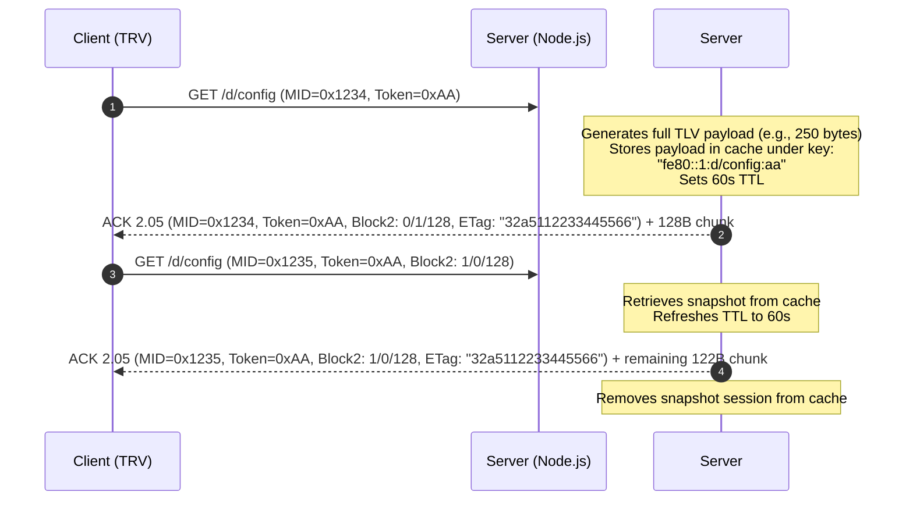
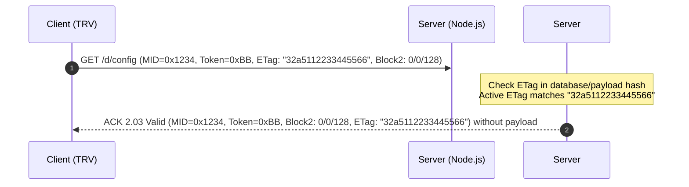

# TaNoClo: CoAP & TLV Protocol Specification

This document provides the definitive, low-level technical specification of the custom Constrained Application Protocol (CoAP) implementation and the binary Type-Length-Value (TLV) serialization engine utilized by Tado Internet Bridges, Valve Actuators, and Room Units. 

---

## 1. CoAP Protocol Specification

Tado's ecosystem communicates via a customized implementation of standard CoAP (RFC 7252) running over UDP. The parser/serializer engine (`ws-server/lib/coap.js`) handles decoding, option packing, delta adjustments, and defensive workarounds for non-standard behavior observed in hardware devices.

### 1.1 CoAP Header Structure (4 Bytes)

All CoAP packets begin with a mandatory 4-byte header in network byte order (Big-Endian):

```
 0                   1                   2                   3
 0 1 2 3 4 5 6 7 8 9 0 1 2 3 4 5 6 7 8 9 0 1 2 3 4 5 6 7 8 9 0 1
+-+-+-+-+-+-+-+-+-+-+-+-+-+-+-+-+-+-+-+-+-+-+-+-+-+-+-+-+-+-+-+-+
|Ver| T |  TKL  |      Code     |          Message ID           |
+-+-+-+-+-+-+-+-+-+-+-+-+-+-+-+-+-+-+-+-+-+-+-+-+-+-+-+-+-+-+-+-+
|   Token (if TKL > 0) [TKL bytes]                              |
+-+-+-+-+-+-+-+-+-+-+-+-+-+-+-+-+-+-+-+-+-+-+-+-+-+-+-+-+-+-+-+-+
|   Options (if any) [variable length] ...                      |
+-+-+-+-+-+-+-+-+-+-+-+-+-+-+-+-+-+-+-+-+-+-+-+-+-+-+-+-+-+-+-+-+
|1 1 1 1 1 1 1 1|   Payload (if any, prefixed by 0xFF) ...      |
+-+-+-+-+-+-+-+-+-+-+-+-+-+-+-+-+-+-+-+-+-+-+-+-+-+-+-+-+-+-+-+-+
```

*   **Version (`Ver`)** [2 bits]: Must be set to `1` (`01` binary).
*   **Type (`T`)** [2 bits]:
    *   `0` = `CON` (Confirmable: Requires Acknowledgement)
    *   `1` = `NON` (Non-confirmable: Does not require Ack)
    *   `2` = `ACK` (Acknowledgement: Response matching a CON packet)
    *   `3` = `RST` (Reset: Message rejected or cannot process)
*   **Token Length (`TKL`)** [4 bits]: Length of the variable Token field (0 to 8 bytes).
*   **Code** [8 bits]: Unsigned integer representing request method or response status.
*   **Message ID (`MID`)** [16 bits]: Big-Endian integer used for deduplication, retries, and matching CON messages with ACKs.

### 1.2 Code Dictionary (Requests & Responses)

#### Request Codes
*   `0.01` (0x01) = `GET` — Retrieve resource state.
*   `0.02` (0x02) = `POST` — Perform authentication or confirmation.
*   `0.03` (0x03) = `PUT` — Update config or state fields.
*   `0.04` (0x04) = `DELETE` — Remove overlay or active block.

#### Response Codes
*   `2.01` (0x41) = `Created` — Successful POST authentication.
*   `2.02` (0x42) = `Deleted` — Successful DELETE request.
*   `2.03` (0x43) = `Valid` — Conditional GET matches ETag; payload unchanged.
*   `2.04` (0x44) = `Changed` — Successful PUT update (no payload).
*   `2.05` (0x45) = `Content` — Successful GET response containing payload.
*   `2.31` (0x5F) = `Continue` — Multi-block payload transfer continue state.
*   `5.04` (0xA4) = `Gateway Timeout` — Uplink route down.

---

### 1.3 Option Delta & Length Encoding

CoAP options are serialized in ascending numerical order. Each option is prefixed by a single byte header followed by optional extension bytes and the value:

```
  0   1   2   3   4   5   6   7
+---+---+---+---+---+---+---+---+
|   Option Delta  | Option Length |
+---+---+---+---+---+---+---+---+
\      Option Delta Extended    / (0, 1, or 2 bytes)
+-------------------------------+
\     Option Length Extended    / (0, 1, or 2 bytes)
+-------------------------------+
\          Option Value         / (Option Length bytes)
+-------------------------------+
```

*   **Option Delta (nibble 1)** [4 bits]: Delta from previous option number.
    *   If `Delta < 13`: Delta is represented directly in the nibble.
    *   If `Delta = 13`: Option Delta Extended is 1 byte, storing `Delta - 13`.
    *   If `Delta = 14`: Option Delta Extended is 2 bytes (Big-Endian), storing `Delta - 269`.
*   **Option Length (nibble 2)** [4 bits]: Length of the option value.
    *   If `Length < 13`: Length is represented directly in the nibble.
    *   If `Length = 13`: Option Length Extended is 1 byte, storing `Length - 13`.
    *   If `Length = 14`: Option Length Extended is 2 bytes (Big-Endian), storing `Length - 269`.

> [!CAUTION]
> **Tado Option 15 Parser Workaround:**
> According to RFC 7252, a nibble value of `15` is reserved for future expansion and must cause a protocol error. However, Tado firmware occasionally sends or receives options containing a malformed `15` nibble in delta or length. 
> To prevent parsing crashes, `coap.js` implements a defensive fallback: if `delta4 === 15 || len4 === 15`, the engine ceases parsing options immediately and scans forward byte-by-byte for the payload marker byte `0xFF`. If found, it positions the read cursor to process the payload; if not, it safely consumes the remaining buffer.

---

### 1.4 CoAP Option Registry

Tado-specific protocol options are mapped to standard and custom identifiers:

| Option Number | Name | Raw Type | Value Purpose |
| :--- | :--- | :--- | :--- |
| **1** | `OPT_IF_MATCH` | `bytes` | Match ETag before modifying resource. |
| **2** | `OPT_MAX_AGE` | `uint` | Cache lifetime in seconds. |
| **3** | `OPT_URI_HOST` | `string` | Destined host. |
| **4** | `OPT_ETAG` | `bytes` | Resource version ETag (2-byte hash block or 8-byte MD5 slice). |
| **7** | `OPT_LOCATION_PATH` | `bytes` | Also used in `/auth/token` for raw 16-byte operational key exchange. |
| **11** | `OPT_URI_PATH` | `string` | Repeating path segments (e.g. `d`, `config` for `/d/config`). |
| **12** | `OPT_CONTENT_FORMAT`| `uint` | Payload format: `42` (`0x2A`) = Binary TLV (`application/octet-stream`), `0` = `text/plain`. **Mandatory on all CoAP `2.05 Content` and `2.04 Changed` responses**; omitting Option 12 (`0xC1 0x2A`) causes the Internet Bridge to reject ACKs and drop devices from `DEV_NEIGHBORS`. |
| **15** | `OPT_URI_QUERY` | `string` | Repeating query parameters (e.g. `v=1`, `lid=1`). |
| **17** | `OPT_ACCEPT` | `uint` | Client-accepted payload format. |
| **23** | `OPT_BLOCK2` | `uint` | Downlink pagination parameter (requested block index, SZX). |
| **27** | `OPT_BLOCK1` | `uint` | Uplink pagination parameter (sent block index, M flag, SZX). |
| **2048** | `OPT_VENDOR_2048` | `bytes` | **Tado Session Token:** Essential 8-byte or 16-byte security token validated on every payload. |

---

## 2. Block2 Transfers & Resource Freezing

Because 802.15.4 FSK radio frames are small, larger payloads (such as configurations, zone states, and diagnostic blocks) cannot fit into a single transmission. Standard Block2 transfer (RFC 7959) is used to paginate responses.

### 2.1 Block Option Structure

The `OPT_BLOCK2` option value is a variable-length integer (1, 2, or 3 bytes) encoded as follows:

```
+-----------------------------------+---+---+
|       Block Number (NUM)          | M |SZX|
+-----------------------------------+---+---+
```

*   **Block Number (NUM)**: The 0-indexed count of the current block.
*   **More Flag (M)** [1 bit]:
    *   `1` = More blocks follow.
    *   `0` = Last block in the transfer.
*   **Size Exponent (SZX)** [3 bits]: Exponent of block size. Block Size = $2^{(SZX + 4)}$ bytes.
    *   Tado uniformly implements `SZX = 3`, giving a block size of $2^{(3+4)} = 128$ bytes.
    *   Encoding helper: `value = (NUM << 4) | (M << 3) | SZX`

---

### 2.2 Resource Freezing & Session Management

Dynamic database resources (such as active temperatures or boiler metrics) change continuously. If the server queried the database for each individual block requested, byte alignment and field positions could shift mid-transfer, leading to packet corruption at the receiver.

To guarantee byte-level consistency across multiple packet transfers, the server implements **Resource Freezing** inside `lib/handlers.js` using `downlinkBlockSessions`:



1.  **Block 0 Allocation:** When a client requests `Block 0` of a resource (or if no session is active), the handler captures a complete, raw snapshot of the generated binary TLV payload.
2.  **Session Key:** The frozen block session is stored in an in-memory Map (`downlinkBlockSessions`) under the key:
    $$\text{Key} = \text{ipv6} + \text{":"} + \text{uriPath} + \text{":"} + \text{token (hex)}$$
3.  **Time-To-Live (TTL):** The session is initialized with a **60,000 ms (60s) TTL**. A periodic cleanup interval in `server.js` sweeps and purges expired sessions every 30 seconds to reclaim memory in case of lost packets.
4.  **Sequential Reads:** For block requests greater than 0, the server retrieves the frozen byte block directly from the session cache and updates the expiration timestamp by another 60 seconds.
5.  **Deallocation:** Once the final block is sent ($M = 0$), the session is immediately destroyed.

---

### 2.3 Conditional GET Optimization

To conserve TRV battery life and minimize FSK radio traffic, the server supports Conditional GETs. If the client includes `OPT_ETAG` matching the current resource's active ETag on `Block 0`, the server skips payload generation entirely and returns `2.03 Valid`:



---

## 3. Binary TLV Serialization Specification

Tado payloads consist of serialized binary Type-Length-Value (TLV) packets. The custom TLV engine (`ws-server/lib/tlv.js`) dynamically handles parsing, variable type boundaries, and inverse scale multiplication.

### 3.1 Binary Field Layout (3-Byte Header)

Each entry in a TLV payload is strictly formatted as:

```
 0                   1                   2
 0 1 2 3 4 5 6 7 8 9 0 1 2 3 4 5 6 7 8 9 0 1 2 3
+-+-+-+-+-+-+-+-+-+-+-+-+-+-+-+-+-+-+-+-+-+-+-+-+
|             Field ID (FID)                    |  (16 bits, Big-Endian)
+-+-+-+-+-+-+-+-+-+-+-+-+-+-+-+-+-+-+-+-+-+-+-+-+
|   Length (L)  |   Value (V) [L bytes] ...     |  (8 bits Length)
+-+-+-+-+-+-+-+-+-+-+-+-+-+-+-+-+-+-+-+-+-+-+-+-+
```

*   **Field ID (FID)** [16 bits]: Unsigned Big-Endian identifier mapping to a specific config, sensor, or state value.
*   **Length** [8 bits]: Length of the following Value block. Maximum capacity is 255 bytes.
*   **Value**: Field data of size `Length` bytes.

---

### 3.2 Numeric Type System Boundaries

During encoding and decoding, values are constrained to standard integer boundaries and byte alignments:

| Type Code | Bytes | Format | Range |
| :--- | :--- | :--- | :--- |
| `u8` | 1 | Unsigned byte | $0$ to $255$ |
| `u16` / `u16be` | 2 | Big-Endian unsigned short | $0$ to $65,535$ |
| `u32be` | 4 | Big-Endian unsigned integer | $0$ to $4,294,967,295$ |
| `s16` / `s16be` | 2 | Big-Endian signed short | $-32,768$ to $32,767$ |
| `s32be` | 4 | Big-Endian signed integer | $-2,147,483,648$ to $2,147,483,647$ |
| `bool` / `flag` | 1 | Boolean flag | $0$ (false) or $1$ (true) |
| `empty` | 0 | Presence identifier | Presence only; no value payload |
| `string` | Var | UTF-8 sequence | Up to 255 bytes |
| `bytes` | Var | Raw binary data | Up to 255 bytes |

---

### 3.3 Scaling Engine & Inverse Scale Math

To transmit floating-point precision numbers (such as temperature) over a integer-only constrained network, the TLV engine utilizes fixed scaling factors.

#### Scaling on Decode (Uplink/Incoming)
Incoming binary values are multiplied by the scaling factor defined in `tlv_labels` to yield database floats:
$$\text{decodedValue} = \text{rawValue} \times \text{scale}$$

*   *Example:* Ambient Temperature (`0x012d`) reports `0x0866` ($2150$ decimal) with a scale of `0.01`.
    $$\text{decodedValue} = 2150 \times 0.01 = 21.5^\circ\text{C}$$

#### Inverse Scaling on Encode (Downlink/Outgoing)
When compiling a payload to send down to a device, the DB float must be divided by the scale factor and rounded:
$$\text{rawValue} = \text{Math.round}\left(\frac{\text{databaseValue}}{\text{scale}}\right)$$

*   *Example:* Domestic Hot Water target setpoint (`0x045b`) is set to $60.5^\circ\text{C}$ in the DB. The scale is `0.01`.
    $$\text{rawValue} = \text{Math.round}\left(\frac{60.5}{0.01}\right) = 6050 = \text{0x17A2}$$

---

### 3.4 Canonical Field ID (FID) Dictionary Table

This dictionary consolidates all observed TLV fields, mapping their hex codes, type properties, scales, paths, and their corresponding database targets:

| Hex ID | Label Name | Type | Scale | Unit | CoAP Path | DB Table | DB Column / JSON Key | Purpose / Description |
| :--- | :--- | :--- | :--- | :--- | :--- | :--- | :--- | :--- |
| `0x0000` | `pair_stop_marker_0000` | `empty` | 1.0 | - | `/d/I/{id}/pair` | `tlv_labels` | - | Zero-length pairing termination action marker. |
| `0x0003` | `reported_rf_key` | `bytes` | 1.0 | - | `/d/rfkey` | `devices` | `field_0155` | 16-byte active AES-128 RF network key reported in GET `/d/rfkey`. |
| `0x0007` | `client_nonce` | `bytes` | 1.0 | - | `auth/token` | `devices` | `field_0007` | 16-byte client-generated cryptographic nonce for token authentication. |
| `0x0035` | `fw_version_other_slot` | `u16be` | 1.0 | - | `/d/{id}/fw/state` | `devices` | `field_0035` | Firmware version present in the other/inactive external SPI slot (or previous version). |
| `0x0036` | `fw_state_aux_0036` | `u8` | 1.0 | - | `/d/{id}/fw/state` | `devices` | `field_0036` | Auxiliary firmware upgrade metric (e.g. partition indicator). |
| `0x0039` | `fw_version_target_or_reported` | `u16be` | 1.0 | - | `/d/{id}/fw/state` | `devices` | `field_0039` | Second firmware version field (likely target or cloud-reported expected version). |
| `0x003a` | `fw_version_active` | `u16be` | 1.0 | - | `/d/{id}/fw/state` | `devices` | `current_fw_version` | Active/running firmware version. |
| `0x003b` | `fw_state_phase_or_step` | `u8` | 1.0 | - | `/d/{id}/fw/state` | `devices` | `field_003b` | Small state/phase value (update/bootloader phase indicator). |
| `0x003c` | `fw_state_phase_aux_003c` | `u8` | 1.0 | - | `/d/{id}/fw/state` | `devices` | `field_003c` | Second small state/phase value (update state machine aux indicator). |
| `0x007a` | `orientation_or_overlay_state` | `u8` | 1.0 | - | `/d/{id}/sen` | `tlv_labels` | - | Device physical orientation or dial overlay state. |
| `0x0104` | `pair_action` | `empty` | 1.0 | - | `/d/I/{id}/pair` | `tlv_labels` | - | Zero-length pairing transaction action marker during companion binding. |
| `0x012d` | `temperature_ambient` | `s16be` | 0.01 | °C | `/d/{id}/sen` | `device_measurements` | `field_012d` | Measured room temperature. |
| `0x012e` | `aux_temperature_1` | `s16be` | 0.01 | °C | `/d/{id}/sen` | `device_measurements` | `field_012e` | Primary reference board thermistor. |
| `0x0135` | `humidity_percent` | `u16be` | 0.01 | % | `/d/{id}/sen` | `device_measurements` | `field_0135` | Room relative humidity level. |
| `0x0136` | `ambient_light_level` | `u16be` | 1.0 | - | `/d/{id}/sen` | `device_measurements` | `field_0136` | Measured light exposure (0-100). |
| `0x0137` | `dial_encoder_steps` | `u8` | 1.0 | step | `/d/{id}/sen` | `device_measurements` | `field_0137` | Relative rotary dial encoder movement steps (resets to 0x7f after report). |
| `0x0140` | `temperature_offset` | `s16be` | 0.01 | °C | `/d/{id}/config` | `devices` | `field_0140` | Temperature offset in Celsius. |
| `0x0143` | `device_flag_0143` | `bool` | 1.0 | - | `/d/{id}/config` | `devices` | `last_config_json->device_flag_0143` | Device setup flag. |
| `0x0149` | `va_orientation` | `u8` | 1.0 | enum | `/d/{id}/config` | `devices` | `field_0149` | Valve layout: `0`=HORIZONTAL, `1`=VERTICAL. |
| `0x014c` | `fw_active_slot` | `u8` | 1.0 | enum | `/d/{id}/fw/state` | `devices` | `field_014c` | Execution slot index: `0` or `1`. |
| `0x0155` | `rf_key` | `bytes` | 1.0 | - | `/d/{id}/config` | `devices` | `field_0155` | Operational network AES-128 RF key. |
| `0x0158` | `device_ui_flags_0158` | `u16be` | 1.0 | bits | `/d/{id}/config` | `devices` | `field_0158` | UI settings bitfield. Bit 9 (`0x0200`)=Dazzle mode, Bit 10 (`0x0400`)=Display Always-On. |
| `0x015a` | `device_config` | `bytes` | 1.0 | hash | `/d/{id}/config` | `devices` | `field_015a` | ETag determinants block configuration hash. |
| `0x015c` | `home_id` | `u32be` | 1.0 | - | `/d/{id}/config` | `devices` | `home_id` | Unique 4-byte Home ID. |
| `0x015d` | `device_type` | `u16be` | 1.0 | - | `/d/{id}/config`, `/codes`| `devices`, `heating_systems` | `field_015d` | Device type / role index (RU Wired=71, RU Wireless Sensor=200, VA Horizontal=112, VA Vertical=113). |
| `0x015e` | `zone_binding_pairs` | `bytes` | 1.0 | pairs | `/d/{id}/config` | `devices` | `field_015e` | Topology-aware binding role+zone array (2-byte pairs: Role byte + Zone byte). |
| `0x0160` | `device_reset_reason` | `u8` | 1.0 | enum | `/d/{id}/sen` | `device_measurements` | `field_0160` | Hardware reset/reboot reason code (POR, PIN, software reset, watchdog). |
| `0x0161` | `opentherm_voltage` | `u16be` | 0.001 | V | `/d/{id}/sen` | `device_measurements` | `field_0161` | OpenTherm loop supply voltage in Volts (mV raw). |
| `0x0162` | `battery_mv` | `u16be` | 1.0 | mV | `/d/{id}/sen` | `device_measurements` | `field_0162` | Power supply voltage. |
| `0x0165` | `opentherm_current` | `u16be` | 1.0 | mA | `/d/{id}/sen` | `tlv_labels` | - | OpenTherm loop supply current in milliamperes. |
| `0x0168` | `ru_opentherm_selftest_supply_mv` | `u32be` | 1.0 | mV | `/d/{id}/selftest/result` | `tlv_labels` | - | RU selftest metrics of OpenTherm docked subsystem reference supply voltage. |
| `0x016a` | `valve_calibration_state`| `u8` | 1.0 | enum | `/d/{id}/mount` | `devices` | `field_016a` | Calibration steps state index. |
| `0x016e` | `mounting` | `bytes` | 1.0 | - | `/d/{id}/mount` | `devices` | `last_config_json->mounting` | Motor mounting status metrics. |
| `0x017d` | `alternative_orientation`| `u8` | 1.0 | enum | `/d/{id}/config` | `devices` | `-` | Alternative orientation code. |
| `0x0180` | `fw_state_update_result_or_bootcount` | `u8` | 1.0 | - | `/d/{id}/fw/state` | `devices` | `field_0180` | Firmware state update result or boot status flags. |
| `0x0182` | `fallback_active` | `bool` | 1.0 | - | `/d/{id}/config` | `devices` | `field_0182` | Active status for device fallback mode. |
| `0x0183` | `config_field_0183` | `bytes` | 1.0 | - | `/d/{id}/config` | `tlv_labels` | - | Device configuration payload field. |
| `0x0197` | `temp_drop_rate_trigger` | `s16be` | 0.01 | °C | `/z/p` | `tlv_labels` | - | Rapid temperature drop trigger threshold in centi-degrees Celsius. |
| `0x019a` | `firmware_table_fid_019a` | `bytes` | 1.0 | - | `/d/{id}/fw` | `tlv_labels` | - | Firmware table manifest field metadata. |
| `0x019d` | `display_contrast` | `u8` | 1.0 | - | `/d/{id}/config` | `devices` | `field_019d` | Device display contrast level. |
| `0x019e` | `display_brightness` | `u8` | 1.0 | - | `/d/{id}/config` | `devices` | `field_019e` | Device display brightness level. |
| `0x01a0` | `fw_state_status` | `u8` | 1.0 | - | `/d/{id}/fw/state` | `devices` | `field_01a0` | Firmware upgrade sequence status flags. |
| `0x01a3` | `error_flags_u32` | `u32be` | 1.0 | bits | `/d/{id}/err` | `devices` | `field_01a3` | Hardware error states bitmask. |
| `0x01a8` | `fw_offer_marker_a8` | `flag` | 1.0 | - | `/d/{id}/fw` | `tlv_labels` | - | Zero-length CoAP firmware update offer transaction marker. |
| `0x01a9` | `fw_flags_a9` | `u8` | 1.0 | - | `/d/{id}/fw` | `tlv_labels` | - | Firmware update flags payload parameter. |
| `0x01aa` | `fw_campaign_or_crc_u16` | `u16` | 1.0 | - | `/d/{id}/fw` | `tlv_labels` | - | Firmware update campaign identifier or checksum. |
| `0x01ab` | `hvac_status_bits_01ab` | `u8` | 1.0 | bits | `/h/{id}/hvac/mon` | `heating_systems` | `-` | Low-level OpenTherm status flag bits. |
| `0x01ac` | `fw_state_put` | `u8` | 1.0 | - | `/d/{id}/fw/state` | `tlv_labels` | - | Firmware update state transition instruction. |
| `0x01b5` | `va_mount_reference_steps` | `u16be` | 1.0 | steps | `/d/{id}/mount` | `devices` | `field_01b5` | Valve learned calibration reference/offset steps. |
| `0x01b6` | `va_mount_seatpoint_steps` | `u16be` | 1.0 | steps | `/d/{id}/mount` | `devices` | `field_01b6` | Valve learned seat/contact point steps. |
| `0x01b8` | `va_mount_state` | `u8` | 1.0 | enum | `/d/{id}/mount` | `devices` | `field_016a` | Valve calibration mounting state index. |
| `0x01c8` | `aux_temperature_2` | `s16be` | 0.01 | °C | `/d/{id}/sen` | `device_measurements` | `field_01c8` | Secondary casing reference thermistor. |
| `0x01d0` | `neighbor_self_ipv6` | `bytes` | 1.0 | - | `/d/{id}/neighbors` | `tlv_labels` | - | Neighbor table client local IPv6 address. |
| `0x01d1` | `neighbor_entry` | `bytes` | 1.0 | - | `/d/{id}/neighbors` | `tlv_labels` | - | Nested neighbor entry diagnostic sub-TLV container. |
| `0x01d2` | `neighbor_ipv6` | `bytes` | 1.0 | - | `/d/{id}/neighbors` | `tlv_labels` | - | Neighbor device IPv6 address (sub-TLV inside 0x01d1). |
| `0x01d3` | `neighbor_data` | `bytes` | 1.0 | - | `/d/{id}/neighbors` | `tlv_labels` | - | Blockwise alignment padding payload (all zeros) attached on multi-block transfers when more neighbors follow. |
| `0x01fa` | `va_mount_mode` | `u8` | 1.0 | enum | `/d/{id}/mount` | `devices` | `field_01fa` | Actuator mounting mechanism operation mode. |
| `0x01fb` | `va_mount_flags` | `u8` | 1.0 | - | `/d/{id}/mount` | `devices` | `field_01fb` | Actuator mounting process execution status flags. |
| `0x01fc` | `pairing_mode` | `bool` | 1.0 | - | `/d/I/{id}/pair` | `devices` | `in_pairing_mode` | Internet Bridge pairing mode toggle switch. |
| `0x01fe` | `firmware_table_fid_01fe` | `bytes` | 1.0 | - | `/d/{id}/fw` | `tlv_labels` | - | Firmware upgrade transaction data partition table. |
| `0x01ff` | `firmware_table_fid_01ff` | `bytes` | 1.0 | - | `/d/{id}/fw` | `tlv_labels` | - | Firmware upgrade transaction data partition table. |
| `0x0200` | `firmware_table_fid_0200` | `bytes` | 1.0 | - | `/d/{id}/fw` | `tlv_labels` | - | Firmware upgrade transaction data partition table. |
| `0x0201` | `pair_stop_marker` | `empty` | 1.0 | - | `/d/I/{id}/pair` | `tlv_labels` | - | Zero-length pairing termination action marker. |
| `0x0202` | `firmware_table_fid_0202` | `bytes` | 1.0 | - | `/d/{id}/fw` | `tlv_labels` | - | Firmware upgrade transaction data partition table. |
| `0x0203` | `firmware_table_fid_0203` | `bytes` | 1.0 | - | `/d/{id}/fw` | `tlv_labels` | - | Firmware upgrade transaction data partition table. |
| `0x0204` | `firmware_table_fid_0204` | `bytes` | 1.0 | - | `/d/{id}/fw` | `tlv_labels` | - | Firmware upgrade transaction data partition table. |
| `0x0205` | `firmware_table_fid_0205` | `bytes` | 1.0 | - | `/d/{id}/fw` | `tlv_labels` | - | Firmware upgrade transaction data partition table. |
| `0x0206` | `firmware_table_fid_0206` | `bytes` | 1.0 | - | `/d/{id}/fw` | `tlv_labels` | - | Firmware upgrade transaction data partition table. |
| `0x0207` | `firmware_table_fid_0207` | `bytes` | 1.0 | - | `/d/{id}/fw` | `tlv_labels` | - | Firmware upgrade transaction data partition table. |
| `0x0208` | `firmware_table_fid_0208` | `bytes` | 1.0 | - | `/d/{id}/fw` | `tlv_labels` | - | Firmware upgrade transaction data partition table. |
| `0x0209` | `firmware_table_fid_0209` | `bytes` | 1.0 | - | `/d/{id}/fw` | `tlv_labels` | - | Firmware upgrade transaction data partition table. |
| `0x020a` | `firmware_table_fid_020a` | `bytes` | 1.0 | - | `/d/{id}/fw` | `tlv_labels` | - | Firmware upgrade transaction data partition table. |
| `0x020b` | `firmware_table_fid_020b` | `bytes` | 1.0 | - | `/d/{id}/fw` | `tlv_labels` | - | Firmware upgrade transaction data partition table. |
| `0x020c` | `firmware_table_fid_020c` | `bytes` | 1.0 | - | `/d/{id}/fw` | `tlv_labels` | - | Firmware upgrade transaction data partition table. |
| `0x020e` | `firmware_table_fid_020e` | `bytes` | 1.0 | - | `/d/{id}/fw` | `tlv_labels` | - | Firmware upgrade transaction data partition table. |
| `0x020f` | `child_lock` | `bool` | 1.0 | - | `/d/{id}/config` | `devices` | `child_lock_enabled` | UI/casing physical child lock configuration toggle. |
| `0x0210` | `firmware_build_id` | `string` | 1.0 | - | `/d/{id}/fw/state` | `devices` | `fw_build_id` | Firmware build identifier string (e.g., 73b9b52). |
| `0x0217` | `valve_position` | `u8` | 1.0 | % | `/d/{id}/sen` | `tlv_labels` | - | Actuator physical valve position percentage. |
| `0x0218` | `valve_state` | `u8` | 1.0 | enum | `/d/{id}/sen` | `tlv_labels` | - | Actuator valve operation status state. |
| `0x0219` | `valve_error` | `u8` | 1.0 | enum | `/d/{id}/sen` | `tlv_labels` | - | Actuator valve operation/calibration error. |
| `0x021a` | `device_config_aux_021a` | `u16be` | 1.0 | - | `/d/{id}/config` | `devices` | `last_config_json->device_config_aux_021a` | Device configuration auxiliary parameter. |
| `0x021b` | `config_field_021b` | `bytes` | 1.0 | - | `/d/{id}/config` | `devices` | `last_config_json->config_field_021b` | Device configuration raw byte field. |
| `0x0221` | `config_field_0221` | `bytes` | 1.0 | - | `/d/{id}/config` | `devices` | `last_config_json->config_field_0221` | Device configuration raw byte field. |
| `0x0223` | `config_field_0223` | `bytes` | 1.0 | - | `/d/{id}/config` | `devices` | `last_config_json->config_field_0223` | Device configuration raw byte field. |
| `0x0224` | `config_field_0224` | `bytes` | 1.0 | - | `/d/{id}/config` | `devices` | `last_config_json->config_field_0224` | Device configuration raw byte field. |
| `0x0225` | `config_field_0225` | `bytes` | 1.0 | - | `/d/{id}/config` | `devices` | `last_config_json->config_field_0225` | Device configuration raw byte field. |
| `0x0226` | `config_field_0226` | `bytes` | 1.0 | - | `/d/{id}/config` | `devices` | `last_config_json->config_field_0226` | Device configuration raw byte field. |
| `0x0227` | `config_field_0227` | `bytes` | 1.0 | - | `/d/{id}/config` | `devices` | `last_config_json->config_field_0227` | Device configuration raw byte field. |
| `0x0228` | `config_field_0228` | `bytes` | 1.0 | - | `/d/{id}/config` | `devices` | `last_config_json->config_field_0228` | Device configuration raw byte field. |
| `0x0229` | `config_field_0229` | `bytes` | 1.0 | - | `/d/{id}/config` | `devices` | `last_config_json->config_field_0229` | Device configuration raw byte field. |
| `0x022a` | `config_field_022a` | `bytes` | 1.0 | - | `/d/{id}/config` | `devices` | `last_config_json->config_field_022a` | Device configuration raw byte field. |
| `0x022b` | `config_field_022b` | `bytes` | 1.0 | - | `/d/{id}/config` | `devices` | `last_config_json->config_field_022b` | Device configuration raw byte field. |
| `0x022c` | `fw_update_start` | `u8` | 1.0 | - | `/d/{id}/config` | `devices` | `last_config_json->fw_update_start` | Firmware update trigger control parameter. |
| `0x022d` | `unknown_022d` | `bytes` | 1.0 | - | `/d/{id}/config` | `devices` | `last_config_json->unknown_022d` | Device hardware configuration metadata field. |
| `0x022e` | `unknown_022e` | `bytes` | 1.0 | - | `/d/{id}/config` | `devices` | `last_config_json->unknown_022e` | Device hardware configuration metadata field. |
| `0x022f` | `unknown_022f` | `bytes` | 1.0 | - | `/d/{id}/config` | `devices` | `last_config_json->unknown_022f` | Device hardware configuration metadata field. |
| `0x0230` | `unknown_0230` | `bytes` | 1.0 | - | `/d/{id}/config` | `devices` | `last_config_json->unknown_0230` | Device hardware configuration metadata field. |
| `0x0231` | `unknown_0231` | `bytes` | 1.0 | - | `/d/{id}/config` | `devices` | `last_config_json->unknown_0231` | Device hardware configuration metadata field. |
| `0x0232` | `unknown_0232` | `bytes` | 1.0 | - | `/d/{id}/config` | `devices` | `last_config_json->unknown_0232` | Device hardware configuration metadata field. |
| `0x0233` | `unknown_0233` | `bytes` | 1.0 | - | `/d/{id}/config` | `devices` | `last_config_json->unknown_0233` | Device hardware configuration metadata field. |
| `0x0234` | `unknown_0234` | `bytes` | 1.0 | - | `/d/{id}/config` | `devices` | `last_config_json->unknown_0234` | Device hardware configuration metadata field. |
| `0x0235` | `unknown_0235` | `bytes` | 1.0 | - | `/d/{id}/config` | `devices` | `last_config_json->unknown_0235` | Device hardware configuration metadata field. |
| `0x0236` | `unknown_0236` | `bytes` | 1.0 | - | `/d/{id}/config` | `devices` | `last_config_json->unknown_0236` | Device hardware configuration metadata field. |
| `0x0237` | `unknown_0237` | `bytes` | 1.0 | - | `/d/{id}/config` | `devices` | `last_config_json->unknown_0237` | Device hardware configuration metadata field. |
| `0x0238` | `unknown_0238` | `bytes` | 1.0 | - | `/d/{id}/config` | `devices` | `last_config_json->unknown_0238` | Device hardware configuration metadata field. |
| `0x0239` | `unknown_0239` | `bytes` | 1.0 | - | `/d/{id}/config` | `devices` | `last_config_json->unknown_0239` | Device hardware configuration metadata field. |
| `0x023a` | `unknown_023a` | `bytes` | 1.0 | - | `/d/{id}/config` | `devices` | `last_config_json->unknown_023a` | Device hardware configuration metadata field. |
| `0x023b` | `unknown_023b` | `bytes` | 1.0 | - | `/d/{id}/config` | `devices` | `last_config_json->unknown_023b` | Device hardware configuration metadata field. |
| `0x023c` | `unknown_023c` | `bytes` | 1.0 | - | `/d/{id}/config` | `devices` | `last_config_json->unknown_023c` | Device hardware configuration metadata field. |
| `0x023d` | `config_field_023d` | `bytes` | 1.0 | - | `/d/{id}/config` | `devices` | `last_config_json->config_field_023d` | Device configuration raw byte field. |
| `0x023e` | `config_field_023e` | `bytes` | 1.0 | - | `/d/{id}/config` | `devices` | `last_config_json->config_field_023e` | Device configuration raw byte field. |
| `0x023f` | `config_field_023f` | `bytes` | 1.0 | - | `/d/{id}/config` | `devices` | `last_config_json->config_field_023f` | Device configuration raw byte field. |
| `0x0240` | `config_field_0240` | `bytes` | 1.0 | - | `/d/{id}/config` | `devices` | `last_config_json->config_field_0240` | Device configuration raw byte field. |
| `0x0241` | `config_field_0241` | `bytes` | 1.0 | - | `/d/{id}/config` | `devices` | `last_config_json->config_field_0241` | Device configuration raw byte field. |
| `0x0242` | `config_field_0242` | `bytes` | 1.0 | - | `/d/{id}/config` | `devices` | `last_config_json->config_field_0242` | Device configuration raw byte field. |
| `0x0243` | `config_field_0243` | `bytes` | 1.0 | - | `/d/{id}/config` | `devices` | `last_config_json->config_field_0243` | Device configuration raw byte field. |
| `0x0244` | `config_field_0244` | `bytes` | 1.0 | - | `/d/{id}/config` | `devices` | `last_config_json->config_field_0244` | Device configuration raw byte field. |
| `0x0245` | `unknown_0245` | `bytes` | 1.0 | - | `/d/{id}/config` | `devices` | `last_config_json->unknown_0245` | Device hardware configuration metadata field. |
| `0x0246` | `config_field_0246` | `bytes` | 1.0 | - | `/d/{id}/config` | `devices` | `last_config_json->config_field_0246` | Device configuration raw byte field. |
| `0x0247` | `config_field_0247` | `bytes` | 1.0 | - | `/d/{id}/config` | `devices` | `last_config_json->config_field_0247` | Device configuration raw byte field. |
| `0x0248` | `config_field_0248` | `bytes` | 1.0 | - | `/d/{id}/config` | `devices` | `last_config_json->config_field_0248` | Device configuration raw byte field. |
| `0x0249` | `config_field_0249` | `bytes` | 1.0 | - | `/d/{id}/config` | `devices` | `last_config_json->config_field_0249` | Device configuration raw byte field. |
| `0x024a` | `config_field_024a` | `bytes` | 1.0 | - | `/d/{id}/config` | `devices` | `last_config_json->config_field_024a` | Device configuration raw byte field. |
| `0x024b` | `config_field_024b` | `bytes` | 1.0 | - | `/d/{id}/config` | `devices` | `last_config_json->config_field_024b` | Device configuration raw byte field. |
| `0x024c` | `config_field_024c` | `bytes` | 1.0 | - | `/d/{id}/config` | `devices` | `last_config_json->config_field_024c` | Device configuration raw byte field. |
| `0x024d` | `config_field_024d` | `bytes` | 1.0 | - | `/d/{id}/config` | `devices` | `last_config_json->config_field_024d` | Device configuration raw byte field. |
| `0x024e` | `config_field_024e` | `bytes` | 1.0 | - | `/d/{id}/config` | `devices` | `last_config_json->config_field_024e` | Device configuration raw byte field. |
| `0x024f` | `config_field_024f` | `bytes` | 1.0 | - | `/d/{id}/config` | `devices` | `last_config_json->config_field_024f` | Device configuration raw byte field. |
| `0x0250` | `config_field_0250` | `bytes` | 1.0 | - | `/d/{id}/config` | `devices` | `last_config_json->config_field_0250` | Device configuration raw byte field. |
| `0x0251` | `config_field_0251` | `bytes` | 1.0 | - | `/d/{id}/config` | `devices` | `last_config_json->config_field_0251` | Device configuration raw byte field. |
| `0x0252` | `config_field_0252` | `bytes` | 1.0 | - | `/d/{id}/config` | `devices` | `last_config_json->config_field_0252` | Device configuration raw byte field. |
| `0x0253` | `config_field_0253` | `bytes` | 1.0 | - | `/d/{id}/config` | `devices` | `last_config_json->config_field_0253` | Device configuration raw byte field. |
| `0x025e` | `session_token` | `bytes` | 1.0 | - | `/d/{id}/auth` | `devices` | `field_025e` | Active operational CoAP session token. |
| `0x025f` | `token_validity_minutes`| `u16be` | 1.0 | min | `/d/{id}/auth` | `devices` | `last_config_json->token_validity_minutes` | Session token validity duration in minutes. |
| `0x0260` | `device_id` | `string` | 1.0 | - | `/d/{id}/auth` | `devices` | `serial_no` | Alphanumeric device hardware serial number. |
| `0x0265` | `va_act_position_steps` | `u16be` | 1.0 | steps | `/d/{id}/act` | `devices` | `field_0265` | Motor piston extension distance steps. |
| `0x0266` | `va_act_position2_steps_unused` | `u16be` | 1.0 | steps | `/d/{id}/act` | `devices` | `field_0266` | Unused / historical placeholder. Real VA firmware uses 0x0294. |
| `0x0270` | `config_field_0270` | `bytes` | 1.0 | - | `/d/{id}/config` | `devices` | `last_config_json->config_field_0270` | Device configuration raw byte field. |
| `0x0273` | `va_act_limit_low_steps`| `u16be` | 1.0 | steps | `/d/{id}/act` | `devices` | `field_0273` | Piston closed/zero-level threshold steps. |
| `0x0275` | `config_field_0275` | `bytes` | 1.0 | - | `/d/{id}/config` | `devices` | `last_config_json->config_field_0275` | Device configuration raw byte field. |
| `0x0276` | `config_field_0276` | `bytes` | 1.0 | - | `/d/{id}/config` | `devices` | `last_config_json->config_field_0276` | Device configuration raw byte field. |
| `0x027a` | `dial_interaction_result`| `u8` | 1.0 | enum | `/d/{id}/sen` | `device_measurements` | `field_027a` | Dial interaction result/status code (click/touch action). |
| `0x027c` | `va_act_limit_high_steps`| `u16be` | 1.0 | steps | `/d/{id}/act` | `devices` | `field_027c` | Piston fully retracted span limit steps. |
| `0x0280` | `va_act_drive_cal_const`| `u16be` | 1.0 | - | `/d/{id}/act` | `devices` | `field_0280` | Valve actuator mechanical drive constant. |
| `0x0283` | `va_act_status_flags_unused` | `s16be` | 1.0 | bits | `/d/{id}/act` | `devices` | `field_0283` | Unused / historical placeholder. Real VA firmware uses 0x028d. |
| `0x0286` | `config_field_0286` | `u16be` | 1.0 | raw | `/d/{id}/config` | `devices` | `last_config_json->config_field_0286` | Device configuration field. |
| `0x028c` | `va_actuator_active` | `bool` | 1.0 | - | `/d/{id}/act` | `devices` | `field_028c` | Actuator calibration/activity status. |
| `0x028d` | `va_act_status_flags_s16` | `s16be` | 1.0 | bits | `/d/{id}/act` | `devices` | `field_0283` | Motor movement error and block bitmask. |
| `0x0290` | `va_child_lock_enabled` | `bool` | 1.0 | - | `/d/{id}/lock` | `devices` | `child_lock_enabled` | Lock touch dial physical control interface. |
| `0x0291` | `config_field_0291` | `u8` | 1.0 | raw | `/d/{id}/config` | `devices` | `last_config_json->config_field_0291` | Device configuration field. |
| `0x0292` | `config_field_0292` | `u8` | 1.0 | raw | `/d/{id}/config` | `devices` | `last_config_json->config_field_0292` | Device configuration field. |
| `0x0293` | `config_field_0293` | `bytes` | 1.0 | - | `/d/{id}/config` | `devices` | `last_config_json->config_field_0293` | Device configuration field. |
| `0x0294` | `va_act_position2_steps`| `u16be` | 1.0 | steps | `/d/{id}/act` | `devices` | `field_0266` | Secondary piston movement steps. |
| `0x0298` | `zone_presence` | `u8` | 1.0 | - | `/z/p` | `tlv_labels` | - | Zone node online/presence registration flag. |
| `0x02b2` | `display_active_timeout`| `u16be` | 1.0 | min | `/d/{id}/config` | `devices` | `field_02b2` | Timeout duration for display activity / temporary override in minutes. |
| `0x02b3` | `device_config_flag_02b3`| `bool` | 1.0 | - | `/d/{id}/config` | `devices` | `last_config_json->device_config_flag_02b3`| Offline fallback config schedule toggle. |
| `0x0312` | `fw_manifest_blob` | `bytes` | 1.0 | blob | `/d/{id}/fw` | `tlv_labels` | - | Firmware upgrade manifest metadata. |
| `0x044c` | `ot_ch_flow_temperature` | `s16be` | 0.01 | °C | `/h/{id}/hvac/mon` | `heating_systems` | `field_044c` | OpenTherm radiator supply temperature. |
| `0x044d` | `ot_ch_return_temperature`| `s16be` | 0.01 | °C | `/h/{id}/hvac/mon` | `heating_systems` | `field_044d` | OpenTherm radiator return temperature. |
| `0x044e` | `ot_exhaust_temperature`  | `s16be` | 0.01 | °C | `/h/{id}/hvac/mon` | `heating_systems` | `last_config_json->0x044e` | OpenTherm flue exhaust gas temperature reading (Data-ID 33). |
| `0x044f` | `ot_outside_temperature`  | `s16be` | 0.01 | °C | `/h/{id}/hvac/mon` | `heating_systems` | `last_config_json->0x044f` | OpenTherm outside sensor temperature reading (Data-ID 27). |
| `0x0450` | `ot_ch_control_setpoint` | `s16be` | 0.01 | °C | `/h/{id}/hvac/mon` | `heating_systems` | `field_0450` | OpenTherm boiler water flow target temp. |
| `0x0452` | `ot_relative_modulation_level` | `u16be` | 1.0 | % | `/h/{id}/hvac/mon` | `heating_systems` | `field_0452` | Active burner combustion load percentage. |
| `0x0457` | `boiler_active` | `bool` | 1.0 | - | `/h/{id}/hvac/mon` | `heating_systems` | `field_0457` | Burner flame presence status. |
| `0x0458` | `hvac_status_fault_flags`| `u16be` | 1.0 | bits | `/h/{id}/hvac/mon` | `heating_systems` | `field_0458` | HVAC protocol system failure bitfield. |
| `0x045a` | `ot_dhw_temperature`      | `s16be` | 0.01 | °C | `/h/{id}/hvac/mon` | `heating_systems` | `last_config_json->0x045a` | OpenTherm domestic hot water measured temperature. |
| `0x045b` | `dhw_target_temperature` | `s16be` | 0.01 | °C | `/h/{id}/hvac/mon/dhw`| `heating_systems` | `field_045b` | Target temperature for Domestic Hot Water. |
| `0x045e` | `ot_dhw_flow_rate`       | `u16be` | 0.1  | L/min | `/h/{id}/hvac/mon` | `heating_systems` | `last_config_json->0x045e` | OpenTherm ID 19 domestic hot water flow rate in litres per minute. |
| `0x0460` | `hvac_water_pressure_mbar`| `u32be` | 1.0 | mbar | `/h/{id}/hvac/codes` | `heating_systems` | `field_0460` | Boiler system water circuit pressure. |
| `0x0462` | `ot_ch_water_pressure_bar`| `s16be` | 0.1  | bar | `/h/{id}/hvac/mon` | `heating_systems` | `last_config_json->0x0462` | OpenTherm ID 18 central heating system water pressure in bar. |
| `0x0463` | `ot_burner_start_count` | `u32be` | 1.0 | cyc | `/h/{id}/hvac/maint` | `heating_systems` | `field_0463` | Total cycles of burner combustion ignition. |
| `0x0464` | `ot_ch_pump_start_count` | `u32be` | 1.0 | cyc | `/h/{id}/hvac/maint` | `heating_systems` | `field_0464` | Total execution cycles of central heating pump. |
| `0x0465` | `ot_ch_burner_start_count`| `u32be` | 1.0 | cyc | `/h/{id}/hvac/maint` | `heating_systems` | `field_0465` | Derived central heating burner start counter (total - DHW). |
| `0x0466` | `ot_burner_time_total` | `u32be` | $0.016\overline{6}$| hrs | `/h/{id}/hvac/maint` | `heating_systems` | `field_0466` | Runtime of burner flame (in raw seconds). |
| `0x0467` | `ot_burner_time_ch` | `u32be` | $0.016\overline{6}$| hrs | `/h/{id}/hvac/maint` | `heating_systems` | `field_0467` | Radiator burner active hours. |
| `0x0468` | `ot_burner_time_dhw` | `u32be` | $0.016\overline{6}$| hrs | `/h/{id}/hvac/maint` | `heating_systems` | `field_0468` | DHW burner active hours. |
| `0x046c` | `ot_dhw_supported`       | `bool` | 1.0 | - | `/h/{id}/hvac/config`| `heating_systems` | `field_046c` | OpenTherm slave configuration: DHW supported/enabled capability. |
| `0x046d` | `ot_dhw_not_supported`   | `bool` | 1.0 | - | `/h/{id}/hvac/config`| `heating_systems` | `field_046d` | OpenTherm slave configuration: DHW not supported capability. |
| `0x046f` | `dhw_setpoint`           | `u16be` | 0.01 | °C | `/h/{id}/hvac/config`| `heating_systems` | `field_046f` | OpenTherm Data ID 57 domestic hot water target setpoint. |
| `0x0471` | `dhw_setpoint_max`       | `u16be` | 0.01 | °C | `/h/{id}/hvac/config`| `heating_systems` | `field_0471` | OpenTherm Data ID 48 DHW setpoint upper limit/boundary. |
| `0x0481` | `hvac_field_presence_list` | `bytes` | 1.0 | - | `/h/{id}/hvac/mon` | `heating_systems` | `field_0481` | Supported OpenTherm parameter FID/attribute map. |
| `0x0c00` | `open_window_state` | `u8` | 1.0 | - | `/z/{id}/ow` | `zones` | `open_window_active` | Controls open window state: `0` = cancel/clear, `1` = active/detected. |
| `0x0d1c` | `server_marker_0d1c` | `empty` | 1.0 | - | - | `tlv_labels` | - | Server-originated empty marker. |
| `0x0dd3` | `server_field_0dd3` | `u8` | 1.0 | - | - | `tlv_labels` | - | Server-originated u8 field (typically 0xA3). |
| `0x0dd8` | `server_marker_0dd8` | `empty` | 1.0 | - | - | `tlv_labels` | - | Server-originated empty marker. |
| `0x1120` | `telemetry_field_1120` | `bytes` | 1.0 | - | - | `tlv_labels` | - | Telemetry diagnostic payload parameter. |
| `0x2000` | `circuit_field_2000` | `bytes` | 1.0 | - | - | `tlv_labels` | - | Heating loop diagnostic payload parameter. |
| `0x2040` | `circuit_dhw_max_flow_temperature`| `u16be` | 0.01 | °C | `/h/{id}/c/{id}/config` | `heating_circuits` | `field_2040` | Maximum flow temperature setpoint constraint. |
| `0x2090` | `circuit_mode_or_flags_2090`| `u8` | 1.0 | enum | `/h/{id}/c/{id}/act` | `heating_circuits` | `field_2090` | Heating circuit operation mode status. |
| `0x4000` | `circuit_reference_temp` | `s16be` | 0.01 | °C | `/c/{id}/act` | `heating_circuits` | `field_4000` | Flow pipeline reference temperature setpoint. |
| `0x4020` | `zone_target_temp` | `s16be` | 0.01 | °C | `/z/p` | `tlv_labels` | - | Active target temperature / setpoint in `/z/p` pings. |
| `0x4040` | `circuit_target_temp` | `s16be` | 0.01 | °C | `/c/{id}/act` | `heating_circuits` | `field_4040` | Active target temperature of heating circuit. |
| `0x4060` | `zone_temperature_4060` | `s16be` | 0.01 | °C | `/z/{id}/p` | `tlv_labels` | - | Zone temperature seen in RF sniffed zone program captures. |
| `0x4080` | `circuit_demand_percent` | `u8` | 1.0 | % | `/c/{id}/act` | `heating_circuits` | `field_4080` | Active heating loop warm water load. |
| `0x40a0` | `demand_percent` | `u8` | 1.0 | % | `/z/{id}/act` | `zone_measurements` | `field_40a0` | Actuator room heat demand power output. |
| `0x40b0` | `circuit_status_0x40b0` | `u16be` | 1.0 | bits | `/c/{id}/act` | `tlv_labels` | - | Heating loop auxiliary status bitmask. |
| `0x40e0` | `heating_active_mode` | `bool` | 1.0 | - | `/z/p` | `tlv_labels` | - | Heating mode state flag (0 or 1) in `/z/p` pings. |
| `0x4120` | `overlay_active_flag` | `bool` | 1.0 | - | `/z/p` | `tlv_labels` | - | Manual overlay / dial override active indicator in `/z/p` pings. |
| `0x4140` | `owd_state` | `u8` | 1.0 | - | `/z/p` | `tlv_labels` | - | Open Window Detection state flag in `/z/p` pings. |
| `0x4160` | `owd_override` | `u8` | 1.0 | - | `/z/p` | `tlv_labels` | - | Open Window active override flag in `/z/p` pings. |
| `0x6000` | `zone_state_base` | `bytes` | 1.0 | - | `/z/{id}/s` | `tlv_labels` | - | Baseline zone state payload block. |
| `0x6020` | `zone_service_type` | `u8` | 1.0 | enum | `/z/{id}/s` | `zone_measurements` | `field_6020` | Zone classification: `1`=HEATING, `2`=HOT_WATER. |
| `0x6040` | `zone_program_uri` | `string` | 1.0 | - | `/z/{id}/config` | `tlv_labels` | - | CoAP URI for zone program timetable. |
| `0x6060` | `zone_program_enabled` | `bool` | 1.0 | - | `/z/{id}/config` | `tlv_labels` | - | Boolean flag indicating schedule active. |
| `0x6080` | `zone_temperature_deviation_limit` | `s16be` | 0.01 | °C | `/z/{id}/config` | `zones` | `field_6080` | OWD trigger temperature deviation sensitivity limit. |
| `0x60a0` | `zone_frost_min_temperature` | `s16be` | 0.01 | °C | `/z/{id}/config` | `zones` | `field_60a0` | Zone minimum frost protection temperature setpoint. |
| `0x60c0` | `zone_temperature_baseline` | `s16be` | 0.01 | °C | `/z/{id}/config` | `zones` | `field_60c0` | Zone baseline temperature target setpoint. |
| `0x60e0` | `zone_open_window_detection_enabled` | `bool` | 1.0 | - | `/z/{id}/config` | `zones` | `open_window_enabled` | Zone Open Window Detection enabled switch. |
| `0x6160` | `home_away` | `u8` | 1.0 | enum | `/z/{id}/s` | `zone_measurements` | `field_6160` | Home occupancy state: `1`=HOME, `2`=AWAY. |
| `0x6180` | `zone_state_flag_6180` | `bool` | 1.0 | - | `/z/{id}/s` | `zone_measurements` | `field_6180` | Zone state activity flag. |
| `0x61e0` | `zone_enabled` | `bool` | 1.0 | - | `/z/{id}/s` | `zone_measurements` | `field_61e0` | General toggle state of heating zone loop. |
| `0x6200` | `schedule_target_temp` | `s16be` | 0.01 | °C | `/z/{id}/s` | `zone_measurements` | `field_6200` | Intended automatic timetable temperature. |
| `0x6240` | `overlay_mode` | `u8` | 1.0 | enum | `/z/{id}/s` | `zone_measurements` | `field_6240` | Manual override type: `1`=MANUAL, `2`=TIMER. |
| `0x6260` | `overlay_has_setpoint` | `bool` | 1.0 | - | `/z/{id}/s` | `zone_measurements` | `field_6260` | Indicates manual setpoint is present in overlay. |
| `0x6280` | `overlay_target_temp` | `s16be` | 0.01 | °C | `/z/{id}/s` | `zone_measurements` | `field_6280` | Active manual overlay override setpoint. |
| `0x62c0` | `zone_open_window_shutoff_duration` | `u16be` | $0.016\overline{6}$| minutes | `/z/{id}/config` | `tlv_labels` | - | Duration in raw seconds to shut off heating when open window is detected. |
| `0x62e0` | `overlay_active_aux` | `bool` | 1.0 | - | `/z/{id}/s` | `zone_measurements` | `field_62e0` | Auxiliary indicator that manual overlay is active. |
| `0x6300` | `zone_config_field_6300` | `bytes` | 1.0 | - | `/z/{id}/config` | `tlv_labels` | - | Internal zone configuration metadata parameter. |
| `0x6320` | `zone_config_field_6320` | `bytes` | 1.0 | - | `/z/{id}/config` | `tlv_labels` | - | Internal zone configuration metadata parameter. |
| `0x6340` | `owd_nvm_state` | `u8` | 1.0 | - | `/z/{id}/s` | `zones` | `field_6340` | Persistent Open Window Detection state stored in device NVM. |
| `0x6380` | `zone_program_time_step` | `u16be` | $0.016\overline{6}$| minutes | `/z/{id}/config` | `tlv_labels` | - | Granularity step of schedule/program timetable (in raw seconds). |
| `0x63a0` | `zone_state_uri` | `string` | 1.0 | - | `/z/{id}/config` | `tlv_labels` | - | CoAP URI for zone state query (typically /z/s). |
| `0x63c0` | `circuit_association` | `u8` | 1.0 | - | `/z/p` | `tlv_labels` | - | Heating circuit link identifier in `/z/p` pings. |
| `0x63e0` | `zone_peer_uris_enabled` | `bool` | 1.0 | - | `/z/{id}/config` | `tlv_labels` | - | Toggle for utilizing zone peer URIs for multi-TRV setups. |
| `0x6440` | `telemetry_config` | `u16be` | 1.0 | - | `/z/{id}/s` | `zone_measurements` | `field_6440` | Auxiliary trigger indicating "resume schedule" action has been requested. |
| `0x6460` | `zone_fallback_heating_type` | `u8` | 1.0 | enum | `/z/{id}/fallback` | `tlv_labels` | - | Backup offline heating control classification mode. |
| `0x7380` | `zone_config_marker_7380` | `empty` | 1.0 | - | `/z/{id}/config` | `tlv_labels` | - | Terminal configuration packet delimiter marker. |
| `0x8000` | `zone_state_peer_uris` | `string` | 1.0 | - | `/z/{id}/config` | `tlv_labels` | - | Peer CoAP URIs mapping for dynamic zone states. |
| `0x8200` | `zone_cpe_peer_uris` | `string` | 1.0 | - | `/z/{id}/config` | `tlv_labels` | - | Peer CoAP URIs mapping for companion binding checks. |
| `0x8400` | `zone_program_peer_uris` | `string` | 1.0 | - | `/z/{id}/config` | `tlv_labels` | - | Peer CoAP URIs mapping for dynamic schedule sync. |

---

## 4. ETag Generation Specifications

ETags are 8-byte hexadecimal sequence blocks transmitted in CoAP options for cached block checks. Tado devices implement two distinct ETag structures:

### 4.1 Valve Actuator Deterministic Hash Algorithm

For Valve Actuators (TRVs), the CoAP configuration ETag is built deterministically. The TRV firmware extracts specific active settings from its RAM slots, packs them into a **27-byte block**, and passes them to a 16-bit rolling checksum step.

#### 27-Byte Target Packing Layout

| Byte Offset | Size | Field Hex | Purpose |
| :--- | :--- | :--- | :--- |
| `[0-1]` | 2 | `0x015d` | HVAC Diagnostic code |
| `[2-9]` | 8 | `0x016e` | Mounting state array (zero-padded if inactive) |
| `[10-17]` | 8 | `0x015e` | Topology bindings (4 pairs of role+zone shorts) |
| `[18-19]` | 2 | `0x0158` | UI flags (Dazzle mode toggle bit) |
| `[20-23]` | 4 | `0x015c` | Home ID (Big-Endian u32be) |
| `[24]` | 1 | `0x0143` | Device setup flag bool |
| `[25-26]` | 2 | `0x0149` | Physical orientation code short |

#### Rolling 16-Bit Checksum
The block is iterated byte-by-byte ($i$ from 0 to 26) with an initial hash value of `0x0000`:

```javascript
function tadoHashStep(dataByte, currentHash) {
    let r0 = (dataByte ^ currentHash) & 0xffff;
    r0 = ((r0 & 0xff) << 8) | ((r0 >> 8) & 0xff); // Swap bytes
    let r3 = (r0 << 4) & 0xffff;
    r3 = (r3 & 0xf000) ^ r0;
    r3 = (r3 ^ (r3 >>> 12)) & 0xffff;
    let finalR0 = ((r3 >> 5) & 0x07f8) ^ r3;
    return finalR0 & 0xffff;
}
```

#### Final CoAP Option Output Construction
The calculated 2-byte integer is padded with the Valve Actuator's persistent 6-byte suffix ($\text{suffix}_{12\text{ hex chars}}$) to yield an 8-byte hexadecimal ETag:

$$\text{ETag} = \text{hash.toString(16).padStart(4, "0")} + \text{suffix}$$

*   **Suffix Resolution Hierarchy**:
    1.  **Inbound Extraction (Option 4)**: Extracted directly from `Bytes [2..7]` of the CoAP Option 4 (ETag) header on incoming `GET /d/{serial}/config` requests transmitted by the TRV.
    2.  **Database Persistence**: Loaded from `devices.config_etag` or `devices.field_015a` (`field_015a.substring(4)`).
    3.  **Deterministic Fallback**: Generated via `crypto.createHash('sha256').update(serialNo).digest('hex').substring(0, 12)`.
*   *Example:* If the 27-byte block yields checksum `0x1234` and the device suffix is `123456789012`, the CoAP ETag returned in Option 4 and TLV `0x015a` is `"1234123456789012"`.

---

### 4.2 Internet Bridge Dynamic ETag Format

Unlike Valve Actuators, the Internet Bridge ETag is dynamic.

*   **Format:**
    $$\text{ETag} = \text{"fe80000000000000"} + \text{payloadHash (8 bytes)}$$
*   **Calculation:**
    1.  The complete payload is computed.
    2.  An MD5 hash is taken of the binary payload block.
    3.  The first 8 bytes (16 hex characters) of the MD5 output are appended to the prefix `fe80000000000000`.
    4.  *Example:* A sensor payload with MD5 starting with `aabb...` yields an ETag option of `fe80000000000000aabb123456789abcd`.

---

## 5. Internet Bridge Firmware Upgrade Limitations (Over RF)

> [!WARNING]
> **Internet Bridge OTA Firmware Updates Over RF are Not Possible:**
> Although the Internet Bridge registers RF-facing CoAP endpoints such as `"d/fw"`, `"d/fw/state"`, and `"d/fw/rq"` on its internal 802.15.4 stack, these handlers act strictly in a server role. 
> 
> * **Server-Only RF Handlers**: When a Valve Actuator (VA) requests a firmware update block from the IB, it targets the `"d/fw/rq"` endpoint. The IB processes this request by reading the VA firmware fragments from its own external SPI flash and transmitting them to the VA over the RF link.
> * **Uplink Upgrade via WebSocket**: The Internet Bridge only downloads its own firmware updates over the active WebSocket/Ethernet connection from the cloud. It paginates the firmware binary via TCP block transfers, writes it into external SPI flash, and bootloads itself upon completion. The IB has no receiver logic or write capability to flash its own firmware via incoming RF packets.

---

## 6. Specific Bitfield and Enum Decodings

This section documents the low-level structure of bitfields and enums.

### 6.1 Device Type (`0x015d`)
Represents the hardware configuration and operational role reported by Room Units and Valve Actuators:
*   `71` (0x47): Room Unit (RU) - Wired Thermostat / Heating Controller / Boiler Driver
*   `200` (0xc8): Room Unit (RU) - Wireless Temperature Sensor (Measuring leader only, non-controller)
*   `112` (0x70): Valve Actuator (VA) - Horizontal mounting configuration
*   `113` (0x71): Valve Actuator (VA) - Vertical mounting configuration

### 6.1b Zone Binding Pairs (`0x015e`)
An array of 2-byte pairs formatted as `[Role Byte (1 byte)][Zone ID (1 byte)]`:
*   `0x02`: **Remote Heating Circuit Controller** (Controls boiler/heating circuit for a room where it is not the measuring device).
*   `0x03`: **RU Zone Follower** (RU present in zone where another device is the measuring leader).
*   `0x05`: **VA Zone Member** (Valve actuator in zone).
*   `0x09`: **Wireless Temperature Sensor** (Measuring leader only, non-actuator / non-driver).
*   `0x0B`: **RU Leader & Controller** (Wired Thermostat acting as measuring leader and heating circuit controller).
*   `0x0D`: **Circuit Driver / Measuring Leader** (Bridge / VA Leader / Hot Water).

### 6.2 UI Config Flags (`0x0158`)
A 16-bit big-endian bitmask (`u16be`) defining active display/user interface behavior:
*   `Bit 9` (`0x0200`): **Dazzle Mode** (Ambient illumination reactive brightness / custom dynamic brightness scaling enabled).
*   `Bit 10` (`0x0400`): **Display Always-On** (Prevents display from timing out to standby after interaction).

### 6.3 OpenTherm Loop Voltage (`0x0161`)
A 16-bit big-endian analog voltage measurement (`u16be`) representing the OpenTherm Loop/Line Voltage in millivolts (mV). It modulates between `~6V` (active/low state during communication) and `~15V` (idle/high state).

### 6.3b OpenTherm Loop Current (`0x0165`)
A 16-bit big-endian measurement representing the OpenTherm loop supply current in milliamperes (mA).

### 6.4 Device Hardware Reset Reason (`0x0160`)
An 8-bit unsigned byte (`u8`) representing hardware reset flags retrieved from the microcontroller (typically matching STM32 RCC CSR reset flags):
*   `Bit 0` (`0x01`): **PIN Reset** (Reset triggered by the external NRST pin).
*   `Bit 1` (`0x02`): **POR/PDR Reset** (Power-On Reset or Power-Down Reset).
*   `Bit 2` (`0x04`): **Software Reset** (Reset initiated by system software command).
*   `Bit 3` (`0x08`): **IWDG Reset** (Independent Watchdog timer timeout reset).
*   `Bit 4` (`0x10`): **WWDG Reset** (Window Watchdog timer timeout reset).
*   `Bit 5` (`0x20`): **LPWR Reset** (Low-Power management reset).

### 6.5 Dial Interaction Telemetry (`0x0137` and `0x027a`)
Used for reporting user rotation and touch interactions on the physical device interface:
*   **Dial Encoder Steps (`0x0137`)**: Represents relative rotation step offset. The value resets to a baseline offset of `0x7f` ($127$) after each reported period. A value $> 127$ indicates clockwise rotation steps, while a value $< 127$ indicates counter-clockwise steps.
*   **Dial Click/Touch Action (`0x027a`)**: Enumerates the click or capacitive touch interaction type registered on the dial overlay.

---

## 7. Topology & Neighbor Discovery Endpoints

### 7.1 Neighbor Topology Report (`/d/{id}/neighbors` / `DEV_NEIGHBORS`)
Periodically uploaded by the Internet Bridge via `PUT` (`CON`) to report its active 6LoWPAN mesh / link neighbors. Transmitted using CoAP blockwise transfer (Option 27 `Block1`/`Block2`, block size $SZX = 2$ / 64 bytes).

#### TLV Fields
*   **`0x01d0` (`neighbor_self_ipv6`)**: 16-byte link-local IPv6 address of the Internet Bridge (`fe80::21b:c507:31xx:xxxx`).
    *   *Presence*: Included **only in Block 0** of the report; omitted from subsequent continuation blocks.
*   **`0x01d1` (`neighbor_entry`)**: Repeated sub-TLV container representing each neighboring device entry. Contains:
    *   **`0x01d2` (`neighbor_ipv6`)**: 16-byte link-local IPv6 address of the neighboring node.
*   **`0x01d3` (`neighbor_data`)**: Block alignment padding byte array (all `0x00` bytes).
    *   **When Included**: Added **only** when there are **more neighbor entries/blocks to follow** AND the current block payload length is less than the 64-byte block boundary ($< 64$ bytes).
    *   **When Omitted**:
        *   **Zero neighbors**: Bridge reports only `0x01d0` (19 bytes total); `0x01d1` and `0x01d3` are omitted.
        *   **Final block / Last neighbor**: When the last neighbor in the routing table is reached (`more = 0`), `0x01d3` is omitted and the packet is sent with its natural unpadded length.
        *   **Single-neighbor network**: If only 1 neighbor exists, it is the final neighbor; `0x01d3` is never attached (payload is 41 bytes).
    *   **Payload Size**: Computed dynamically as $\text{len} = 61 - \text{currentPayloadLength}$ bytes of `0x00` (e.g., 20 bytes in Block 0 with `0x01d0` + `0x01d1`, or 39 bytes in continuation blocks with only `0x01d1`) so the resulting block with TLV headers reaches exactly 64 bytes.

#### Mesh Topology Discovery & Ingestion
*   **Neighbor Ingestion**: A child device (physical VA/RU or ESP32 emulator) is added to the Bridge's active Contiki `uip_ds6_nbr` routing table as soon as the Bridge receives and acknowledges a valid link-layer 802.15.4 / 6LoWPAN frame matching the network PAN ID and RF decryption key (e.g., MAC ACKed pings, `/sen`, `/mnt`, or pairing handshakes).
*   **Dirty State Detection & Push Trigger**: IB continuously checks the active mesh neighbor list against the cached snapshot buffer. If any neighbor IPv6, state, or route status changes, a dirty flag is set, triggering an immediate blockwise `PUT /d/{id}/neighbors` upload to the backend.

### 7.2 Zone Parameter Presence Ping (`/z/p`)
Transmitted periodically by Smart Radiator Valves (Valve Actuators) to announce local zone temperature, target setpoint, and heat demand across the 802.15.4 mesh.
*   **URI**: `/z/p` (`OPT_URI_PATH = "z"`, `"p"`)
*   **Method**: `PUT` (CON)
*   **Supported TLV Fields**:
    *   **`0x4060` (`zone_temperature_4060`)**: Current zone / ambient room temperature (s16be, scaled by $0.01^\circ\text{C}$). Present in steady-state pings.
    *   **`0x40a0` (`demand_percent`)**: Active heat demand output (u8, $0-100\%$). Appended when demand is non-zero or dynamically changing.
    *   **`0x4020` (`zone_target_temp`)**: Active target temperature / setpoint (s16be, scaled by $0.01^\circ\text{C}$).
    *   **`0x40e0` (`heating_active_mode`)**: Heating mode state flag (u8, boolean `0` or `1`).
    *   **`0x4120` (`overlay_active_flag`)**: Manual overlay / dial override active indicator (u8, boolean).
    *   **`0x4140` (`owd_state`)**: Open Window Detection state flag (u8).
    *   **`0x4160` (`owd_override`)**: Open Window active override flag (u8).
    *   **`0x0197` (`temp_drop_rate_trigger`)**: Rapid temperature drop / window trigger value (s16be).
    *   **`0x63c0` (`circuit_association`)**: Heating circuit link identifier (u8).
    *   **`0x0298` (`zone_presence`)**: Zone node online/presence registration flag (u8).
*   **Note**: Room Units (`RU`) do **not** transmit `/z/p`; they report ambient telemetry solely via `/d/{serial}/sen` and receive zone state updates from the server.