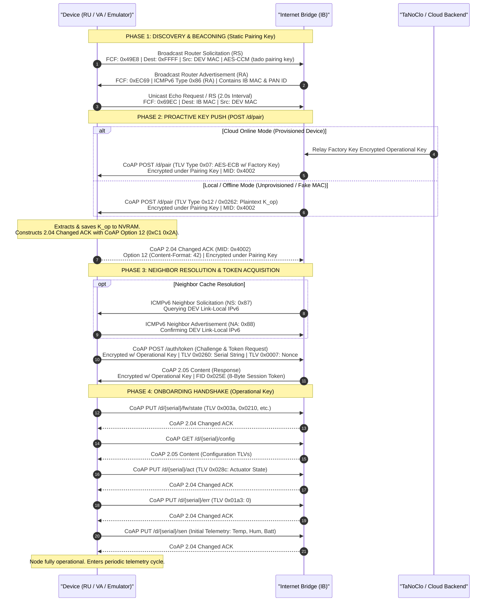

# Tado RF Pairing Protocol Specification

This document provides complete technical specifications of the radio-frequency (RF) pairing, key negotiation, and onboarding protocol between Tado Sub-GHz battery-powered nodes (Valve Actuators `VA`, Room Units `RU`, Smart Thermostats `ST`, Wireless Sensors `WR/SU`) and the Tado Internet Bridge (IB).

---

## 1. Handshake Architecture & Core Principles

Initial trust bootstrapping and operational onboarding consist of four distinct phases:

1. **Discovery & Beaconing Phase (Phase 1):** The unassociated device broadcasts encrypted ICMPv6 Router Solicitations (RS) under the static `tado pairing key`. The IB responds with an ICMPv6 Router Advertisement (RA), enabling the device to capture the IB's 8-byte EUI-64 MAC address and 16-bit PAN ID.
2. **Proactive Key Push Phase (Phase 2):** The Internet Bridge sends a CoAP `POST /d/pair` under the static Pairing Key, distributing the 16-byte network Operational Key ($K_{\text{op}}$).
   - **Online Mode:** Key is encrypted with the device's factory key ($K_{\text{factory}}$ / $K_{\text{NVM-34}}$) via AES-ECB (TLV `0x07`).
   - **Offline Mode:** Key is pushed in plaintext inside TLV `0x12` (or TLV `0x0262` / `0x0155`).
   - The device confirms receipt by replying with a CoAP `2.04 Changed` ACK.
3. **Neighbor Resolution & Token Acquisition (Phase 3):** The IB queries the device via ICMPv6 Neighbor Solicitation (`0x87`), and the device responds with Neighbor Advertisement (`0x88`). The device requests a session token via CoAP `POST auth/token` (TLV `0x0260`), and receives an 8-byte Session Token (`0x025E` / CoAP Option 2048).
4. **Post-Pairing Onboarding Sequence (Phase 4):** The newly paired node executes a structured, staggered bootup handshake (`PUT /d/{serial}/fw/state`, `GET /d/{serial}/config`, `PUT /d/{serial}/act`, `PUT /d/{serial}/err`, and `PUT /d/{serial}/sen`) under the Operational Key.

> [!NOTE]
> **MAC Address:**
> The 8-byte EUI-64 MAC address (`00:1B:C5:07:xx:xx:xx:xx`) is assigned at the physical radio layer and burned into hardware flash (Sector 508 on VA/RU).

---

## 2. End-to-End Handshake Flow

---

## 3. Cryptographic Keys & Primitives

### 3.1 Key Hierarchy

| Key Level | Length | Storage / Location | Purpose |
|---|---|---|---|
| **Static Pairing Key** | 16 Bytes | Hardcoded in firmware (`"tado pairing key"` / `74 61 64 6f 20 70 61 69 72 69 6e 67 20 6b 65 79`) | Encrypts discovery beacons, Router Solicitations, and `POST /d/pair` frames. |
| **Factory Key ($K_{\text{factory}}$ / $K_{\text{NVM-34}}$)** | 16 Bytes | Burned in factory NVS (Sector 508) & Cloud DB | Device-unique key used to decrypt the Operational Key in Online Mode (TLV `0x07`). |
| **Operational Key ($K_{\text{op}}$)** | 16 Bytes | Network-wide shared key (NVRAM Index 7) | Encrypts all regular operational CoAP traffic.
| **Session Token** | 8 Bytes | Volatile session state (Option 2048 / TLV `0x025E`) | Ephemeral session credential attached to CoAP requests for backend validation. |

### 3.2 Operational Key Push Variants (`POST /d/pair`)

During Phase 2, the Internet Bridge distributes the Operational Key using one of the following payload formats:

1. **Variant A: Plaintext Key Push (TLV `0x12` / `0x0155` / `0x0262`)**:
   - Used when the IB is offline, or when pairing a device whose factory key is not in the backend database.
   - Payload structure:
     - `0x12 0x10 <16_BYTES_K_OP>` (1-byte Tag format)
     - OR `0x02 0x62 0x10 <16_BYTES_K_OP>` / `0x01 0x55 0x10 <16_BYTES_K_OP>` (2-byte Tag format).
2. **Variant B: Factory-Encrypted Key Push (TLV `0x07`)**:
   - Used when the IB is online and the device is recognized in the cloud database.
   - Payload structure:
     - `0x07 0x10 <16_BYTES_CIPHERTEXT>`
   - Plaintext $K_{\text{op}}$ is recovered via AES-128-ECB decryption:
     $$K_{\text{op}} = \text{AES-ECB}_{\text{Decrypt}}(K_{\text{factory}}, \text{Payload}_{\text{TLV 0x07}})$$

---

## 4. Post-Pairing Onboarding (Stages 0–6)

| Stage | Action | Message Details |
|:---:|---|---|
| **0** | **Link Setup** | Send 2x Router Solicitation (`0x85`) + 1x Neighbor Advertisement (`0x88`). |
| **1** | **Token Handshake** | Send CoAP `POST /auth/token` with TLV `0x0260` (Serial) and `0x0007` (Nonce). |
| **2** | **Firmware Push** | Send CoAP `PUT /d/{serial}/fw/state` with firmware TLVs. |
| **3** | **Config Sync** | Send CoAP `GET /d/{serial}/config` to sync home/zone configuration. |
| **4** | **Actuator State** | Send CoAP `PUT /d/{serial}/act` (`0x028c: 0`). |
| **5** | **Error Clear** | Send CoAP `PUT /d/{serial}/err` (`0x01a3: 0`). |
| **6** | **Telemetry Push** | Send CoAP `PUT /d/{serial}/sen` with ambient temperature, humidity, battery voltage, and reset counter. |