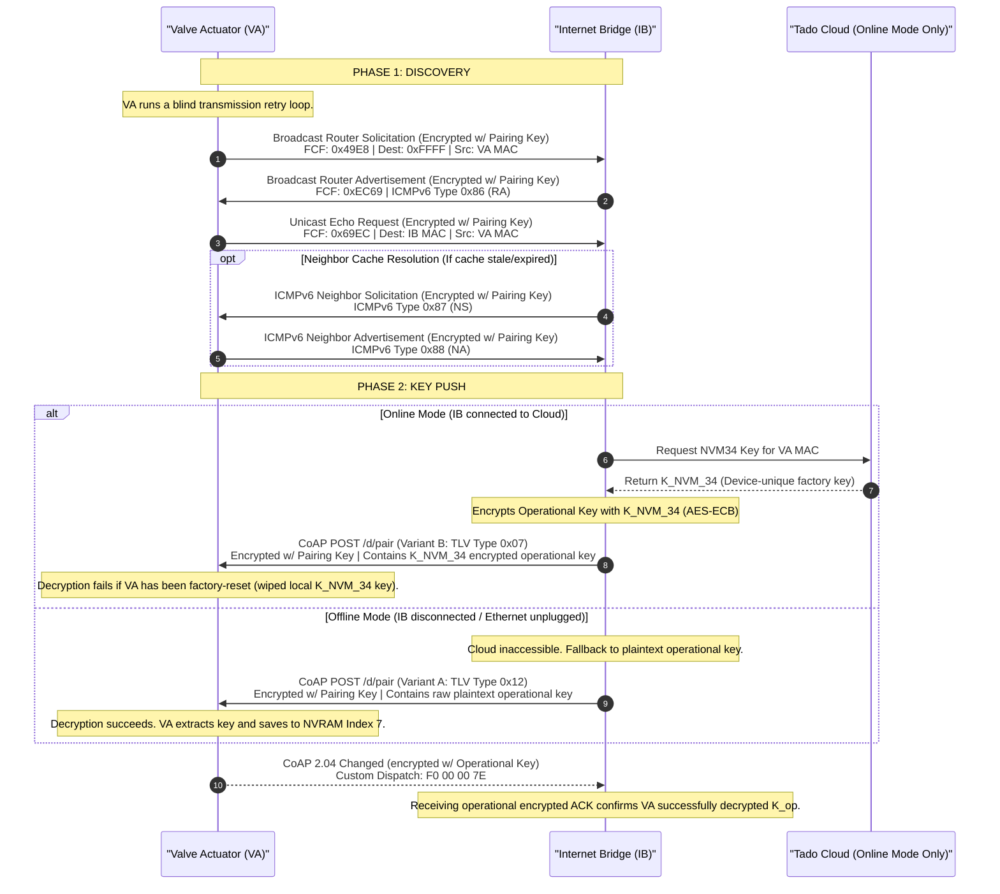
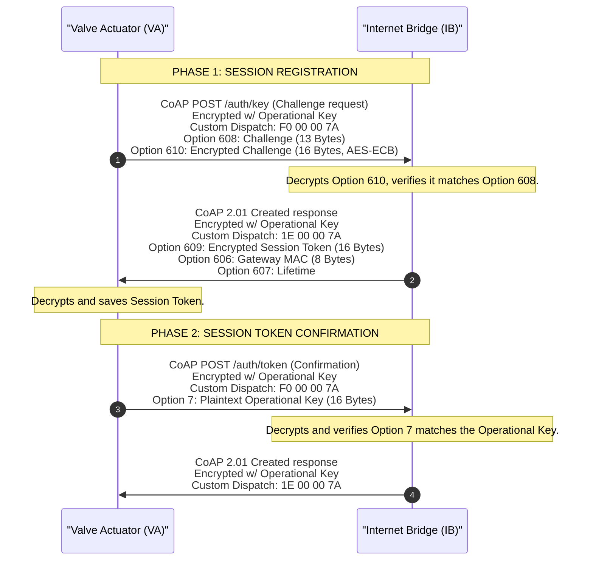
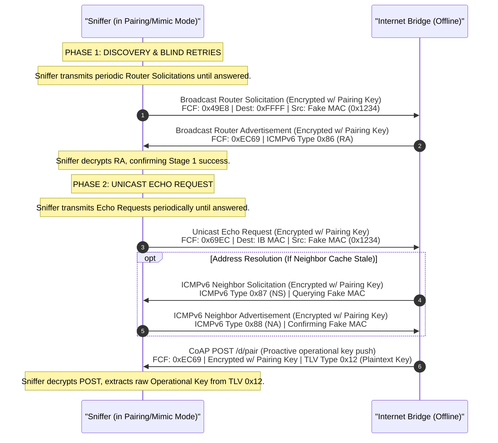

# Tado RF Pairing Protocol Specification

This document provides specifications of the radio-frequency (RF) pairing and key-negotiation protocol between the Tado Valve Actuator (VA) and the Tado Internet Bridge (IB).

---

## 1. Handshake Flows & Sequences

Initial trust bootstrapping and operational execution consist of two distinct native sequences:

1. **Native Pairing Flow (Proactive Key Push):** The native process used by the Internet Bridge to distribute the network-wide 16-byte Operational Key ($K_{\text{op}}$) to an unassociated or factory-reset Valve Actuator. The IB proactively pushes this key via CoAP `/d/pair` (encrypted under the static Pairing Key).
2. **Native Operational Session Authentication (Bootup/Registration):** Once a Valve Actuator has been successfully paired and possesses the Operational Key, it must authenticate its session with the IB upon bootup or reconnection. It does this by executing a CoAP `/auth/key` and `/auth/token` handshake, which is **fully encrypted under the Operational Key**.

---

### 1.1 Native Proactive Key Push Flow

This flow is the native mechanism used to pair new devices. The format of the pushed key depends on the IB's online status (connected to Tado cloud vs. offline):

---

### 1.2 Native Operational Session Authentication (Bootup)

Once paired, a Valve Actuator establishes a session with the IB using the Operational Key. This transaction is fully encrypted using the Operational Key (AES-128-CCM):

---

### 2. Message Formats & Cryptographic Primitives

During the pairing sequence, frames use the **Pairing Mode Tado Custom Dispatch** header, which contains the little-endian sender short address in bytes 0-1, and `00 7E` in bytes 2-3. This results in:
*   **`F0 00 00 7E`** for frames transmitted by the Valve Actuator (using temporary pairing short address `0x00F0`).
*   **`1E 00 00 7E`** for frames transmitted by the Internet Bridge (using temporary pairing short address `0x001E`).

These dispatches segment pairing traffic from operational traffic (which uses dispatches like `23 00 00 7A`).

### 2.1 CoAP Option Registry for Pairing

The pairing protocol uses a specialized set of CoAP options. The following table lists these options in cumulative sequence order:

| Option ID (Dec) | Option ID (Hex) | Name | Size (Bytes) | Format | Purpose |
| :--- | :--- | :--- | :--- | :--- | :--- |
| **`7`** | `0x07` | `Uri-Query` / `Auth-Token` | 16 | Plaintext Bytes | Carries the raw Operational Key during the `/auth/token` confirmation request. |
| **`11`** | `0x0B` | `Uri-Path` | Variable | UTF-8 String | Path segments: `"auth"` and `"key"` or `"token"`. |
| **`606`** | `0x25E` | `Gateway-MAC` | 8 | Extended Address | Cleartext extended IEEE address of the Internet Bridge. |
| **`607`** | `0x25F` | `Lifetime` | 4 | Uint32 | Operational lifetime or session timeout parameter. |
| **`608`** | `0x260` | `Challenge` | 13 | Plaintext Bytes | Cleartext random challenge generated by the Valve Actuator. |
| **`609`** | `0x261` | `Encrypted-Key` | 16 | Encrypted Bytes | Operational Key encrypted with the static Pairing Key. |
| **`610`** | `0x262` | `Encrypted-Challenge` | 16 | Encrypted Bytes | Challenge encrypted with the static Pairing Key. |

---

## 3. Cryptographic Operations & Distribution Variants

### 3.1 Bootstrap Keys
The pairing handshake relies on two distinct key levels:
1.  **Static Pairing Key:** A hardcoded key embedded in the firmware of every Tado device at production.
    - **ASCII:** `"tado pairing key"`
    - **Hex:** `74 61 64 6f 20 70 61 69 72 69 6e 67 20 6b 65 79`
    - **NVM Location:** NVM Index 2 (Read-Only).
2.  **Operational Key (Network RF Key):** A static 16-byte key shared by all devices on a given Home/IB network. It is generated once by the Internet Bridge during initial setup.
    - **NVM Location:** NVM Index 7 (Read/Write).

### 3.2 Challenge Verification (AES-128-ECB)

The Valve Actuator generates 13 random bytes ($C$), pads them with 3 zero-bytes to form a 16-byte block ($C_{\text{padded}}$), and encrypts it using the Pairing Key ($K_{\text{pair}}$):

$$C_{\text{enc}} = \text{AES-ECB}_{\text{Encrypt}}(K_{\text{pair}}, C_{\text{padded}})$$

- **Padded Challenge (16 Bytes):** `C [0..12] || 00 00 00`
- **AES-ECB Ciphertext ($C_{\text{enc}}$):** Sent in Option 610 (`0x262`).

The Internet Bridge decrypts Option 610 and asserts that the decrypted plaintext matches the raw challenge sent in Option 608.

### 3.3 Operational Key Distribution Variants

When distributing the Operational Key ($K_{\text{op}}$) to a joining device, the Internet Bridge behaves differently depending on whether it is **connected to the Tado cloud** (online) or **disconnected** (offline):

#### 3.3.1 Online Mode (Variant B - Encrypted operational Key - TLV Type `0x07`)
If the IB is connected to the internet and has access to the Tado backend database:
- The backend retrieves the device-specific cryptographic key $K_{\text{NVM-34}}$ associated with the joining device's MAC/Serial.
- The operational key is encrypted using the device's $K_{\text{NVM-34}}$ key:
  $$K_{\text{op-enc}} = \text{AES-ECB}_{\text{Encrypt}}(K_{\text{NVM-34}}, K_{\text{op}})$$
- This encrypted key is sent in **TLV Type `0x07`**.
- *Note on NVM34 Key:* The $K_{\text{NVM-34}}$ key is a device-unique cryptographic key randomly generated and programmed in the factory. It cannot be derived offline. If a device has been factory-reset, it loses this key and cannot decrypt the TLV `0x07` payload, leading to handshake failure.

#### 3.3.2 Offline Mode (Variant A - Plaintext operational Key - TLV Type `0x12`)
If the IB is disconnected from the internet (e.g. Ethernet cable unplugged) and forced to run in local offline pairing mode:
- The IB has no access to the Tado backend database to fetch the $K_{\text{NVM-34}}$ key for unknown devices.
- If pairing is initiated with an **unknown / fake MAC address** (such as our static MAC `001BC50731561234`), the IB cannot generate a device-specific encrypted payload.
- As a fallback, the IB is forced to distribute the operational network key in **plaintext** inside **TLV Type `0x12`**.
- This plaintext distribution allows our pairing/extraction component to easily sniff and save the operational key without needing complex device-specific nonces or keys.

---

## 4. Sniffer Extraction Techniques

An eavesdropper or monitor can extract the Operational Network Key using the following methods:

### 4.1 Passive Extraction: Option 609 (Encrypted Operational Key)
During Phase 2, the sniffer monitors CoAP response code `2.01 Created` (`0x41`) under pairing-key decryption. Upon locating Option 609 (`0x261`), it decrypts it:
$$K_{\text{op}} = \text{AES-ECB}_{\text{Decrypt}}(K_{\text{pair}}, \text{Option } 609)$$

### 4.2 Passive Extraction: Option 7 (Plaintext Operational Key)
During Phase 3, the sniffer monitors CoAP request code `POST` (`0x02`) to `/auth/token`. If Option 7 is present, the sniffer extracts the 16-byte value directly in cleartext.

### 4.3 Proactive Offline Bypass Extraction (TLV `0x12` Exploit)
By using a fake MAC address (`001BC50731561234`) and taking the IB offline, the sniffer intercepts the proactively pushed `POST /d/pair` frame. Since the IB has no internet connection to query the cloud for the device-unique NVM34 key, it is forced to send the key inside TLV `0x12` in plaintext. The sniffer reads this directly from the payload.

---

## 5. Active Pairing Sniffer Timing

Because microsecond-accurate CSL synchronization is highly sensitive to firmware overhead and radio latencies, the sniffer does not use CSL synchronization. Instead, the sniffer configuration is designed to run a blind, high-frequency periodic transmission retry loop (30 retry cycles) to ensure it hits the Internet Bridge's narrow receiver windows.

---

## 6. Internet Bridge Router Advertisement (RA) Broadcast

During Phase 1 (discovery), the Internet Bridge broadcasts encrypted ICMPv6 Router Advertisements (RA) to announce its network parameters, link-layer address, and IPv6 prefixes on the pairing channel.

### 6.1 Frame & Plaintext Structure
The broadcast packet uses standard Data frame encapsulation (`0xEC69`) and is encrypted using the static **Pairing Key** with **AES-128-CCM**. 

Once decrypted, the payload has the following structure:
- **Source MAC suffix** (`plaintext[0..2]`): 3-byte trailer.
- **Inner Header** (`plaintext[3]`): `0x3B` (Next Header: No Next Header/Custom) instead of the standard `0x04` used in operational mode.
- **Sequence Number** (`plaintext[4]`): Standard sequence counter.
- **6LoWPAN Dispatch / Alignment** (`plaintext[5]`): `0x01` (uncompressed next header alignment).
- **ICMPv6 RA Header** (`plaintext[6..21]`):
  - Byte 6: `0x86` (ICMPv6 Router Advertisement Type)
  - Byte 7: `0x00` (Code)
  - Bytes 8-9: Checksum
  - Byte 10: `0x40` (Cur Hop Limit = 64)
  - Byte 11: `0x40` (Flags: Managed address configuration)
  - Bytes 12-13: `0x0708` (Router Lifetime = 1800 seconds)

---

## 7. Active Key Sniffing via Reset VA Mimicry (Proactive Offline Bypass)

The proactive offline bypass exploit mimics a factory-reset Valve Actuator using a fake MAC address while the Internet Bridge is disconnected from the internet. This forces the IB to disclose the operational network key in plaintext.

### 7.1 Exploitation Procedure
1. **Go Offline**: Disconnect the Tado Internet Bridge from the local network / internet (unplug the Ethernet cable).
2. **Trigger Pairing Mode**: Press the physical pairing button on the Internet Bridge until the Link LED flashes.
3. **Wait for the IB MAC to be captured**: The IB will broadcast its MAC address in a unicast Echo Request.
4. **Execute Challenge**: Click the "Retrieve RF key" button on the sniffer interface. The sniffer automatically extracts the plaintext Operational Key from the resulting offline CoAP `/d/pair` (TLV `0x12`) packet.