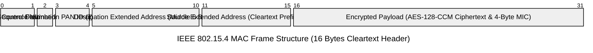
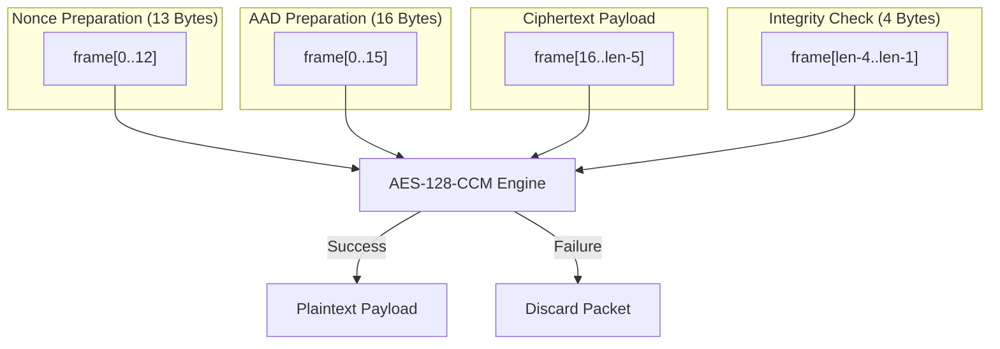
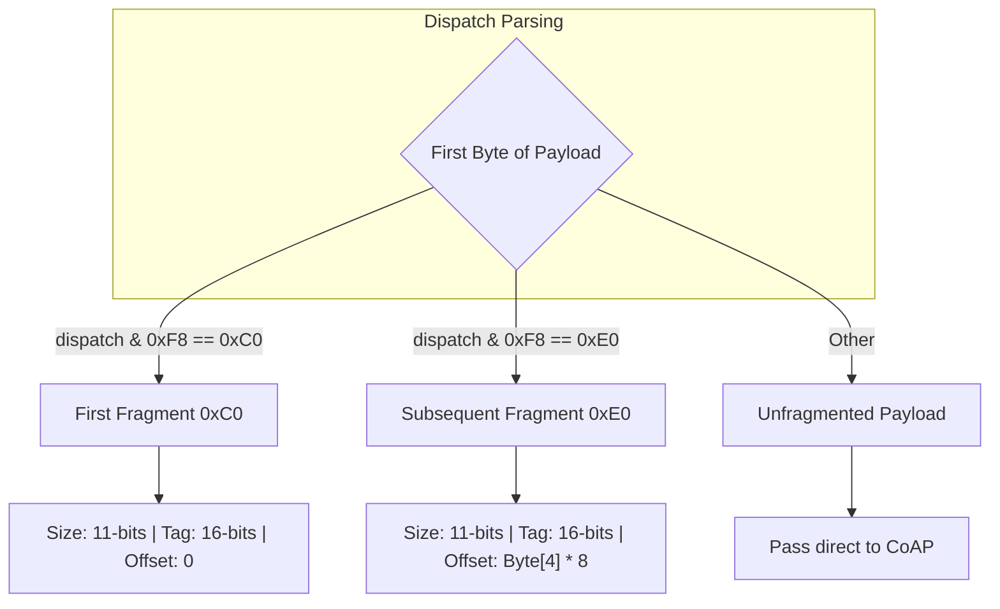

# Tado RF Protocol Specification

This document provides the specification of the radio frequency (RF) protocol used by Tado devices (including the Internet Bridge, Smart Radiator Thermostats (VA), and Smart Room Thermostats) and the Tanoclo RF Sniffer Receiver implementation details. It covers the physical layer, the Tado communication framework (CoAP and custom protocols), cryptographic details, and the complete RF packet structure from physical transmission to the application-layer payload.

Based on real-world data and the [Tado Hardware Teardown Wiki](https://github.com/sdegeorgio/Tado_Hardware_Teardown/wiki).

---

## 1. Physical Layer (PHY)

The Physical Layer for both sniffing and transmission (as implemented in `tado_emulator` and `tado_sniffer`) is managed by a Semtech SX1276 LoRa/FSK transceiver operated in **FSK Packet Mode**. The radio configuration provides maximum sensitivity and robust reception/transmission in the 868 MHz ISM band.

### 1.1 SX1276 Register Configuration

The following table lists the definitive register configuration used to initialize the SX1276 transceiver for both continuous reception and low-latency packet transmission:

| Register Hex | Name | Value | Binary | Description / Rationale |
| :--- | :--- | :--- | :--- | :--- |
| `0x01` | `REG_OP_MODE` | `0x05` | `00000101` | Sets Mode to **RX (Continuous Receiver Mode)** (transiently set to SLEEP `0x00` / TX `0x03` during transmission). |
| `0x02` | `REG_BITRATE_MSB` | `0x02` | `00000010` | Bitrate MSB. Combined with LSB yields $Bitrate = \frac{F_{\text{osc}}}{BitRate} = 50,000\text{ bps}$ ($50\text{ kbps}$). |
| `0x03` | `REG_BITRATE_LSB` | `0x80` | `10000000` | Bitrate LSB. Register value $0x0280 = 640$. $Bitrate = \frac{32,000,000}{640} = 50,000\text{ bps}$. |
| `0x04` | `REG_FDEV_MSB` | `0x01` | `00000001` | Frequency Deviation MSB. Combined with LSB yields $25.39\text{ kHz}$ deviation. |
| `0x05` | `REG_FDEV_LSB` | `0xA0` | `10100000` | Frequency Deviation LSB. Register value $0x01A0 = 416$. $F_{\text{dev}} = 416 \times 61.035\text{ Hz} \approx 25.39\text{ kHz}$ (aligned with CC110L). |
| `0x09` | `REG_PA_CONFIG` | `0x8F` | `10001111` | Configures Power Amplifier to **PA_BOOST** at maximum output power (+17 dBm / +20 dBm). |
| `0x0A` | `REG_PARAMP` | `0x29` | `00101001` | Enables **GFSK modulation shaping** with BT=1.0 (matches CC110L MDMCFG2=0x13). |
| `0x0C` | `REG_LNA` | `0x23` | `00100011` | Sets LNA Gain to **G1 (Maximum Gain)** and enables **LNA Boost** for maximum sensitivity. |
| `0x0D` | `REG_RX_CONFIG` | `0x1E` | `00011110` | Enables **AfcAutoOn**, **AgcAutoOn**, and triggers RX on **PreambleDetect + RSSI**. |
| `0x10` | `REG_RSSI_THRESH` | `0xD2` | `11010010` | Sets **RSSI Threshold to -105 dBm** to prevent triggering on the noise floor. |
| `0x12` | `REG_RX_BW` | `0x0A` | `00001010` | RX Filter Bandwidth: **100 kHz** (Mantissa = 20, Exponent = 2). |
| `0x13` | `REG_AFC_BW` | `0x01` | `00000001` | AFC Bandwidth: **166.67 kHz** (Mantissa = 24, Exponent = 1). |
| `0x1A` | `REG_AFC_FEI` | `0x20` | `00100000` | Enables **AfcAutoClearOn** (clears frequency offset at RX start). |
| `0x1F` | `REG_PREAMBLE_DETECT` | `0xCA` | `11001010` | Enables **3-Byte Preamble Detector** with a detection size tolerance of 10. |
| `0x25` | `REG_PREAMBLE_MSB` | `0x00` | `00000000` | TX Preamble MSB: Sets preamble length for transmission. |
| `0x26` | `REG_PREAMBLE_LSB` | `0x04` | `00000100` | TX Preamble LSB: **4 bytes** (640 µs at 50 kbps, matching native CC110L MDMCFG1=0x22). |
| `0x27` | `REG_SYNC_CONFIG` | `0x73` | `01110011` | Sync Word Generation ON, **AutoRestartRx = 01** (Restart RX without PLL lock), **4-Byte Sync Word**. |
| `0x28` | `REG_SYNC_VALUE_1` | `0xD3` | `11010011` | Sync Word Byte 1: **`0xD3`** (Definitive Tado Sync Word MSB). |
| `0x29` | `REG_SYNC_VALUE_2` | `0x91` | `10010001` | Sync Word Byte 2: **`0x91`** (Definitive Tado Sync Word LSB). |
| `0x2A` | `REG_SYNC_VALUE_3` | `0xD3` | `11010011` | Sync Word Byte 3: **`0xD3`** (Definitive Tado Sync Word MSB). |
| `0x2B` | `REG_SYNC_VALUE_4` | `0x91` | `10010001` | Sync Word Byte 4: **`0x91`** (Definitive Tado Sync Word LSB). |
| `0x30` | `REG_PACKET_CONFIG_1` | `0x99` | `10011001` | **Variable Length Packets**, **Hardware CRC ON** (utilizes standard CCITT CRC polynomial for hardware-level validation), **CrcAutoClearOff = 1**. |
| `0x31` | `REG_PACKET_CONFIG_2` | `0x40` | `01000000` | Enables **Packet Mode** (disables beacon, home control, and whitening). |
| `0x32` | `REG_PAYLOAD_LENGTH` | `0x7F` | `01111111` | Sets Maximum Payload Length limit to **127 bytes** (optimizing FIFO streaming capture and transmission). |
| `0x35` | `REG_FIFO_THRESH` | `0x8E` | `10001110` | **TxStartCondition = FIFO Not Empty** (begins transmission immediately upon FIFO write), FIFO threshold = 14. |
| `0x40` | `REG_DIO_MAPPING_1` | `0x0C` | `00001100` | Maps DIO0 to `PayloadReady` (RX) / `PacketSent` (TX) and DIO2 to `SyncAddress`. |

> [!IMPORTANT]
> **No Address Whitening:** Tado devices do **not** use hardware or software whitening on the RF link. Standard `REG_PACKET_CONFIG_2` is explicitly set to `0x40` (disabling address whitening and keeping standard packet mode).

### 1.2 Channel Tuning and Frequency Bands

Tado is capable of transmitting on and receiving from 50 channels in the 868 MHz ISM band (numbered 0 to 49). In practice the Internet Bridge (IB) defaults to using **Channel 26** ($868.3237\text{ MHz}$).

The exact carrier frequency for a given channel is calculated using the following formula:

$$F_{\text{Hz}} = 863,125,000 + (\text{channel} \times 199,951)$$

In Megahertz, the tuning carrier frequency is:

$$F_{\text{MHz}} = 863.125 + (\text{channel} \times 0.199951)$$

#### SX1276 Frequency Register Synthesis ($F_{\text{rf}}$)
To tune the SX1276 carrier frequency, the computed $F_{\text{Hz}}$ is converted into a 24-bit register value ($F_{\text{rf}}$) written to `REG_FRF_MSB` (`0x06`), `REG_FRF_MID` (`0x07`), and `REG_FRF_LSB` (`0x08`).
The register value uses a step size of $F_{\text{step}} = \frac{32,000,000}{2^{19}} = 61.03515625\text{ Hz}$:

$$F_{\text{rf}} = \text{round}\left( \frac{F_{\text{Hz}}}{61.03515625} \right)$$

---

## 2. MAC Layer (IEEE 802.15.4)

Tado devices encapsulate physical radio payloads within standard **IEEE 802.15.4-2003** Data Frames.

### 2.1 MAC Frame Format



### 2.2 Frame Control Field (FCF)

The Frame Control Field consists of the first 2 bytes (`frame[0..1]`) and is hardcoded to **`0xEC69`** (transmitted over the air as `0x69` then `0xEC`) for all Data frames.

Parsing the 16 bits of `0xEC69` (binary `1110 1100 0110 1001`) from LSB to MSB:
- **Bits 0-2 (Frame Type):** `001` (Data Frame)
- **Bit 3 (Security Enabled):** `1` (AES Encryption Active)
- **Bit 4 (Frame Pending):** `0` (No additional packets waiting)
- **Bit 5 (AR / Acknowledgment Request):** `1` (Receiver must send MAC ACK)
- **Bit 6 (PAN ID Compression):** `1` (Single PAN ID shared; Source PAN ID compressed/omitted)
- **Bits 7-9 (Reserved):** `000`
- **Bits 10-11 (Dest Addressing Mode):** `11` (Extended 64-bit / 8-byte Address)
- **Bits 12-13 (Frame Version):** `00` (IEEE 802.15.4-2003)
- **Bits 14-15 (Source Addressing Mode):** `11` (Extended 64-bit / 8-byte Address)

### 2.3 Extended Addressing & Obfuscation

Tado compresses and obfuscates addresses on the air:
- **Destination Extended Address:** Reconstructed by combining Destination PAN ID (`frame[3..4]`) with the 6 cleartext bytes in the MAC header (`frame[5..10]`). The first 2 bytes of the Destination Extended Address (LSB in little-endian format) match the Destination PAN ID.
- **Source Extended Address:** The first **5 bytes** are transmitted in cleartext in the MAC header (`frame[11..15]`). The remaining **3 bytes** are placed at the very start of the plaintext payload (`plaintext[0..2]`) before encryption.

#### Address Reconstitution Algorithm
```
dst_ext[0..1] = frame[3..4]     (Destination PAN ID)
dst_ext[2..7] = frame[5..10]    (Cleartext Destination MAC suffix)

src_ext[0..4] = frame[11..15]   (Cleartext Source MAC prefix, 5 bytes)
src_ext[5..7] = plaintext[0..2] (Decrypted Source MAC suffix, 3 bytes)
```

### 2.4 IEEE 802.15.4 Short Address Derivation

Tado devices derive their 16-bit 802.15.4 Short Address directly from the first 2 bytes of their wire little-endian EUI-64 MAC address:

$$\text{short\_addr} = \text{mac\_addr}[0] \mid (\text{mac\_addr}[1] \ll 8)$$

---

## 3. Cryptographic Layer

All operational data payloads are encrypted and authenticated using **AES-128-CCM** (Counter with CBC-MAC) according to standard IEEE 802.15.4 security operations.

### 3.1 Primitives and Layout

- **Algorithm:** AES-128-CCM (`mbedtls_ccm_auth_decrypt` / `mbedtls_ccm_encrypt_and_tag`)
- **Key Size:** 128 bits (16 bytes)
- **Nonce Size:** 13 bytes (`frame[0..12]`)
- **Additional Authenticated Data (AAD) Size:** 16 bytes (`frame[0..15]`, spanning the entire MAC header)
- **Message Integrity Code (MIC) Size:** 4 bytes (appended immediately following ciphertext)


### 3.2 Security Keys

1. **Pairing Key:** Static bootstrap key hardcoded in every Tado device:
   - **ASCII:** `"tado pairing key"`
   - **Hex:** `74 61 64 6f 20 70 61 69 72 69 6e 67 20 6b 65 79`
2. **Operational Key ($K_{\text{op}}$):** Dynamic 128-bit network key shared across all devices in a Home, negotiated via `POST /d/pair`.

---

## 4. Plaintext Payload Structure & Wire Framing

Once decrypted (or prior to encryption during transmission), the plaintext payload layout contains:

| Offset (Bytes) | Field Name | Size (Bytes) | Description |
| :--- | :--- | :--- | :--- |
| `0..2` | `SRC_EXT_tail` | 3 | Last 3 bytes of Source Extended MAC (`mac_addr[5..7]`). |
| `3` | `Inner Protocol Header` | 1 | `0x04` for standard data/CoAP, `0x3B` for ICMPv6 RA broadcast. |
| `4` | `Sequence Number` | 1 | 1-byte frame sequence number. |
| `5..8` | `Tado Custom Dispatch` | 4 | Sender Short Addr (2B LE) + Context (1B) + Dispatch Mode (1B: `0x7E`/`0x7C`/`0x7A`). |
| `9..14` | `6LoWPAN IPHC / NHC Header` | 6 | Port compression: `0x33 0xF0 0x16 0x33 <dst_port_hi> <dst_port_lo>` (or 7B `0xF7 0x00 0xF0...`). |
| `15..16` | `IPv6 UDP Checksum` | 2 | Standard RFC 768 / RFC 2460 UDP checksum over link-local IPv6 pseudo-header. |
| `17..N` | `CoAP Protocol Message` | Variable | Encapsulated standard RFC 7252 CoAP datagram. |
| `N+1..N+2` | `CRC16-Kermit Trailer` | 2 | CRC-16 Kermit checksum computed over `frame_header (16B) + plaintext`. |

### 4.1 IPv6 UDP Checksum Computation

The 2-byte UDP checksum at `plaintext[15..16]` is calculated over:
1. **IPv6 Link-Local Pseudo-Header (40 bytes)**:
   - Source IPv6 (`fe80::...` derived from source MAC)
   - Destination IPv6 (`fe80::...` derived from dest MAC)
   - Upper-Layer Packet Length (8 + CoAP size)
   - Next Header (`17` for UDP)
2. **UDP Header (8 bytes)**: Source port (`5683`), Destination port (e.g. `4005` or `5683`), Length, Zero Checksum.
3. **CoAP Payload**.

### 4.2 Frame CRC16-Kermit Trailer

Tado hardware appends a 2-byte CRC16-Kermit checksum at the end of the plaintext buffer before AES encryption:
- **Polynomial:** `0x1021` (reflected: `0x8408`), Initial value: `0x0000`.
- **Data Covered:** The 16-byte cleartext frame header + entire plaintext data payload.

### 4.3 Mandatory CoAP Option 12 on Acknowledgments (`0xC1 0x2A`)

When answering incoming CoAP requests from the Internet Bridge (e.g., `POST /d/pair` or telemetry syncs):
- The response ACK MUST include **CoAP Option 12 (`Content-Format: 42`)**, serialized as `0xC1 0x2A`.
- If Option 12 is omitted, the Internet Bridge radio firmware treats the ACK as incomplete and repeatedly retransmits the request.

### 4.4 Tado Custom Dispatch

The 4-byte Tado Dispatch field determines the sender's identity and the operating context of the message:
*   **Bytes 0-1 (Sender Short Address):** The little-endian representation of the transmitting device's short address.
    - `F0 00` (0x00F0): Temporary short address used by a Valve Actuator during pairing request phase.
    - `1E 00` (0x001E): Temporary short address used by the Internet Bridge during pairing response phase.
    - Dynamic values (e.g. `0E 03` for 0x030E) represent the operational short addresses assigned post-pairing.
*   **Bytes 2-3 (Mode):** Dictates the communication state:
    - `00 7E`: **Pairing Handshake Mode**.
    - `00 7A`: **Operational Mode**.

Thus, common dispatch headers include `F0 00 00 7E` (VA pairing request), `1E 00 00 7E` (IB pairing response), and dynamic values like `0E 03 00 7A` (operational telemetry).

### 4.5 6LoWPAN UDP Next Header Compression (NHC)

To conserve bandwidth over the air, Tado implements standard 6LoWPAN UDP compression. The NHC header format varies dynamically depending on the source and destination ports:

#### 1. 6-Byte NHC Header (`33 F0 16 33 0F A5`)
Used for traffic targeted at the Internet Bridge's pairing port (`4005`) from client port (`5683`).
*   **`0x33`:** 6LoWPAN IPHC dispatch byte.
*   **`0xF0`:** NHC-UDP control byte (checksum inline, ports compressed).
*   **`0x16 0x33`:** Source Port offset remapping ($0x1633 = 5683$).
*   **`0x0F 0xA5`:** Destination Port offset remapping ($0x0FA5 = 4005$).

#### 2. 7-Byte NHC Header (`F7 00 F0 16 33 16 33`)
Used for standard operational CoAP traffic where both source and destination ports are mapped to `5683`.
*   **`0xF7`:** 6LoWPAN IPHC dispatch byte.
*   **`0x00`:** Hop limit / Reserved byte.
*   **`0xF0`:** Port Compression control byte.
*   **`0x16 0x33`:** Source Port offset remapping ($0x1633 = 5683$).
*   **`0x16 0x33`:** Destination Port offset remapping ($0x1633 = 5683$).

### 4.6 Decrypted Plaintext Byte Layout (Fragmented vs Unfragmented)

The position of the 6LoWPAN dispatch byte differs between fragmented and unfragmented packets due to the interleaving of the fragmentation header:

#### Unfragmented Packets
```
plaintext[0..2]  = Source MAC tail (3 bytes)
plaintext[3]     = Inner Protocol Header (0x04)
plaintext[4]     = Sequence Number
plaintext[5..8]  = Tado Custom Dispatch (4 bytes: short_addr LE + mode)
plaintext[9..]   = 6LoWPAN NHC Header → CoAP
```
The NHC dispatch byte is at **`plaintext[9]`** (offset 4 in `tado_payload = plaintext + 5`).

#### Fragmented Packets (FRAG1)
```
plaintext[0..2]  = Source MAC tail (3 bytes)
plaintext[3]     = Inner Protocol Header (0x04)
plaintext[4]     = Sequence Number
plaintext[5..7]  = Sender Short Addr (2B) + Prefix (1B)  ← extracted separately
plaintext[8..11] = FRAG1 Dispatch Header (4 bytes: dispatch+size, tag)
plaintext[12..]  = Fragment payload (starts with Tado Custom Dispatch + NHC + CoAP)
```
Within the fragment payload, the NHC dispatch byte is at **`plaintext[12+4]`** = **`plaintext[16]`** (i.e., after 4 bytes of Tado Custom Dispatch). But the reassembler input starts at `plaintext[8]`, so relative to the dispatch header, the fragment payload starts at offset 4 (FRAG1 header = 4 bytes).

---

## 5. 6LoWPAN Reassembly (Fragmentation)

Large CoAP transmissions (such as complete configuration updates, schedules, and pairing handshakes) exceed the standard 802.15.4 single-packet limits. Tado resolves this by utilizing standard **6LoWPAN Fragmentation Dispatches** (RFC 4944).

The `SixLoWPANReassembler` manages the accumulation and stitching of incoming fragments back into complete CoAP datagrams.

### 5.1 Fragmentation Dispatch Formats



#### 1. First Fragment (`0xC0` prefix)
Signals the start of a fragmented transmission. 

```
Byte 0:     [1 1 0 0 0 | Size MSB (3-bits)] -> Prefix 0xC0
Byte 1:     [Size LSB (8-bits)]
Byte 2:     [Datagram Tag MSB]
Byte 3:     [Datagram Tag LSB]
Byte 4+:    Fragment Data payload...
```

*   **Size Calculation:** `uint16_t size = ((payload[0] & 0x07) << 8) | payload[1];`
*   **Tag Extraction:** `uint16_t tag = (payload[2] << 8) | payload[3];`
*   **Offset:** Implicitly $0$.

#### 2. Subsequent Fragments (`0xE0` prefix)
Carries consecutive chunks of the fragmented payload.

```
Byte 0:     [1 1 1 0 0 | Size MSB (3-bits)] -> Prefix 0xE0
Byte 1:     [Size LSB (8-bits)]
Byte 2:     [Datagram Tag MSB]
Byte 3:     [Datagram Tag LSB]
Byte 4:     [Fragment Offset] (divided by 8)
Byte 5+:    Fragment Data payload...
```

*   **Size Calculation:** `uint16_t size = ((payload[0] & 0x07) << 8) | payload[1];`
*   **Tag Extraction:** `uint16_t tag = (payload[2] << 8) | payload[3];`
*   **Offset Calculation:** `uint16_t offset = payload[4] * 8;` (Multiply by 8 to reconstitute the byte index!)

### 5.2 Reassembly State and Timing Parameters

The `SixLoWPANReassembler` handles packet aggregation and cleanups using the following parameters:
- **Maximum Reassembly Buffers:** Managed dynamically inside a `std::map<uint16_t, Datagram>` structure indexed by the unique 16-bit `tag`.
- **Reassembly Timeout:** **10 seconds** (`10000ms`). If a fragment for a tagged datagram is not received within 10 seconds of the last fragment, the entire datagram buffer is discarded as stale.
- **Cleanup Interval:** **5 seconds** (`5000ms`). A periodic background cleanup routine checks and purges stale buffers.
- **Duplicate Detection:** If a fragment arrives with an offset that has already been filled in the `fragments` map, it is treated as a duplicate or overlap and ignored.

### 5.3 Header Compression Expansion and Correct Offset Mapping

> [!IMPORTANT]
> The `datagram_size` field in the fragmentation header expresses the **uncompressed** IPv6/UDP datagram size (i.e., as if no 6LoWPAN header compression had been applied). Similarly, the `offset` field in subsequent fragments is expressed in units of 8 bytes of the **uncompressed** datagram. Because Tado uses IPHC/NHC to compress the IPv6+UDP headers, the **compressed on-the-wire size** of the datagram is smaller than the declared `datagram_size`. A reassembler operating on compressed fragments must account for this difference.

#### Header Expansion Math

The uncompressed IPv6 header (40 bytes) + UDP header (8 bytes) = **48 bytes** of headers. 6LoWPAN header compression replaces these with a much shorter compressed representation. The **expansion** is defined as:

$$\text{expansion} = 48 - \text{compressed-header-size}$$

Where `compressed_header_size` is the number of bytes between the end of the fragmentation dispatch header and the start of the CoAP payload inside FRAG1. This can be computed dynamically as:

$$\text{compressed-header-size} = \text{coapOffset} - 12$$

(Where `coapOffset` is the absolute byte position of the first CoAP header byte within the decrypted buffer, and `12` is the length of the 5-byte prefix + 3-byte net prefix + 4-byte FRAG1 header.)

#### Known Compression Formats and Their Expansions

| NHC Dispatch | Compressed Header | Expansion | CoAP Offset (in FRAG1) | Example Use |
|:---|:---|:---|:---|:---|
| `0x33` (6-byte NHC) | 9 bytes | 39 | 21 | Pairing: src=5683, dst=4005 |
| `0xF7` (7-byte NHC) | 10 bytes | 38 | 22 | Operational: src=5683, dst=5683 |
| `0xF5` (8-byte inline dest) | 18 bytes | 30 | 30 | Inline dest IP NHC |
| `0xD7` (8-byte + hop limit) | 19 bytes | 29 | 31 | Inline dest IP + hop limit |

#### Compressed Offset Calculation for FRAGN

The `offset` field in a FRAGN dispatch refers to uncompressed byte positions. To correctly place a fragment's data in the compressed buffer, the reassembler must subtract the expansion:

$$\text{compressedOffset} = (\text{offset-field} \times 8) - \text{expansion}$$

#### Practical Example (Pairing Request, 135-byte datagram)

- **Declared datagram_size:** 135 (uncompressed)
- **NHC dispatch:** `0x33` → expansion = 39
- **Compressed datagram size:** 135 − 39 = **96 bytes**
- **FRAG1 payload:** 91 bytes (offsets 0–90 in compressed space)
- **FRAGN offset field:** `0x10` (16) → uncompressed offset = 128 → compressed offset = 128 − 39 = **89**
- **FRAGN payload:** 9 bytes (offsets 89–97 in compressed space)
- **Overlap:** FRAG1 covers bytes 0–90, FRAGN starts at byte 89 → **2 bytes overlap** (bytes 89 and 90)
- **Net coverage:** 91 + 9 − 2 = 98 bytes ≥ 96 → **reassembly complete**

> [!WARNING]
> A naïve reassembler that uses `datagram_size` (135) as the completion threshold and stores FRAGN at uncompressed offset 128 will **never** complete reassembly, because there will always appear to be a 37-byte gap between FRAG1 (ending at byte 91) and FRAGN (starting at byte 128). The correct approach is to: (1) compute the expansion from FRAG1's NHC header, (2) translate all FRAGN offsets to compressed space, and (3) use `compressedSize = datagram_size − expansion` as the completion threshold.

#### Handling Out-of-Order FRAGN Before FRAG1

If a FRAGN arrives before its corresponding FRAG1 (and thus before the expansion is known), the reassembler should store it using a default estimated expansion (40 bytes is a safe fallback). When FRAG1 subsequently arrives and the precise expansion is calculated, all previously stored FRAGN offsets must be re-keyed using the corrected expansion value.

---

## 6. Packet Flow and Decoding Example

To illustrate the complete decapsulation stack, consider a telemetry status frame sniffed on **Channel 26 (868.323 MHz)**.

### 6.1 Raw Encrypted Frame (Over the Air)
```hex
69 EC 4D 11 22 11 22 33 44 55 66 77 88 50 01 02 
FA DB C0 EF FE A9 DB E4 18 C0 AA BB DD 12 CC FF
```
1.  **SX1276 FSK Sync Word Match:** Matches `D3 91`. Carrier tuned to $868.3237\text{ MHz}$.
2.  **MAC Frame Header Parsing:**
    - FCF: `frame[0..1] = 0x69 0xEC` (`0xEC69` -> Security enabled Data Frame).
    - Sequence No: `frame[2] = 0x4D`.
    - PAN ID: `frame[3..4] = 0x11 0x22` (matches `dst_mac[0..1]`).
    - Dest Extended Address: `frame[5..12] = 11 22 33 44 55 66 77 88`.
    - Src Extended Address (Clear prefix): `frame[13..15] = 50 01 02`.
3.  **AES-128-CCM Decryption:**
    - Key: Operational Key (16 bytes loaded from NVRAM index 7).
    - Nonce: `69 EC 4D AB CD 11 22 33 44 55 66 77 88` (first 13 bytes).
    - AAD: `69 EC 4D AB CD 11 22 33 44 55 66 77 88 50 01 02` (first 16 bytes).
    - Ciphertext Payload: bytes index 16 to end (excluding last 4 bytes).
    - Decryption is successful.

### 6.2 Decrypted Plaintext Payload
```hex
03 04 05 06 07 04 4D 23 00 00 7A F7 00 F0 16 33 
16 33 40 02 AA BB ...
```
1.  **Address Reconstitution:**
    - Clear MAC Src: `50 01 02`
    - Plaintext Decrypted Tail: `03 04 05 06 07` (First 5 bytes of plaintext)
    - Full Reconstituted Src MAC: **`50:01:02:03:04:05:06:07`**
2.  **Inner Encapsulation Header Validation:**
    - Byte 5: `0x04` (Encapsulation verified).
    - Byte 6: `0x4D` (Sequence matches).
3.  **Tado Custom Dispatch Filtering:**
    - Bytes 7-10: `23 00 00 7A` (**Operational mode confirmed**).
4.  **6LoWPAN Decompression:**
    - Bytes 11-17: `F7 00 F0 16 33 16 33` (LowPAN UDP NHC -> maps UDP ports to 5683).
5.  **CoAP Parsing (CoAPOptionExtractor):**
    - Plaintext starting at Byte 18 (`40 02 AA BB ...`) is passed to the CoAP parser.
    - `0x40` -> Version 1, CON type, 0-length token.
    - `0x02` -> POST Request code.
    - `0xAABB` -> Message ID.
    - Parsed options and TLVs are extracted and logged.

---

## 7. CSL Beacon Frame (Type 0x05 — Multipurpose)

During both pairing mode and operational mode, the Internet Bridge broadcasts
Coordinated Sample Listening (CSL) Multipurpose Beacon frames. These are 12 bytes long (13 bytes including the SX1276 length prefix byte).

### 7.1 Frame Layout

| Buffer Offset | Length | Field | Example Value | Notes |
|---|---|---|---|---|
| buffer[0] | 1 | SX1276 Length Byte | `0x0C` | Always 12 (not part of IEEE frame) |
| buffer[1] | 1 | FCF LSB | `0x25` | bits[2:0]=0x05 (Multipurpose type) |
| buffer[2] | 1 | Sequence Number | `0x3B` | Increments per burst cycle |
| buffer[3..4] | 2 | PAN ID | `0xFF 0xFF` | Little-endian. Matches `dst_short` (`0xFFFF` for broadcast). |
| buffer[5..6] | 2 | Destination Short Addr | `0xFF 0xFF` | `0xFFFF` = broadcast, or specific VA addr |
| buffer[7..8] | 2 | Source Short Addr | `0x82 0x0E` | **`0x0E82` = Internet Bridge** |
| buffer[9..10] | 2 | **CSL Countdown** | `0xF8 0x00` | Little-endian. 320 µs/tick. |
| buffer[11..12] | 2 | CSL Period | `0x80 0x3F` | Constant `0x3F80`. |

### 7.2 Countdown Timing Parameters
- **Tick Resolution:** 320 µs per countdown unit.
- **Burst Interval:** Each burst is 10 beacons. Countdown decrements by 25 ticks between beacons (~8 ms).
- **Terminal Beacon:** Final beacon in burst has countdown `0x0000` (the RX window opens NOW).
- **Period constant:** `0x3F80` corresponds to a ~5 second CSL period.

### 7.3 Operational Mode Beacons
CSL beacons are also broadcast during normal operational mode.
The destination address may target individual VA short addresses rather than broadcast
`0xFFFF`. Source is always `0x0E82`.

### 7.4 CSL Beacons in Pairing
During pairing:
- **Broadcast Beacons:** The Internet Bridge broadcasts CSL beacons to `0xFFFF` under PAN `0xFFFF`.

---

## 8. Sniffer Stream Receiver App (tanoclo-stream-receiver)

The sniffer hardware (ESP32) encapsulates successfully captured raw radio frames into length-prefixed TCP messages and streams them over Wi-Fi/Ethernet to the **TaNoClo RF Sniffer Receiver** Home Assistant App (`tanoclo-stream-receiver/stream_receiver.js`). 

### 8.1 Modular Dependencies
To operate inside the Home Assistant app container, the Stream Receiver features its own parsing and discovery dependencies located under `tanoclo-stream-receiver/lib/`:
- `lib/coap.js`: Standard CoAP decoder extracting paths, codes, and raw payloads.
- `lib/tlv.js`: Replicated TLV parsing engine supporting scale remapping.
- `lib/ha-discovery.js`: Home Assistant MQTT Auto-Discovery engine to automatically register device entities.
- `tlv_labels.json`: Static JSON dump of the database TLV label mappings. Generated and synced using `sync_tlv_labels.js`.

### 8.2 Partitioned Diagnostic Counters
To ensure mathematically correct TCP reception auditing, the Stream Receiver registers 10 mutually-exclusive packet status counters. The sum of these categories equals the total count of received TCP packets exactly (`sumHandled === statsTcpReceived`):
1. **`statsTooShort`**: Framed messages with payload length < 3 bytes.
2. **`statsCrcFailed`**: Packets where the hardware CRC check flag is false.
3. **`statsDuplicateRaw`**: Duplicate raw packets filtered within a 1-second sliding window.
4. **`statsShortFrame`**: IEEE 802.15.4 frames too short or with mismatching length byte.
5. **`statsNotEncrypted`**: Unencrypted or control frames (FCF security bit not set).
6. **`statsDecryptionFailed`**: Standard data frames failing AES-128-CCM authentication for all configured keys.
7. **`statsNonOperational`**: Successfully decrypted frames with non-operational inner protocol (e.g., ICMPv6 `0x3B`).
8. **`statsNoCoap`**: Operational frames where no valid CoAP header could be located.
9. **`statsIncompleteFragment`**: 6LoWPAN fragments pending reassembly (not yet complete).
10. **`statsDecodedCoap`**: Fully decrypted and parsed CoAP messages (unfragmented or reassembled).

### 8.3 MQTT Integration Topic Schema
Upon successful decryption and parsing of a unique packet, the Stream Receiver publishes a JSON payload to the local MQTT broker. The topic hierarchy is structured dynamically:
- **Topic Schema**: `tado/sniffer/{sender_mac}/{coap_path}`
  - `{sender_mac}`: Reconstituted 8-byte IEEE MAC address of the transmitting device (e.g. `5001020304050607`).
  - `{coap_path}`: The destination CoAP resource URI path (e.g. `d/config` or `z/1/s`).
- **Payload Format**: A complete JSON dictionary containing:
  - Raw decrypted hex strings.
  - Decoded CoAP header parameters.
  - An array of parsed TLVs with matched labels, friendly names, formatted values, and units.