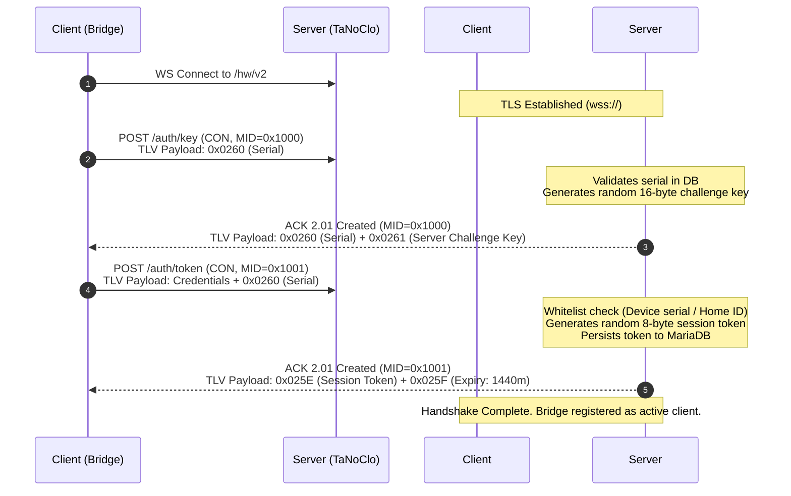
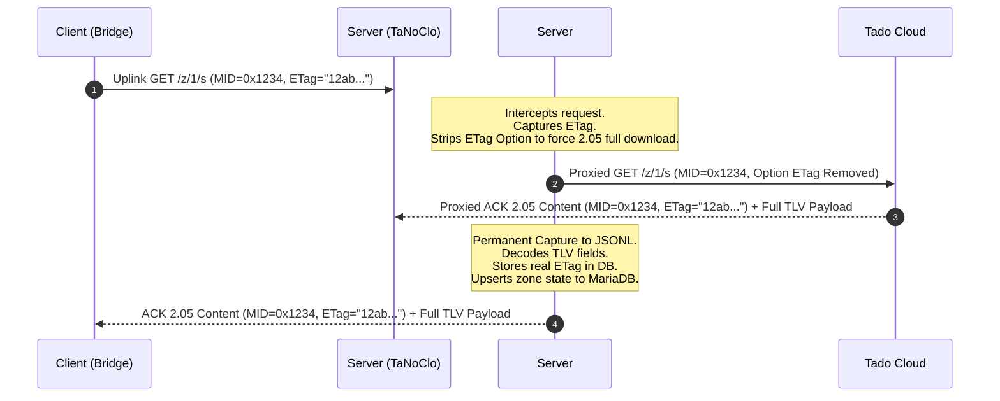

# TaNoClo: WebSocket Bridge & Session Specification

This document provides the low-level technical specification of the WebSocket bridge, connection authentication flow, session management, and proxy routing system utilized by Tado Internet Bridges to communicate with the configured backend.

---

## 1. WebSocket 28-Byte Bridge Frame Format

Every binary WebSocket message exchanged between the Internet Bridge (client) and the backend wraps a CoAP packet in a **28-byte bridge frame header**. This frame serves as the transport-layer encapsulation, carrying routing information, direction, and destination IPv6/port details.

### 1.1 Frame Layout & Byte Offsets

The total header size is strictly **28 bytes**. The payload begins at byte index 28. All multi-byte fields are encoded in **Big-Endian** (Network) byte order:

| Byte Offset | Size (Bytes) | Data Type | Field Name | Purpose / Value |
| :--- | :--- | :--- | :--- | :--- |
| **`[0-1]`** | 2 | `uint16` | `direction` | `0x0001` = Client-to-Server (Uplink)<br/>`0x0002` = Server-to-Client (Downlink) |
| **`[2]`** | 1 | `uint8` | `ipv6_len` | Address length indicator. Strictly set to `0x10` (16 bytes). |
| **`[3-18]`** | 16 | `bytes` | `ipv6_address` | IPv6 address of target/source device (e.g., TRV, Room Unit). |
| **`[19-20]`** | 2 | `uint16` | `field_a` | Routing flag. Downlink standard = `4`. |
| **`[21]`** | 1 | `uint8` | `field_b` | Routing flag. Downlink standard = `2`. |
| **`[22-23]`** | 2 | `uint16` | `udp_port` | Remote UDP port of destination/source. Typically `5683`. |
| **`[24-25]`** | 2 | `uint16` | `field_c` | Routing flag. Downlink standard = `5`. |
| **`[26-27]`** | 2 | `uint16` | `coap_len` | Length of the subsequent raw CoAP packet payload in bytes. |
| **`[28+]`** | Variable | `bytes` | `coap_bytes` | The raw encapsulated CoAP packet. |

---

### 1.2 Binary Parsing and Building Mechanics

#### Parsing (Buffer to Object)
When a binary frame is received by the WebSocket server (`ws-server/lib/ws-bridge.js`), it validates:
1. That the message length is $\ge 28$ bytes.
2. That `ipv6_len` (byte index 2) is exactly `0x10`.
3. That the remaining buffer length matches the parsed `coap_len` (bytes index 26-27).

#### Building (Object to Buffer)
When transmitting a downlink frame to a device via the bridge:
*   An IPv6 string is parsed and written into a 16-byte raw buffer.
*   A combined buffer of size $28 + \text{payloadLength}$ is allocated.
*   Routing fields (`fieldA = 4`, `fieldB = 2`, `udpPort = 5683`, `fieldC = 5`) are populated as standard downlink routing parameters.
*   The raw CoAP bytes are appended starting at offset 28.

---

## 2. Authentication Handshake Flow

The Internet Bridge establishes a secure TLS connection to the WebSocket endpoint `/hw/v2`. Once connected, the client performs a two-stage handshake using TLV-formatted CoAP messages to authenticate and secure a session token.



### 2.1 Handshake Stage 1: Key Challenge (`auth/key`)

1.  **Request**: The bridge sends a CoAP `POST /auth/key` message.
    *   **Payload (TLV)**: Contains the full device serial number under Field ID **`0x0260`** (e.g., `IB0000000000`).
2.  **Server Response**: The server validates the serial against the database and returns `2.01 Created`.
    *   **Payload (TLV)**:
        *   **`0x0260`**: Echoes the bridge serial number.
        *   **`0x0261`**: Generates and sends a cryptographically secure 16-byte random ephemeral challenge key (`crypto.randomBytes(16)`), encrypted with the device's `factory_key` via AES-128-ECB if provisioned in the database.

---

### 2.2 Handshake Stage 2: Token Confirmation (`auth/token`)

1.  **Request**: The bridge sends a CoAP `POST /auth/token` message.
    *   **Payload (TLV)**: Contains the device serial under Field ID **`0x0260`** alongside credential verifications.
2.  **Whitelist Validation**:
    *   The server resolves the bridge device serial to its associated `home_id` via the database.
    *   It performs a strict whitelist check against the `whitelist` table for both the `device` serial and the `home` ID.
    *   If **both** are missing from the whitelist, the connection is rejected with a `4.01 Unauthorized` CoAP response (`0x81` ACK containing an empty payload), and the connection is closed.
3.  **Token Issuance**:
    *   The server generates a secure, cryptographically random **8-byte Session Token**.
    *   **Payload (TLV)**:
        *   **`0x025E`**: Raw 8-byte Session Token.
        *   **`0x025F`**: Session validity duration represented as a `u16be` set to `1440` (24 hours in minutes).
4.  **Client Registration**:
    *   The session token is persisted to the `devices` database table under `session_token`.
    *   The active bridge session is recorded in the memory maps.
    *   Any stale previous WebSocket connection for the same device serial is forcefully terminated to prevent session ghosting.
    *   The device's connection state in the database is set to online (`connection_state = 1`).

---

## 3. Session Caching & Memory Maps

To handle traffic routing, message delivery, and real-time proxy intercepts efficiently, the WebSocket server maintains five primary in-memory maps.

### 3.1 Memory Map Dictionary

```
+-----------------------------------------------------------------------------------+
|                                  MEMORY MAPS                                      |
+-----------------------------------------------------------------------------------+
|                                                                                   |
|  clients Map                                                                      |
|  [deviceId (string)] ----> { ws, ipv6, fieldA, fieldB, udpPort, fieldC,           |
|                              session2048, homeId, connectedAt, lastMessageAt }    |
|                                                                                   |
|  wsToBridgeId Map                                                                 |
|  [ws (WebSocket)] ----> deviceId (string)                                         |
|                                                                                   |
|  ipv6ToDevice Map                                                                 |
|  [ipv6 (string Group)] ----> deviceSerial (string)                                |
|                                                                                   |
|  deviceSessions Map                                                               |
|  [deviceId (string)] ----> activeSessionToken (Buffer)                            |
|                                                                                   |
|  proxyConnections Map                                                             |
|  [ws (WebSocket)] ----> proxyWs (WebSocket Client to ingress.tado.com)            |
|                                                                                   |
+-----------------------------------------------------------------------------------+
```

#### `clients` Map
Tracks all active Internet Bridge sessions currently connected to TaNoClo.
*   **Key**: `deviceId` (Bridge full serial, string).
*   **Value (Object)**:
    *   `ws`: Active uWebSockets.js socket handle.
    *   `ipv6`: Source IPv6 address string.
    *   `fieldA` / `fieldB` / `fieldC`: Routing parameters parsed from uplink.
    *   `udpPort`: Remapped UDP port of client.
    *   `session2048`: The active 8-byte Session Token (used to populate Option 2048 in downlink pushes).
    *   `homeId`: Associated Home ID from DB.
    *   `connectedAt` / `lastMessageAt`: ISO timestamp trackers.
    *   `lastDbUpdate`: Timestamp of the last connection state db update (throttled to 60s).

#### `wsToBridgeId` Map
Performs reverse-lookup of a WebSocket connection instance back to its authenticated bridge serial.
*   **Key**: WebSocket socket instance.
*   **Value**: `deviceId` (string).

#### `ipv6ToDevice` Map
Accelerates source-routing by bypassing database lookups for uplink packets.
*   **Key**: Normalized lowercase IPv6 group string (e.g. `fe80::1`).
*   **Value**: Associated device serial number. Pre-populated from `devices` table at server startup.

#### `deviceSessions` Map
Stores session tokens to survive server reloads or brief connection drops.
*   **Key**: `deviceId` (string).
*   **Value**: Raw session token `Buffer`.

#### `proxyConnections` Map
Coordinates transparent proxy sockets for real Tado integration.
*   **Key**: Client WebSocket handle.
*   **Value**: Active `ws` client connected directly upstream to `ingress.tado.com`.

---

### 3.2 Transparent Proxy Mode & ETag Interception

When a home's `is_proxied` flag is set to `1` in the database, the server initiates an upstream WebSocket connection to `ingress.tado.com` utilizing the Tado Root CA certificate (`certs/tadoRootCA.cer`).



#### ETag Stripping for Config & State Capture
Tado devices aggressively cache configurations, sending an `OPT_ETAG` option to get short `2.03 Valid` (no payload) responses. To force full payload extraction:
1.  On uplink requests for target paths (`config`, `hvac`, `z/{id}/s`), the server inspects the packet.
2.  If an ETag is present and the server does not yet have a permanent captured configuration block on disk, the server **strips the ETag option** from the CoAP options array.
3.  The request is rewritten and sent to the Tado cloud. This forces the cloud to respond with a full `2.05 Content` payload.

#### Response Capture & Parsing
When the Tado cloud returns `2.05 Content` payloads:
1.  **Disk Capture**: The raw payload, path, ETag, and metadata are written to an append-only JSONL capture log under `log/config_capture/` using `lib/config-capture.js`. This capture is permanent and never overwritten.
2.  **Database Synchronization**:
    *   **Device Configurations (`/config`)**: Stores captured FIDs (e.g. `actuator_config`) inside `devices` (`last_config_json` and `config_field_015a`).
    *   **HVAC Configurations (`/hvac`)**: Upserts settings into the `heating_systems` table.
    *   **Zone Configurations (`z/{id}/config`)**: Decodes and writes fields to the `zones` table.
    *   **Zone States (`z/{id}/s`)**: Extracts temperature target, overlay configuration, and overlays status, writing them to `zone_measurements` and updating `zone_overlays`.
3.  **Real ETag Storage**: Captured ETags are written to the database (`devices.config_etag`, `zones.config_etag`, etc.) to match exact Tado cloud synchronization parity.

#### Firmware Update Blocking & Security Protection
To prevent transparently-proxied devices from performing automated OTA firmware upgrades that could brick patched firmware configurations, the server intercepts and blocks unsafe traffic (`shouldBlockProxyMessage`):
*   **Path Interception**: If an uplink/downlink message contains paths matching `d/fw`, `fw/rq`, or `fw/state` (unless safely tracking state), it is blocked. **However, `fw/state` paths are explicitly allowed to pass in order to track the device's update state.**
*   **Block Transfer Interception**: Any Block1 or Block2 segmented CoAP transactions associated with standard `POST` or `CONTINUE` codes are blocked **only if they target a firmware-related path** (typical of large binary firmware chunks). Block transfers on other paths (like schedules or configs) are allowed to pass normally.

#### Proxy Commands Routing (allow_commands_in_proxy)
Normally, when a device is proxied, the TaNoClo server skips processing commands destined to the device locally (since commands should go to the real Tado API/cloud). However, a setting can be toggled on the admin portal dashboard ("Commands in Proxy") per home. When the HTTP command API triggers a downlink push, the server queries the home's proxy status. If `allow_commands_in_proxy` is disabled, the command is dropped, logging that the device is proxied. If `allow_commands_in_proxy` is enabled, the server allows the command. The device's response to these commands is intercepted and blocked from being forwarded to the upstream Tado cloud, keeping the cloud's view consistent.

---

## 4. CoAP Path Routing Table

The CoAP server maps incoming URI paths. This function processes segment tokens to assign request types, matching paths with handler operations and target database tables:

| URI Pattern | Classified Type | Handled Direction | CoAP Code | DB / Protocol Operation |
| :--- | :--- | :--- | :--- | :--- |
| `/auth/key` | `auth_key` | Uplink | `POST` | Ephemeral server challenge key generation (`crypto.randomBytes`). |
| `/auth/token` | `auth_token` | Uplink | `POST` | Whitelist check. Registers session token in DB. |
| `/d/{id}/info` | `device_info` | Uplink / Downlink | `GET` / `POST` | Stores device firmware version, hardware info in DB. |
| `/d/{id}/config` | `device_config` | Uplink / Downlink | `GET` / `PUT` | **GET**: Builds binary TLV of device configuration from DB.<br/>**PUT**: Persists configuration changes (e.g., offsets, LED) in DB. |
| `/d/{id}/sen` | `device_sensor` | Uplink / Downlink | `GET` / `POST` | **GET**: Builds binary TLV of sensor settings.<br/>**POST**: Inserts telemetries (temperature, humidity, light, battery mV) to `device_measurements`, computes battery %, and updates connection state. |
| `/d/{id}/act` | `device_actuator` | Uplink / Downlink | `GET` / `PUT` | **GET**: Generates current actuator status (valve position, motor state).<br/>**PUT**: Persists updated actuator statistics in DB. |
| `/d/{id}/mnt` | `mount` | Uplink | `POST` | Updates TRV motor mounting status (e.g., calibrated). |
| `/d/{id}/lock` | `lock` | Uplink / Downlink | `GET` / `PUT` | **GET**: Returns `va_child_lock_enabled` in TLV (uses consistent lock ETag).<br/>**PUT**: Stores lock setting (`child_lock_enabled`) in DB. |
| `/d/{id}/err` | `device_error` | Uplink | `POST` | Persists device error flags to `devices.error_flags` in DB. |
| `/d/{id}/rfkey` | `rfkey` | Uplink | `POST` | Captures RF key from device and stores in `devices.rf_key`. |
| `/d/{id}/selftest`| `selftest` | Uplink | `POST` | Updates battery selftest mV results in DB. |
| `/d/{id}/neighbors`| `neighbors` | Uplink | `GET` | Returns lists of visible neighbor devices (signal/LQI metrics). |
| `/h/{id}/c/{cid}/act`| `circuit_actuator`| Uplink | `GET` / `PUT` | Manages diagnostic actuator states for central boiler relays. |
| `/h/{id}/c/{cid}/config`| `circuit_config`| Downlink | `PUT` | Configures hot water maximum heating limit. |
| `/h/{id}/z/{zid}/config`| `zone_config` | Downlink | `PUT` | Updates temperature settings and zone configurations in DB. |
| `/z/{id}/s` | `zone_state` | Uplink / Downlink | `GET` / `PUT` | **GET**: Builds zone state TLV (temperature, target, overlays).<br/>**PUT**: Inserts state to `zone_measurements`, syncs active overlays or removes them in `zone_overlays`. |
| `/z/{id}/p` | `zone_params` | Uplink | `POST` | Updates physical parameters reported by the zone leader. |
| `/z/{id}/extui` | `zone_extui` | Uplink | `POST` | Reports manual dial turn adjustments from TRVs. |
| `/z/{id}/ov` | `zone_overlay` | Uplink / Downlink | `GET` / `PUT` | Processes manual temporary temperature setpoints. |
| `/z/{id}/fallback`| `zone_fallback` | Uplink | `GET` / `POST` | Resolves safe fallback operational modes on communications loss. |
| `/z/{id}/ow` | `open_window` | Uplink / Downlink | `POST` / `PUT` | **POST (Uplink)**: Device reports OWD. Stores in `zone_measurements.open_window_detected`. <br>**PUT (Downlink)**: Server commands OWD state using `0x0c00` (0=cancel, 1=activate). |
| `/time` | `time` | Uplink | `GET` | Responds with Protobuf-encoded current Unix epoch time. |

---

## 5. Push Commands & Cron Scheduling

REST endpoints allow administrative control and status inspection. Downlink pushes utilize a retry tracker and automatic segmentation for larger messages.

### 5.1 REST HTTP Command API (`ws-server/lib/command-api.js`)

Running on internal port **`3111`**, this HTTP REST service translates external API calls into encapsulated downlink CoAP packets.

#### Primary HTTP REST Routes
*   `GET /api/health`: Detailed system diagnostics (secured behind JWT authentication).
*   `GET /api/public/health`: Unauthenticated health check endpoint returning connected client count for external monitoring.
*   `GET /api/clients`: Returns JSON listing all connected bridge details (`deviceId`, `ipv6`, `connectedAt`, `homeId`, `lastMessageAt`).
*   `POST /api/time/broadcast`: Triggers an immediate time sync broadcast to all bridges.
*   `POST /api/send`: Sends a custom CoAP message (accepts JSON payloads, serializes to TLV, injects token Option 2048, and pushes to device).
*   `POST /api/send-raw`: Sends a raw hex WS bridge frame directly.
*   `POST /api/devices/{id}/rfkey/refresh`: Pushes a GET request to `d/rfkey`.
*   `POST /api/devices/{id}/config`: Pushes a full, updated configuration TLV to the target device, auto-generating a new ETag.
*   `POST /api/devices/{id}/lock`: Toggles the child lock status of a TRV.
*   `POST /api/devices/{id}/identify`: Triggers the device's locate LED sequence.
*   `POST /api/devices/{id}/reboot`: Reboots the target hardware device.
*   `POST /api/devices/{id}/pair`: Commands the bridge to enter pairing mode for a specific device serial.
*   `POST /api/homes/{id}/c/{circuit}/config`: Configures Hot Water maximum temperature limit.
*   `POST /api/homes/{id}/z/{zone}/config`: Encodes and pushes updated settings to zone devices based on DB configurations.
*   `POST /api/homes/{id}/z/{zone}/overlay`: Deploys a new zone temperature overlay (power, temperature setting, and termination).
*   `DELETE /api/homes/{id}/z/{zone}/overlay`: Reverts a zone back to schedule mode.
*   `POST /api/homes/{id}/zones/{zone}/openWindow/activate`: Activates Open Window Detection state on zone devices.
*   `DELETE /api/homes/{id}/zones/{zone}/openWindow`: Cancels Open Window Detection state on zone devices.

---

### 5.2 Delivery Retries & Segmented Block1 Uplinks

Downlink delivery must survive unstable RF packet losses.

#### Exponential Backoff Retries
If the server sends a Confirmable (`CON`) command, it tracks the Message ID (`MID`) in `_pendingCommands`. If no `ACK` matches the `MID` within standard limits, the server retries transmission:
*   **Retry Intervals**: `RETRY_INTERVALS = [6000, 13000, 26000, 50000, 90000]` (5 attempts, totaling ~3 minutes).
*   **Tracking**: A tracking dictionary `_commandTracker` monitors statuses (`pending`, `delivered`, `failed`) and reports delivery latencies.

#### Server-Initiated Block1 Fragmentation
If the server needs to push a large configuration block (e.g. daily schedule transition tables) exceeding **128 bytes** (set by `SERVER_BLOCK1_SIZE`), it splits the payload using Block1 pagination (RFC 7959):
1.  **Block Option**: Includes `OPT_BLOCK1` inside the CoAP options array carrying block number, more flag, and size exponent.
2.  **Pagination Flow**: The server transmits block 0, awaits a `2.31 Continue` ACK from the device, then transmits subsequent blocks until finalization (`M = 0`).

---

### 5.3 Scheduled Cron Maintenance (`ws-server/lib/cron.js`)

A dedicated background cron manager schedules and triggers maintenance actions:

*   **Inactivity Check (Every 1 minute)**: Evaluates `last_contact` timestamps for all active devices. If a device has not sent telemetries for **longer than 20 minutes**, its connection status is set to offline (`connection_state = 0`).
*   **Zone Maintenance (Every 1 minute)**:
    *   **Overlay Expiry**: Monitors active overlays in `zone_overlays` that carry a specific `termination_expiry` timestamp. Once reached, the database entry is deleted, and the zone is reverted back to schedule mode.
    *   **Open Window Expiry**: Checks if a zone has `open_window_active = 1` and `open_window_expiry` has passed. If so, it deactivates the open window state, updates the DB, and pushes a cancel command to the zone's devices.
    *   **Early Start Detection (30-Minute Look-Ahead)**: Evaluates the upcoming heating schedule block. If the home is in home mode, the zone type is `HEATING`, and `early_start_enabled` is true, the server starts heating **up to 30 minutes early** by triggering a state push.
    *   **Schedule Transitions**: Detects if a new schedule block has commenced. Updates DB tables and triggers states pushes.
    *   **Pending Offline Schedule Sync**: Detects if a zone has `offline_schedule_enabled = 1` and has a pending schedule update. If so, it pushes the offline schedule sync during the night (between 2:00 and 5:00 local time).
*   **Time Synchronization (Every 4 hours)**: Performs a global time sync. Broadcasts current Unix epoch time to all bridges using a protobuf-encoded payload over `d/time`.
*   **RF Key Broadcast (Every 24 hours)**: Triggers an RF key refresh query (`d/rfkey`) to all connected bridges.
*   **Weather Synchronization (Every 1 hour)**: Calls the `weather` module to poll outdoor temperature updates for homes, keeping local measurements synchronized.
*   **Home Assistant Discovery Backup (Every 24 hours)**: Re-publishes all MQTT Home Assistant Auto-Discovery configuration mappings to Mosquitto.
*   **Database & File Cleanup (Every 24 hours)**: Runs database and log maintenance:
    *   `device_measurements`: Deletes historical records older than the set amount of days (default 30 days).
    *   `zone_measurements`: Deletes historical records older than the set amount of months (default 13 months).
    *   `home_weather`: Deletes historical records older than the set amount of months (default 13 months).
    *   `oauth_auth_codes`: Deletes expired OAuth authorization codes.
    *   **Log Cleanup**: Deletes rotated debug log files (`debug.*.log`) older than the set amount of days (default 7 days).
