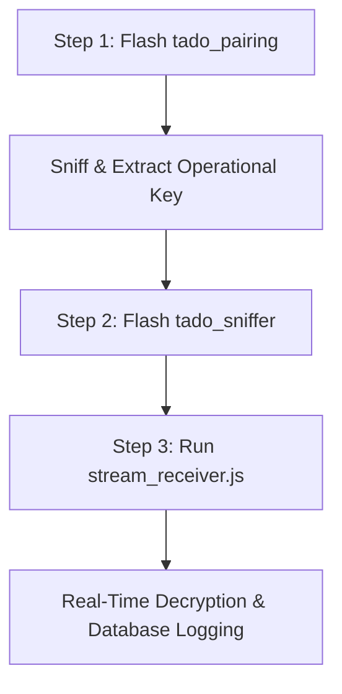

# ESPHome Tado RF Toolkit: Key Sniffer & Packet Analyzer

This directory contains the custom ESPHome-based RF components and host-side analysis utilities designed to interface with the proprietary Tado RF protocol using a **TTGO LoRa32 V1** development board (ESP32 + Semtech SX1276 FSK/LoRa transceiver).

To ensure high performance and clean operations, the toolkit is split into two distinct, dedicated ESPHome components:
1. **`tado_pairing`**: An active, reset-VA mimicry agent used to quickly extract the operational RF network key from the Internet Bridge without completing or registering pairing.
2. **`tado_sniffer`**: A passive packet capturing and UDP streaming component used to sniff operational packets and stream them in real-time to the host.

---

## 1. System Workflow

To capture and analyze secure traffic from a Tado network, follow this standard progression:



1. **Flash `tado_pairing`** to extract the 16-byte operational RF network key from the Internet Bridge (IB).
2. **Flash `tado_sniffer`** to the same device once you have successfully captured the operational key.
3. **Run `stream_receiver.js`** on your host server to receive, decrypt, reassemble (6LoWPAN), and decode (CoAP/TLV) the packet stream, with direct MariaDB integration.

---

## 2. Hardware Configuration

Both firmware components are pre-configured for the **TTGO LoRa32 V1.6.1** development board:

| SX1276 Pin | ESP32 GPIO | Role | Configuration in YAML |
| :--- | :--- | :--- | :--- |
| **SCK** | GPIO 5 | SPI Clock | `spi.clk_pin: 5` |
| **MISO** | GPIO 19 | SPI Master-In Slave-Out | `spi.miso_pin: 19` |
| **MOSI** | GPIO 27 | SPI Master-Out Slave-In | `spi.mosi_pin: 27` |
| **NSS / CS** | GPIO 18 | SPI Chip Select | `cs_pin: 18` |
| **DIO0** | GPIO 26 | TX/RX Done Interrupt | `dio0_pin: 26` |
| **RST** | GPIO 14 | Transceiver Hardware Reset | `rst_pin: 14` |

**NOTE**: It is highly recommended to get a better 868MHz antenna for the TTGO LoRa32 V1.6.1 board than the stock one, as it is not very good and will result in poor range and reliability. 
Search for a "868MHz LoRa antenna SMA connector" with 5 or 10 dBi gain. This will improve the range and reliability of the sniffer.

---

## 3. Step-by-Step Guide: Sniffing the Operational RF Key (Offline Bypass Exploit)

This allows you to proactively capture the operational RF key from the Tado Internet Bridge (IB) without interfering with your existing Valve Actuators. By mimicking an unregistered, factory-reset Valve Actuator at the radio layer (using a static fake MAC address) while the Internet Bridge is offline, we force the IB to proactively disclose the operational key in plaintext (TLV `0x12`), bypassing device-specific cloud-key encryption (Variant B / TLV `0x07`).

### Step 3.1: Flash the Pairing Firmware
Compile and flash the pairing component to your TTGO LoRa32 board:
```
esphome run tado_pairing/tado_pairing.yaml
```

### Step 3.2: Configure the Target IB MAC Address
The pairing agent needs to know the MAC address of the target Internet Bridge.
1. **Option A (Passive Sniffing):** On initial boot, the sniffer starts in `STATE_DISCOVERING`. Press the pairing button on the real Internet Bridge (IB) until its Pairing LED blinks. The sniffer will passively capture the IB MAC and PAN ID from the IB's Router Advertisements, save them to NVRAM, and transition to `STATE_IDLE`.
2. **Option B (Manual Entry):** If you already know your Internet Bridge's MAC, enter it directly into the **Target IB MAC** field in the ESPHome web dashboard.

*Note:* The target Valve Actuator MAC is hardcoded statically to `001BC50731561234` inside the firmware, so no configuration is required for the VA.

### Step 3.3: Run the Offline Pairing Challenge
1. **Disconnect the IB from the Internet**: Physically unplug the Ethernet cable from the Internet Bridge. **This is critical**—if the IB is online, it will contact the Tado cloud to encrypt the payload, returning an undecryptable TLV `0x07`.
2. **Put the IB in Pairing Mode**: Press the pairing button on the back of the IB until the pairing LED blinks. 
3. **Trigger the Challenge**: Click the **Retrieve RF key** button on the ESPHome web dashboard.
4. **Monitor the Logs**: Watch the console output. You will see:
   - `[Mimic] *** SUCCESS! OPERATIONAL KEY EXTRACTED! ***` (The offline IB responds with CoAP `/d/pair` containing the plaintext operational key inside TLV `0x12`).
5. The extracted key will display under **Stored RF Key** and is saved securely in the ESP32's NVRAM. Copy this key.

---

## 4. Passive Packet Sniffing & TCP Streaming

Once you have successfully sniffed the operational key, you must flash the sniffer firmware to begin streaming live traffic.

### Step 4.1: Flash the Sniffer Firmware
Flash the packet sniffer configuration to the device:
```
esphome run tado_sniffer/tado_sniffer.yaml
```

### Step 4.2: Configuration Schema & UI Controls
The sniffer is controlled via the ESPHome dashboard using the following controls:
* **Sniffer Channel**: Tune the SX1276 carrier frequency (0 to 49). Standard operational channel is typically `26`.
* **TCP Host**: Configure the host IP address where the `stream_receiver.js` is running (e.g., your local development PC/server).
* **TCP Port**: Configure the port `stream_receiver.js` is listening on (default: `9999`).
* **Log Raw Packets Switch**: Toggle to log raw hex packets (directly to the console and TCP stream).
* **Print Diagnostic Stats Switch**: Periodically outputs reception/error statistics.

---

## 5. Host Analysis Suite: `stream_receiver.js`

If you use Home Assistant refer to [tanoclo-stream-receiver/DOCS.md](../tanoclo-stream-receiver/DOCS.md) instead of the following instructions for setting up the stream receiver using a Home Assistant OS App/Addon.

`stream_receiver.js` is a Node.js-based daemon that runs on the host to process the TCP packet stream sent by the `tado_sniffer` hardware.

### 5.1 Features
- **Real-Time Decryption**: Automatically decrypts captured data packets using the network's operational key via AES-128-CCM.
- **6LoWPAN Reassembly**: Handles unfragmented and fragmented (`FRAG1`/`FRAGN`) packets, dynamically calculating compression expansion and reassembling split payloads.
- **CoAP & TLV Decoding**: Decodes CoAP structures and parses binary TLVs, using static label definitions mapped from the database.
- **Standalone Execution**: Run the receiver daemon with zero runtime database connections; maps TLV metadata from a local static [tlv_labels.json](../tanoclo-stream-receiver/tlv_labels.json) file.
- **MQTT State Publishing**: Publishes successfully decoded unique CoAP packets to `tado/sniffer/{SENDER MAC}/{COAP PATH}`. The JSON payload maps field values to both raw hex IDs and friendly, human-readable names.
- **Configurable File Logging**: Option to toggle live packet logging to `live_decrypted.log` on/off via configuration.
- **Robust Statistical Tracking**: Divides packets into a mutually exclusive partitioning of status categories (duplicate raw, CRC failures, decryption errors, valid CoAP, etc.) so stats always balance perfectly.

### 5.2 Database Synchronization
To extract friendly TLV labels from the MariaDB server into the standalone JSON mapping, run:
```bash
# Run from the tanoclo-stream-receiver directory
node sync_tlv_labels.js
```
The sync script can be configured with the following environment variables:
* `DB_HOST`: MariaDB host address
* `DB_NAME`: Database name
* `DB_USER`: Database username
* `DB_PASS`: Database password

### 5.3 Configuration: `config.json`
You can create a `config.json` in the `tanoclo-stream-receiver/` directory (based on [config.json.example](../tanoclo-stream-receiver/config.json.example)) to store persistent credentials and keys:
```json
{
  "tcpPort": 9999,
  "fileLogging": false,
  "keys": {
    "IB1234567890": "aabbccddeeff00112233445566778899",
    "PAIRING": "7461646f2070616972696e67206b6579"
  },
  "whitelistedPanIds": [
    "0x1234",
    "0x5678"
  ],
  "mqtt": {
    "enabled": true,
    "host": "mqtt://localhost",
    "topic": "tado/sniffer",
    "username": "mqtt_user",
    "password": "mqtt_password"
  }
}
```

You should add whitelisted PAN IDs (short) to the `whitelistedPanIds` array in `config.json` based on the (short) PAN IDs of your devices (you can see these in the sniffer logs).

### 5.4 Invocation
Run the receiver daemon:
```bash
node tanoclo-stream-receiver/stream_receiver.js [--stats]
```

#### Command Line Flags
- `--stats`: Periodically prints detailed packet status statistics.
- `--port <port>`: Overrides the TCP listening port (default: `9999`).
- `--keys <name=hex,name2=hex...>`: Provides comma-separated name-key pairs for AES decryption.
- `--panids <id1,id2...>`: Provides comma-separated whitelisted PAN IDs.
- `--mqtt-host <url>`: Configures/enables MQTT connection (e.g., `mqtt://192.168.1.100`).
- `--mqtt-topic <topic>`: Configures base MQTT topic.
- `--mqtt-user <username>`: Configures MQTT username.
- `--mqtt-pass <password>`: Configures MQTT password.
- `--file-logging` / `--no-file-logging`: Toggles writing packet data to `live_decrypted.log`.

#### Environment Variables
You can also set the following environment variables:
* `TCP_PORT`: Port number (also accepts legacy `UDP_PORT`).
* `FILE_LOGGING`: Toggle logging to file (`true`/`false`).
* `TADO_KEYS`: Comma-separated `name=hex` keys.
* `TADO_PAN_IDS`: Comma-separated whitelisted PAN IDs.
* `MQTT_ENABLED`: Enable MQTT pushes (`true`/`false`).
* `MQTT_HOST`: Broker URL.
* `MQTT_TOPIC`: Base topic.
* `MQTT_USERNAME` / `MQTT_PASSWORD`: Broker credentials.