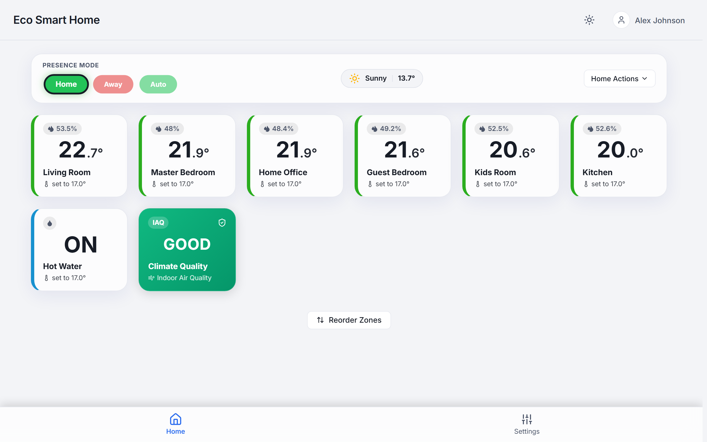
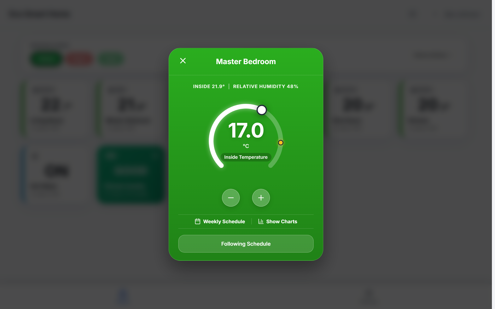
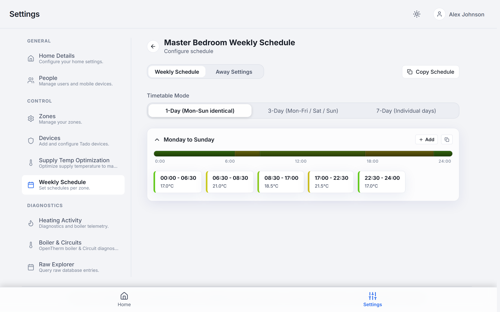
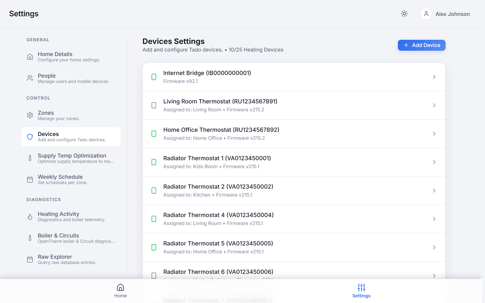
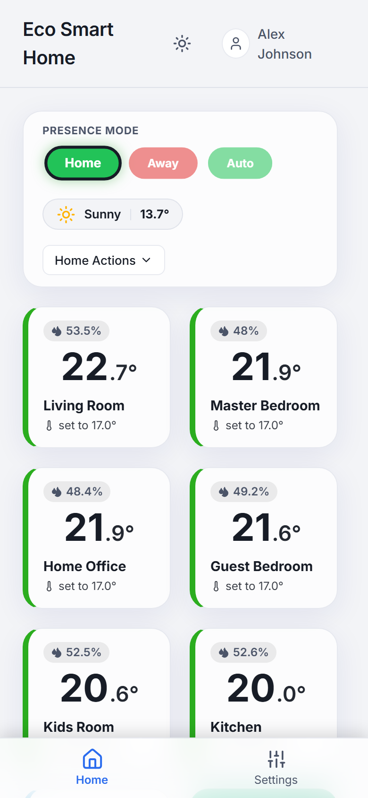
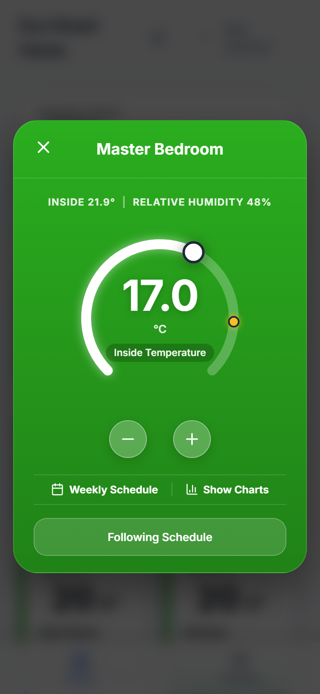
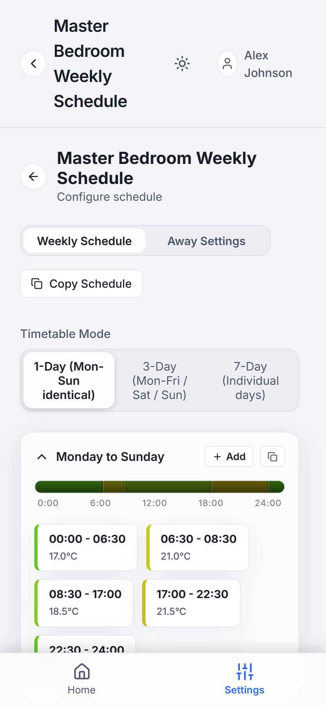
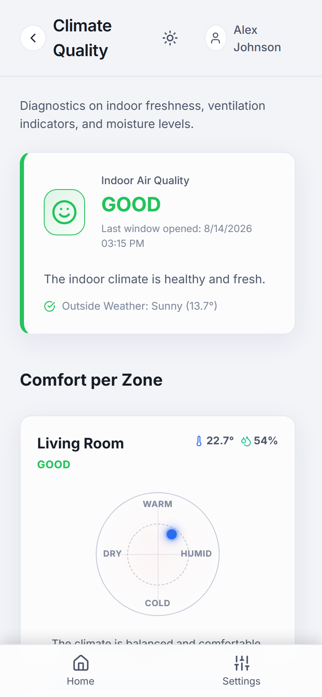

# TaNoClo Modern React Climate Portal (frontend-new)

This directory contains **frontend-new**, a modern, responsive Single-Page Application (SPA). Built using **React**, **Vite**, and styled with custom modern CSS/Tailwind, it acts as the primary user portal for managing smart schedules, rooms, devices, and users on TaNoClo.

---

## 📱 Core Features

1. **Vibrant Climate Dashboard**:
   - Real-time room cards displaying current temperatures, humidity, heating power percentage, and target overlays.
2. **Advanced Settings Management**:
   - **Smart Schedules**: Complete schedule blocks and timetable editor.
   - **Device Configuration**: Manage battery chemistry (Alkaline vs NiMH), view raw steps, set actuator travel limits, toggle child lock, view battery voltage, or inspect firmware/connection states.
   - **Geofencing**: Add/remove mobile devices, configure GPS distance thresholds.
   - **Security & Setup**: Manage whitelisted WebSocket hardware clients, system users, and set passwords.
3. **Capacitor Mobile Compatibility**: Bundled with **Capacitor** to compile native Android (`.apk`) and iOS packages.

<p align="center">
  
  
</p>
<p align="center">
  
  
</p>
<p align="center">
  
  
  
  
</p>

---

## 🧪 Testing Strategy

Run tests using Vitest:
```bash
npx vitest run
```
*Note: Unit and integration tests must be executed with `npx vitest run`.*

---

## 🚀 Building & Deployment

### 1. Build Web Assets
Compile and optimize the React application for production deployment:
```bash
npm run build
```
This packages the production bundle and outputs files directly into the backend static folder: `ws-server/frontend-dist/`.

### 2. Compile Android Client (Capacitor)
To package and compile the application as a native Android APK:

1. **Build & Sync**:
   ```bash
   npm run build
   npx cap sync android

   ```
2. **Compile Release / Debug APK**:
   TaNoClo Android Gradle builds require **JDK 22** for Gradle compilation compatibility. In Windows PowerShell:
   ```powershell
   # Set JDK 22 path and compile Gradle target
   $env:JAVA_HOME="C:\Program Files\Java\jdk-22"
   cd android
   .\gradlew assembleRelease
   ```
3. **Output APK**:
   The successfully compiled release APK will be generated at:
   `frontend-new/android/app/build/outputs/apk/release/app-release.apk`

