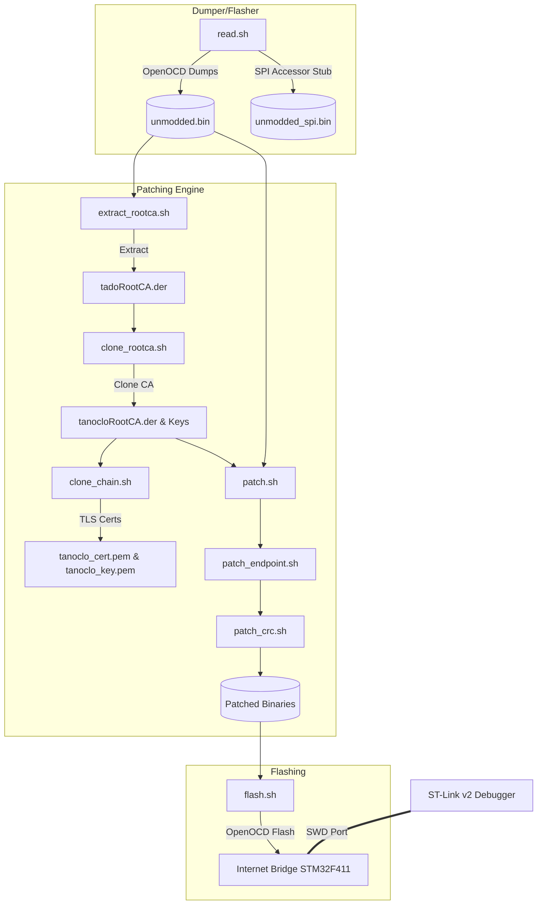
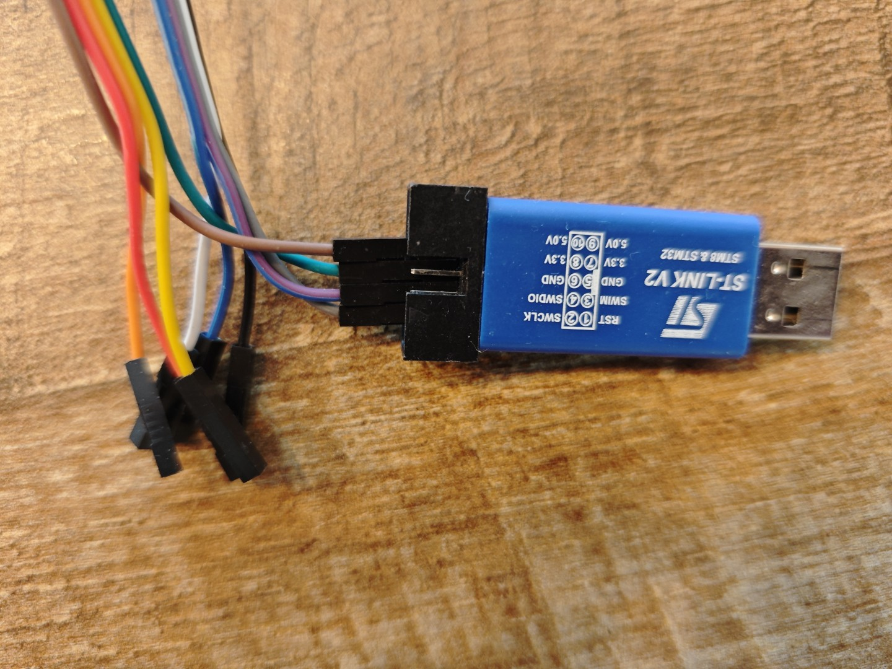
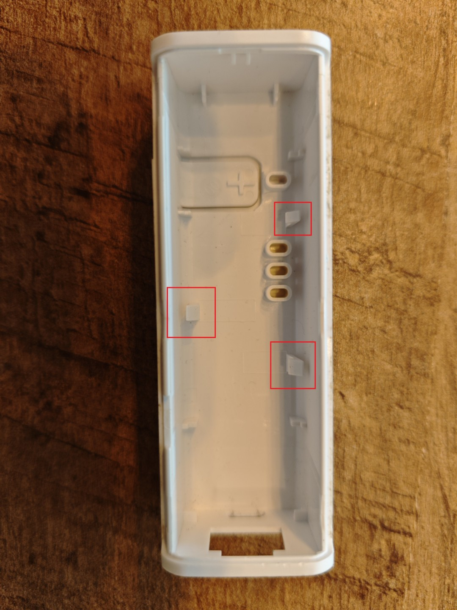
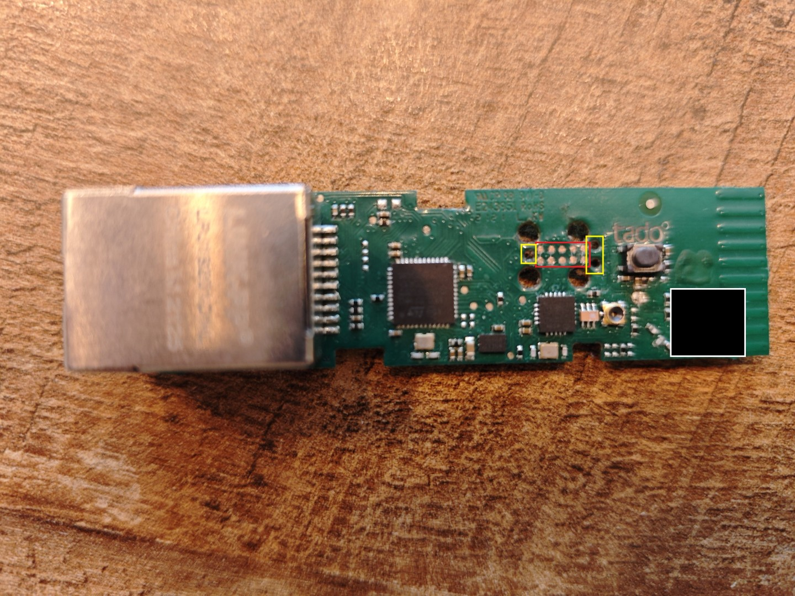
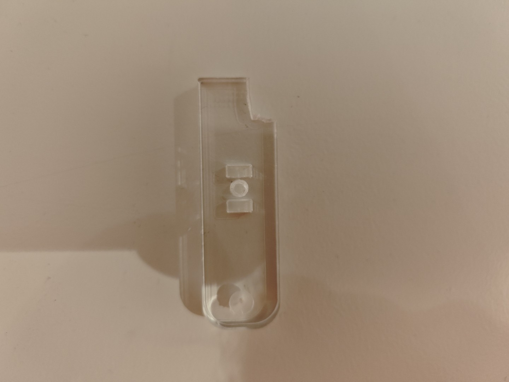
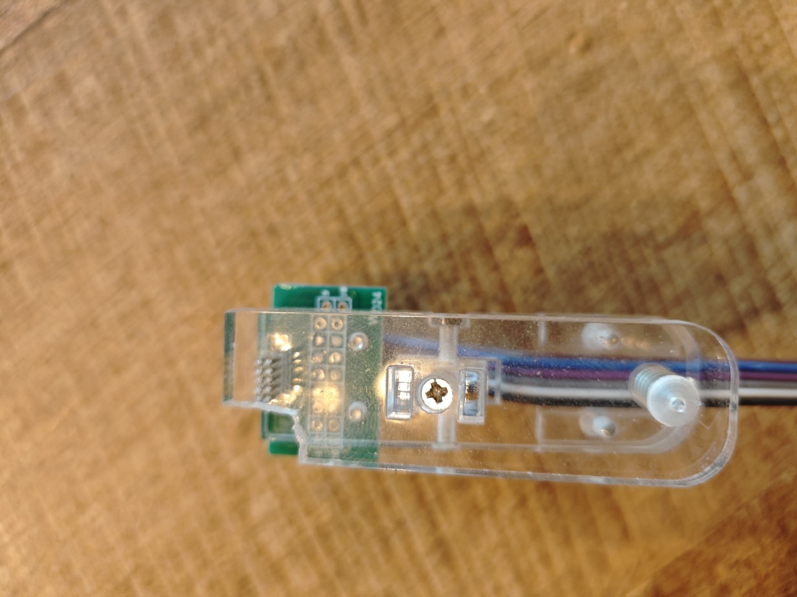
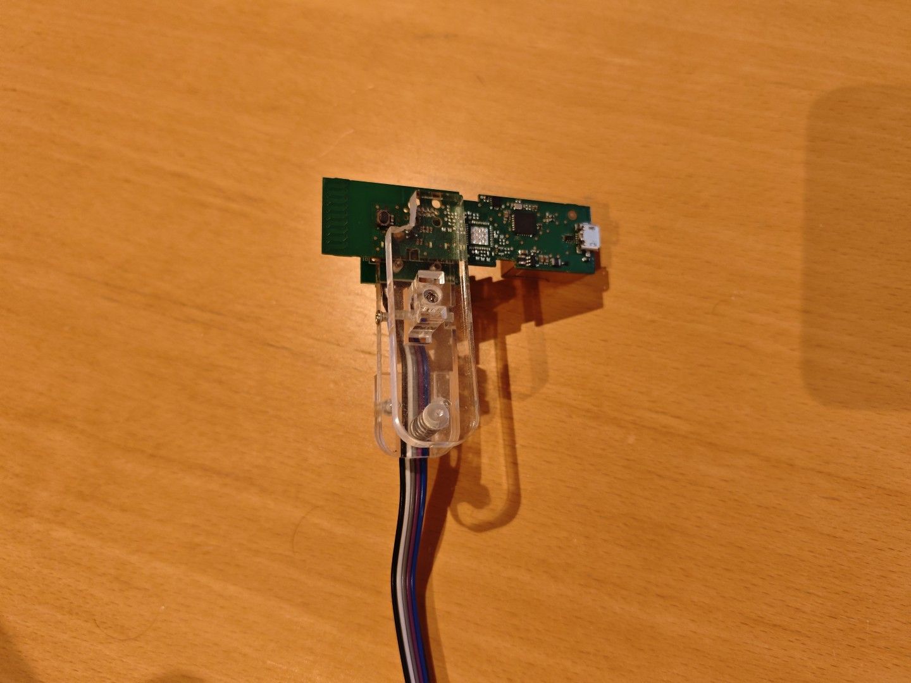
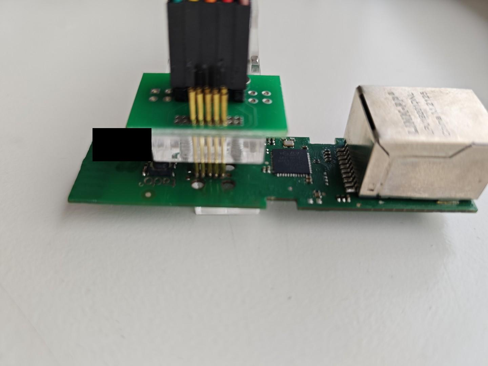
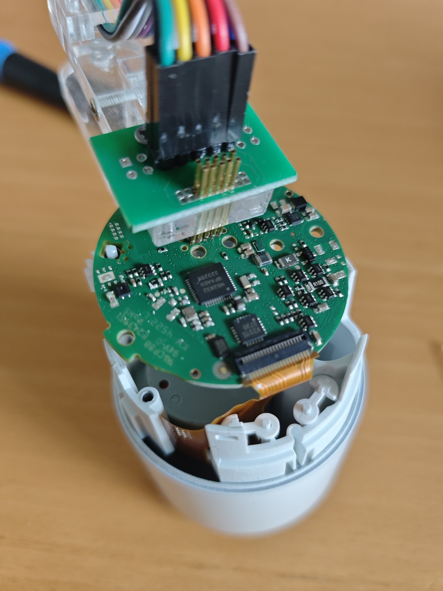
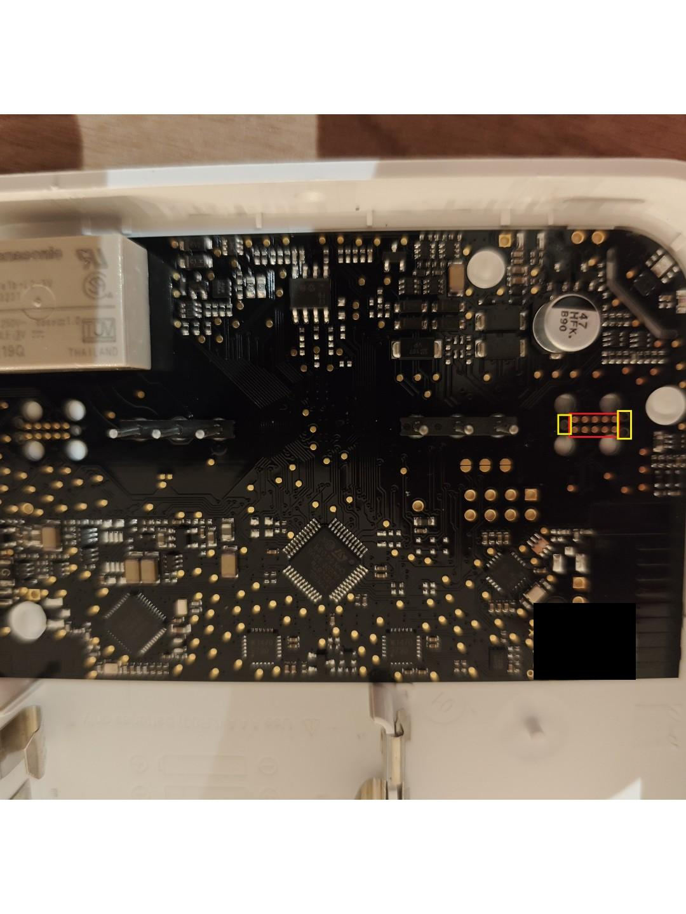

# Internet Bridge Firmware Patching Toolkit

This directory contains the tools and scripts necessary to dump, patch, and re-flash the firmware of the Tado Internet Bridge (STM32F411-based). The primary goal of these patches is to redirect the device's secure WebSocket connection to your self-hosted **TaNoClo** WebSocket server instead of the Tado Cloud.

> [!IMPORTANT]
> **Supported Firmware Version:** Only firmware version **92.1** is supported. The toolkit automatically verifies this by scanning the running internal firmware dump (`unmodded.bin`). If the running version is not 92.1, it checks the external SPI flash dump (`unmodded_spi.bin`) for a copy of version 92.1 in either firmware slot, extracts it, and updates the internal image and bootloader descriptors accordingly.

---

## 1. Overview of the Patching Workflow

Because the Internet Bridge verifies the authenticity of the Tado Cloud server using an embedded Root Certificate Authority (Root CA) and connects to a hardcoded domain name via TLS, we must apply three patches to the dumped firmware:

1. **Root CA Cloning:** Extract the original 639-byte DER-encoded Tado Root CA from the firmware, generate a new custom CA certificate with the same metadata (subject/issuer fields) using a newly generated private key, and overwrite the Root CA inside the firmware binary.
2. **Endpoint Redirection:** Locate the hardcoded WebSocket endpoint string in the firmware and patch it to point to a custom domain (e.g., `tanoclo.tado.lan`).
3. **CRC / Checksum Update:** Recalculate the little-endian header checksum of the patched internal flash segment and write it back to prevent the bootloader from rejecting the modified image.



---

## 2. Hardware You'll Need

| Item | Required | Notes |
|------|:--------:|-------|
| **ST-Link V2** programmer | ✅ | Or compatible clone. Connects to your PC via USB. |
| **10-pin clip-on pogo programmer** | For solderless | 5×2 layout, 1.27mm pitch. Clips onto the board test points. |
| **Opening tools** | ✅ | Phone repair pry tools or a small knife. |
| **Soldering iron + thin wire** | For solder method | If you prefer a permanent connection or don't want to buy a pogo clip. |

### Where to Buy

**ST-Link V2 programmer:**
- [Amazon — AZDelivery ST-Link V2](https://www.amazon.de/-/en/AZDelivery-V2-Debugger-Programmer-Emulator/dp/B086TWZNMM)



**10-pin pogo clip-on programmer (1.27mm pitch):**
- [AliExpress — Pogo pin clip programmer (option 1)](https://de.aliexpress.com/item/1005007887384238.html)
- [AliExpress — Pogo pin clip programmer (option 2)](https://de.aliexpress.com/item/1005006609750088.html)

> [!IMPORTANT]
> When ordering, make sure to select the **5 Pin / 5P, Double Row, 1.27mm spacing** variant.

---

## 3. Installing Required Tools

### Ubuntu / Debian (bash)

```bash
sudo apt update
sudo apt install -y openocd openssl coreutils gawk grep
```

The scripts require: `dd`, `od`, `awk`, `stat`, `mktemp`, `openssl`, `wc`, `grep`, `printf`, `openocd`. Most are pre-installed on standard Ubuntu/Debian — the command above ensures the ones that might be missing.

### Windows (PowerShell)

```powershell
winget install -e --id OpenOCD.OpenOCD
winget install -e --id ShiningLight.OpenSSL
```

The PowerShell script equivalents (`.ps1`) handle the remaining tool requirements internally — no additional installation needed.

> [!NOTE]
> Both the bash and PowerShell scripts check for required tools at startup and will exit with a clear error if anything is missing.

---

## 4. Opening the Internet Bridge

The Internet Bridge case is held together by **clips only** — no screws. The clips are at the short and long ends of the case. Use phone repair pry tools or a small knife to carefully pry the case open along the seam. I have had best success with inserting a board flat spudger in the seam of the short end of the case on the side of the ethernet port. After prying it in the seam, twist the spudger to release the clips on the sides of the short end. Then carefully work your way down the long edges of the case, releasing the clips manually or with the spudger.

After opening the shell you will see the PCB. The PCB is held in place by 3 plastic clips along the long edges. The clip locations are highlighted below:



Carefully pry the PCB loose from the shell with a plastic tool and remove the PCB from the shell. This is as much, if not more, of a pain as opening the shell. I have had best success by removing the clip that is alone on one of the sides (the side with the button) with a side-cutter and then pushing up with a plastic tool from within the ethernet port while simultanously pushing first the clip nearest to the ethernet port and then the furthest clip to the side of the case while keeping upward pressure from within the ethernet port with the plastic tool. The PCB should come loose this way.

Once removed, look for the 10-pin SWD test point cluster visible near the center of the board. The test points and orientation holes are highlighted (red = test points, yellow = orientation holes):



---

## 5. Connecting the Programmer

### 5.1 Test Point Layout

The board has a **10-pin test point cluster** (5×2 grid, 1.27mm pitch) used for SWD programming. Orientation is determined by the small round holes on the PCB near the test points:

- **Single hole (●)** → to the **LEFT** of the test points
- **Double holes (●●)** → to the **RIGHT** of the test points
- **Programmer tail** → points **DOWN**

```
        ● (single hole)                            ●● (double holes)

         ┌─────────────────────────────────────────────┐
         │  ①       ②       ③       ④       ⑤         │  ← Top row
         │ 3V3     n/c     n/c     n/c     GND        │
         │                                             │
         │  ⑥       ⑦       ⑧       ⑨       ⑩         │  ← Bottom row
         │ n/c    SWDIO   SWCLK    n/c     n/c        │
         └─────────────────────────────────────────────┘

                            ↓ (programmer tail points down)
```

Only **4 of the 10 pins** carry the required SWD signals:

| # | Signal | Location |
|---|--------|----------|
| ① | **3V3** (VCC) | Top row, far left |
| ⑤ | **GND** (Ground) | Top row, far right |
| ⑦ | **SWDIO** (Data) | Bottom row, 2nd from left |
| ⑧ | **SWCLK** (Clock) | Bottom row, 3rd from left |

### 5.2 ST-Link V2 Wiring

Connect the 4 SWD signals from the board test points to the ST-Link V2 header:

| Signal | Board Pin | ST-Link V2 Pin |
|--------|-----------|----------------|
| 3V3    | ① (top-left) | Pin 7 (3.3V) |
| GND    | ⑤ (top-right) | Pin 5 (GND) |
| SWDIO  | ⑦ (bottom, 2nd) | Pin 4 (SWDIO) |
| SWCLK  | ⑧ (bottom, 3rd) | Pin 2 (SWCLK) |

### 5.3 Solderless Method (Clip-on Programmer)

> [!WARNING]
> **Modification required:** The bottom plastic of the clip-on programmer interferes with the reset button on the board. Before first use, **file down the plastic** on the bottom edge of the clip-on using a Dremel/multitool or small saw. See the reference photo below for the area to remove.



The clip-on programmer can be disassembled before filing and reassembled afterwards — the spring mechanism still functions:



After filing, the clip-on should look like this when attached to the board:



1. Connect the 4 wires from the clip-on to the ST-Link V2 according to the table in 5.2
2. Orient the clip-on so the **tail points down** and the pogo pins align with the 10-pin grid.
3. Use the PCB orientation holes as reference: **single hole left**, **double holes right**.
4. Squeeze the clip to press the pogo pins firmly onto the test points.
5. Place the IB PCB on a flat surface, bend the wires so they don't push the PCB up and make sure the PCB lies stable before plugging in the ST-Link V2. Optionally use a USB extension cable.

Result with the clip-on correctly connected:



### 5.4 Solder Method

For a permanent connection, solder 4 thin wires directly to the test points:

- **①** → 3V3
- **⑤** → GND
- **⑦** → SWDIO
- **⑧** → SWCLK

---

## 6. Running the Patching Workflow

Connect the ST-Link V2 to your PC via USB and ensure the programmer is connected to the board test points (see §5). 

***DO NOT connect the IB to USB or ethernet while having the programmer connected. Having the IB powered through both USB and the programmer can brick the IB.***

Note: Ignore the "[stm32f4x.cpu] halted due to debug-request, current mode: Thread 
xPSR: 0x2........ pc: 0x2........ msp: 0x2........" messages, these are to be expected while the script interacts with the device.

### Linux (bash)

```bash
./read_patch_flash.sh
```

### Windows (PowerShell)

```powershell
.\read_patch_flash.ps1
```

By default the scripts will dump the internal and SPI flash partitions, extract the Tado root CA, generate new TLS certificates, replace the Tado root CA in the internal and SPI firmware images and write these back to the device, and finally flash these firmware images to all three firmware slots of the device.

### Command Line Options

You can customize the script behavior by passing options:

#### Windows (PowerShell)
- `-FlashInternal`: Flash the patched binary to the internal flash slot.
- `-FlashSpiA`: Flash the patched binary to external SPI Slot A.
- `-FlashSpiB`: Flash the patched binary to external SPI Slot B.
- `-NoFlash`: Do not write/flash any binaries to the device (dry-run/generate files only).
- `-ReuseCerts`: Skip generating new TLS certificates, copying existing certificates from `out_old` (which must exist) to `out` and reusing them to patch the firmware.
- `-Revert`: Revert the device to the original factory firmware by flashing `original/unmodded.bin` and `original/unmodded_spi.bin`. (If no slot selection is specified, reverts all internal and SPI slots).

Example:
```powershell
.\read_patch_flash.ps1 -FlashInternal -FlashSpiA -ReuseCerts
```

#### Linux (bash)
- `--flash-internal`: Flash the patched binary to the internal flash slot.
- `--flash-spi-a`: Flash the patched binary to external SPI Slot A.
- `--flash-spi-b`: Flash the patched binary to external SPI Slot B.
- `--no-flash`: Do not write/flash any binaries to the device (dry-run/generate files only).
- `--reuse-certs`: Skip generating new TLS certificates, copying existing certificates from `out_old` to `out` and reusing them.
- `--revert`: Revert the device to original factory firmware.

Example:
```bash
./read_patch_flash.sh --flash-internal --flash-spi-a --reuse-certs
```

If no options are provided, the script runs in default mode (flashes internal and automatically detects/patches the active SPI slot).

The `endpoint_type` variable in `read_patch_flash.sh` / `read_patch_flash.ps1` configures the target domain routing. The **default is `2`** (custom local endpoint). Available options:

| `endpoint_type` | Target Endpoint | Use Case |
| :---: | :--- | :--- |
| `0` | `ws://ingress.tado.com:443` | Original Tado cloud domain (port 443) |
| `1` | `ws://ingress.tado.com:988` | Original Tado cloud domain on custom port 988 |
| `2` **(default)** | `ws://tanoclo.tado.lan:988` | TaNoClo domain on port 988 |

Note that whatever domain you choose the IB will not connect to the original server anymore because the Tado RootCA certificate is replaced. The IB will then only connect to a server that uses your cloned CA certificate. Using the TaNoClo server you can proxy the connection to the Tado cloud though.

---

## 7. Certificate Installation & Server Configuration

The script outputs all patched firmware binaries, security certificates, and keys into the `/out` directory. After running the patcher make sure you backup the contents of the `out` directory and the `original` directory. 

To enable the patched Internet Bridge to connect to the TaNoClo Node.js WebSocket server:

1. Copy the generated TLS certificates to the server's certificate directory:
   ```bash
   cp out/tanoclo_key.pem ../ws-server/certs/tanoclo_key.pem
   cp out/tanoclo_cert.pem ../ws-server/certs/tanoclo_cert.pem
   cp original/tadoRootCA.cer ../ws-server/certs/tadoRootCA.cer
   ```
2. Configure your DNS or hosts file so that the target endpoint domain (e.g. `tanoclo.tado.lan`) resolves to the IP of your Docker host running the Node.js WebSocket server.
3. Start (or restart) the TaNoClo server container. The Node.js server will load the certificates from `ws-server/certs/` and listen on port `988` for incoming TLS WebSocket connections.

Once the patched Internet Bridge boots, it will establish a direct WebSocket connection to the TaNoClo Node.js server. No other proxy is required — the server handles TLS termination natively using the cloned certificate chain.

---

## 8. Directory & Script Inventory

* **`spi_stub.c` / `spi_stub.elf` / `spi_stub_addrs.tcl`**: A lightweight SRAM-executing helper stub that acts as a bridge between OpenOCD and the external SPI flash chip. OpenOCD cannot write or read raw SPI flash directly; this stub is loaded into STM32 SRAM to handle SPI transactions.
* **`read.sh`**: Detects the ST-Link v2 programmer, connects via OpenOCD, dumps the 512KB internal flash into `unmodded.bin`, loads the SPI accessor stub, and dumps the 2MB external SPI flash into `unmodded_spi.bin` (deduplicating sector blocks).
* **`patch.sh`**: Orchestrates the entire patching pipeline. It generates the custom certificates and patches the internal/external flash files.
* **`flash.sh`**: Checks for the ST-Link v2 programmer and flashes the patched binary back to the internal STM32 flash (and optionally writes the external SPI flash depending on the selected slot configuration).
* **`read_patch_flash.sh`**: The master automation script that runs `read.sh`, backs up the factory firmware to `original/`, runs `patch.sh`, and invokes `flash.sh` in sequence.

### 8.1 Low-level Patches (Invoked by `patch.sh`)
* **`extract_rootca.sh`**: Extracts the original Root CA DER file from internal flash offset `0x00059FF0` (639 bytes).
* **`clone_rootca.sh`**: Generates a new Root CA private key and certificate mimicking the original Tado CA.
* **`clone_chain.sh`**: Generates intermediate and leaf certificates (`ingress.key`/`ingress.pem` and `ingress-intermediate.key`/`ingress-intermediate.pem`) for the local server.
* **`patch_endpoint.sh`**: Rewrites the WebSocket endpoint strings in the firmware to match the customized redirection.
* **`patch_crc.sh`**: Re-computes the STM32 firmware header checksum (2 bytes at offset `0x00008D04`) using a custom CRC-16 computation loop over offsets `0x00020000` to `0x00080000`.
* **`patch_rootca_validate.sh`**: Writes the new DER CA back to the firmware and verifies the SHA-256 hashes of the patch.

### 8.2 SRAM SPI Stub (Pre-compiled)

> [!NOTE]
> The pre-compiled `spi_stub.elf` and `spi_stub_addrs.tcl` are **already included** in this repository. You do **not** need to recompile unless you modify `spi_stub.c`.

If you do need to recompile (e.g. after editing `spi_stub.c`), run:
```bash
arm-none-eabi-gcc -mcpu=cortex-m4 -mthumb -O2 \
  -ffreestanding -fno-builtin -ffunction-sections -fdata-sections \
  -nostdlib \
  -Wl,--gc-sections -Wl,-Ttext=0x20000000 \
  -Wl,-e,stub_entry -Wl,--undefined=stub_entry \
  spi_stub.c -o spi_stub.elf

arm-none-eabi-nm -n spi_stub.elf | awk ' \
  / stub_entry$/   {printf "set STUB_ENTRY 0x%s\n",$1} \
  / g_buf$/        {printf "set BUF_ADDR   0x%s\n",$1} \
  / g_flash_len$/  {printf "set G_LEN      0x%s\n",$1} \
  / g_flash_addr$/ {printf "set G_ADDR     0x%s\n",$1} \
  / g_op$/         {printf "set G_OP       0x%s\n",$1} \
  / g_out$/        {printf "set G_OUT      0x%s\n",$1} \
  ' > spi_stub_addrs.tcl
```

---

## 9. Other Devices (Development Only)

> [!WARNING]
> Reading and flashing the **VA (Smart Radiator Thermostat)** and **RU (Room Unit)** is **completely optional** and provided for **development purposes only**. The scripts and information below are not required for normal TaNoClo operation.

### 9.1 VA — Smart Radiator Thermostat (V2 / V3 / V3+)

The VA uses the same SWD test point layout as the Internet Bridge even though the chip is a nRF52832.

**Opening the device:**

Follow the [iFixit Tado Smart Radiator Thermostat v3+ Teardown](https://www.ifixit.com/Teardown/Tado+Smart+Radiator+Thermostat+v3+Plus+Teardown/129731) — **only steps 1, 2, and 3** are needed. The PCB can be left in place and the clip-on programmer connected in place.



**Connecting the clip-on programmer:**

The test point cluster location and orientation are **identical** to the Internet Bridge (see §5). Use the same orientation rules: single hole left, double holes right, tail down.

**Reading the firmware:**

```bash
openocd -f interface/stlink.cfg -f target/nrf52.cfg -f dump_va.tcl
```
### 9.2 RU — Room Unit

The RU also uses the same SWD test point layout even though the chip is a STM32L0.

**Opening the device:**

Open the RU case to expose the PCB. The 1 + 2 small orientation holes (single hole / double holes) are the same as on the IB and VA — use them to orient the programmer.



**Connecting the programmer (solderless):**

Because the RU's board sits deeper in its case, the clip-on programmer does not fit with its screw/spring mechanism. To connect:

1. **Remove the clip-on device screw** — you'll be left with only the top part (the pogo pin head).
2. **Push the pogo pins straight down** onto the test point cluster.
3. **Hold firmly** during the entire read/flash operation — there's no spring clamp to maintain pressure.

The test point orientation is **identical** to IB and VA (see §5).

**Reading the firmware:**

```bash
openocd -f interface/stlink.cfg -f target/stm32l.cfg -f dump_ru.tcl
```