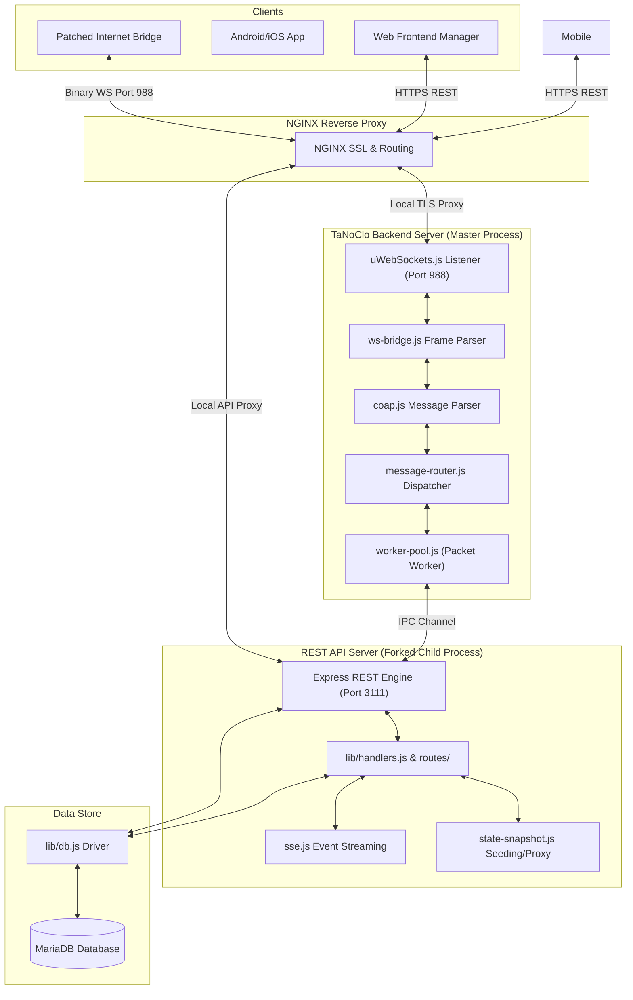

# TaNoClo WebSocket & REST API Server

The **TaNoClo WebSocket & REST API Server** is the central backend engine for the TaNoClo project. Written in Node.js, it acts as the translation layer between the custom, binary WebSocket protocol used by the Internet Bridge and standard HTTP/JSON REST APIs used by mobile and web clients.

---

## 1. System Architecture & Routing Flow

The server manages a master-child process IPC architecture:
1.  **uWebSockets.js Binary Port (`988`):** The master process accepts TLS-encrypted WebSocket connections from patched Internet Bridges, decrypts the bridge frames, and routes the encapsulated CoAP packets.
2.  **Express REST Engine Child Process (`3111`):** Automatically spawned as a child process. It exposes the API, handles HTTP command APIs (port `3111`), and serves the web management SPA. The master and child communicate via local IPC channels.



---

## 2. Configuration & Environment Variables

All settings are managed via environment variables and loaded through [lib/config.js](lib/config.js).

### 2.1 Database Credentials
*   **`DB_HOST`** (String): Hostname or IP address of the MariaDB server. Default: `'127.0.0.1'`.
*   **`DB_NAME`** (String): Database schema name. Default: `'tanoclo'`.
*   **`DB_USER`** (String): Database user account. Default: `'tanoclo'`.
*   **`DB_PASS`** (String): Database password. Default: `''`.

### 2.2 Server Port Configuration
*   **`WS_PORT`** (Integer): The listening port for the binary WebSocket server. Default: `988`.
*   **`HTTP_API_PORT`** or **`API_PORT`** (Integer): The listening port for the REST API and setup portal. Default: `3111`.

### 2.3 Cryptography & SSL Certificates
*   **`SSL_KEY_PATH`** (String): Path to the SSL private key for local TLS termination. Default: `'certs/tanoclo_key.pem'`.
*   **`SSL_CERT_PATH`** (String): Path to the SSL certificate for local TLS termination. Default: `'certs/tanoclo_cert.pem'`.
*   **`TADO_ROOT_CA_PATH`** (String): Path to the cloned/intercepted Root CA certificate. Default: `'certs/tadoRootCA.cer'`.
*   **`JWT_SECRET`** (String): Secret used to sign user JWT authorization tokens. Default: `'secret_key'`.

### 2.4 System Settings
*   **`TANOCLO_DOMAIN`** (String): Base domain routing endpoint for host checks. Default: `'tanoclo.domain.com'`.
*   **`LOG_LEVEL`** (String): Console log level (`debug`, `info`, `warn`, `error`). Default: `'debug'`.
*   **`TANOCLO_ZONE_CONFIG_READONLY`** (Boolean): If `true`, blocks pushes of zone configurations to prevent accidental writes. Default: `true`.
*   **`TANOCLO_SWAGGER_ENABLED`** (Boolean): Enables Swagger OpenAPI interactive documentation when `true`. Default: `true`.

---

## 3. Directory & Module Inventory

### 3.1 Shared Modules (`ws-server/lib/`)
The core routing and protocol layers are modularized into JavaScript files inside the [`lib/`](lib/) folder:

*   **[`battery.js`](lib/battery.js):** Computes estimated battery drain curves and lifetimes for Smart Radiator Thermostats.
*   **[`coap-transport.js`](lib/coap-transport.js):** Low-level wrapper transmitting CoAP messages.
*   **[`coap.js`](lib/coap.js):** Custom parser and builder for RFC 7252 CoAP packets.
*   **[`command-api.js`](lib/command-api.js):** REST API endpoints to queue and push binary CoAP downlink commands to sleeping hardware.
*   **[`command-log.js`](lib/command-log.js):** Utility to write historical commands to filesystem logs.
*   **[`commands/`](lib/commands/):** Handlers compiling specific commands down to TLV packets.
    *   `device.js`: Encodes hardware parameters (display, orientation, limit calibration).
    *   `schedule.js`: Encodes smart schedules into compact time blocks.
    *   `zone.js`: Encodes zone temperature targets and overlays.
*   **[`config-capture.js`](lib/config-capture.js):** Append-only logging driver that streams Bridge-submitted settings to a JSONL logging catalog.
*   **[`config.js`](lib/config.js):** Loads, validates, and standardizes all system environment variables.
*   **[`cron.js`](lib/cron.js):** Central background cron scheduler for time broadcasts, early start heating updates, and weather calculations.
*   **[`db.js`](lib/db.js):** Primary database coordinator interface.
*   **[`db-* Entity Drivers`](lib/):** Entity-specific database query modules.
    *   `db-auth.js`: Verifies user login and TOTP credentials.
    *   `db-base.js`: Establishes the base MariaDB pool wrapper.
    *   `db-devices.js`: Device configurations, battery states, and connection tracking.
    *   `db-homes.js`: Home locations, geofence structures, and metadata.
    *   `db-migrate.js`: Migrates database schemas on startup.
    *   `db-snapshots.js`: State capture import, export, and snapshots.
    *   `db-utils.js`: Shared database query formatting helpers.
    *   `db-zones/`: Subdivided zone query modules (`state.js`, `overlays.js`, `schedule.js`, `etags.js`).
*   **[`device-manager.js`](lib/device-manager.js):** Coordinates active device states and checks.
*   **[`energy.js`](lib/energy.js):** Accumulates heating demand percentages over time to calculate estimated gas/energy consumption.
*   **[`geo-utils.js`](lib/geo-utils.js):** Implements Haversine distance formulas to support geolocation geofencing thresholds.
*   **[`ha-discovery/`](lib/ha-discovery/):** Auto-discovery builders registering Tado entities with Home Assistant over MQTT.
    *   `boiler-builders.js`: Generates OpenTherm telemetry sensors.
    *   `circuit-builders.js`: Generates heating circuit controls.
    *   `device-builders.js`: Generates physical TRV/Thermostat entities.
    *   `emulated-builders.js`: Generates emulated virtual device sensors and controls.
    *   `home-builders.js`: Generates Home presence tracking.
    *   `mobile-builders.js`: Generates mobile geofencing entities.
    *   `zone-builders.js`: Generates zone climate cards.
*   **[`handlers.js`](lib/handlers.js):** Route handler library matching incoming CoAP endpoints to database queries.
*   **[`handlers/`](lib/handlers/):** Sub-handlers parsing specific uplink CoAP packets.
    *   `coap-helpers.js`: Shared parsing utilities.
    *   `device-handlers.js`: Resolves device authorization, hardware parameters, and status checks.
    *   `telemetry-handlers.js`: Extracts temperature, humidity, and valve travel reports.
    *   `zone-handlers.js`: Extracts target schedules and active mode reports.
    *   `path-classifier.js`: Maps packet paths.
*   **[`logger.js`](lib/logger.js):** Console and file logging driver supporting rotation schemas.
*   **[`mappers.js`](lib/mappers.js):** Data mappers translating raw DB structures to API JSON.
*   **[`message-cache.js`](lib/message-cache.js):** Transmit caches that temporarily store outbound commands until a battery-operated device wakes up.
*   **[`message-router/`](lib/message-router/):** Core router coordinating inbound/outbound messaging (`index.js`, `uplink.js`, `downlink.js`).
*   **[`metrics.js`](lib/metrics.js):** Exposes runtime diagnostic metrics.
*   **[`mqtt-client.js`](lib/mqtt-client.js):** Establishes connectivity to the local MQTT broker.
*   **[`mqtt-commands.js`](lib/mqtt-commands.js):** Translates incoming MQTT topic requests into CoAP downlinks.
*   **[`mqtt-ha-discovery.js`](lib/mqtt-ha-discovery.js):** Registers entities dynamically with Home Assistant.
*   **[`mqtt-publisher.js`](lib/mqtt-publisher.js):** Publishes state changes to MQTT.
*   **[`ota-sync.js`](lib/ota-sync.js):** Synchronizes and deploys web & mobile OTA update bundles.
*   **[`owd-detector.js`](lib/owd-detector.js):** Computes open window triggers based on rapid temperature drops.
*   **[`packet-worker.js`](lib/packet-worker.js):** Subprocess executing packet processing safely.
*   **[`presence-helper.js`](lib/presence-helper.js):** Evaluates home presence state from connected mobile geofencing reports.
*   **[`proxy-manager.js`](lib/proxy-manager.js):** Manages proxy routing to Tado cloud.
*   **[`state-restore.js`](lib/state-restore.js) & [`state-snapshot.js`](lib/state-snapshot.js):** Orchestrates full environment snapshot backups, imports, and exports.
*   **[`tlv.js`](lib/tlv.js):** Encoders/decoders for Tag-Length-Value (TLV) payload buffers.
*   **[`utils.js`](lib/utils.js):** Basic data transformations and buffer reconstruction helpers.
*   **[`weather.js`](lib/weather.js):** Fetches regional meteorological data for weather-compensation adjustments.
*   **[`worker-pool.js`](lib/worker-pool.js):** Coordinates worker threads for parallel packet parsing.
*   **[`ws-bridge.js`](lib/ws-bridge.js):** Encoders and decoders for the WS binary frame wrappers.
*   **[`zone-state-schema.js`](lib/zone-state-schema.js):** Holds schema metadata representing structural layouts of Zone State TLVs.

### 3.2 Mobile & Setup REST API Route Handlers (`ws-server/api/routes/`)
The web backend endpoints and portal endpoints are listed below:

*   **[`auth.js`](api/routes/auth.js):** Handles OAuth2 credential verification, access token generation, and mobile device authorization (subdivided under `api/routes/auth/` into `token.js`, `device.js`, and `revoke.js`).
*   **[`bridges.js`](api/routes/bridges.js):** Manages online/offline states of connected Internet Bridges.
*   **[`devices.js`](api/routes/devices.js):** Operates hardware registers, checks firmware status, and reads battery states of Valve Actuators.
*   **[`graphql.js`](api/routes/graphql.js):** Processes GraphQL queries.
*   **[`heating.js`](api/routes/heating.js):** Configures advanced zone heating setups, target temperatures, and hot water settings.
*   **[`homes.js`](api/routes/homes.js):** Central controller managing user homes, address registration, geofencing parameters, and heating control models. Subdivided into logical sub-routers under `api/routes/homes/` (including `base.js`, `heating.js`, `weather.js`, `users.js`, `energy.js`, `installations.js`, `logs.js`, `incident.js`, and `helpers.js`).
*   **[`misc.js`](api/routes/misc.js):** Returns general time zone offsets, weather overlays, and overall system status.
*   **[`mobileDevices.js`](api/routes/mobileDevices.js):** Registers mobile phones and handles geofence reports.
*   **[`ota.js`](api/routes/ota.js):** Serves frontend web and Capacitor mobile OTA update bundles.
*   **[`setup-mqtt.js`](api/routes/setup-mqtt.js):** Manages MQTT broker configuration and home deletion/reset procedures.
*   **[`setup-snapshots.js`](api/routes/setup-snapshots.js):** Manages state backup, import, export, and restores.
*   **[`setup.js`](api/routes/setup.js):** Central mount point routing to administrative sub-routers under `api/routes/setup/`:
    *   `portal.js`: Entrypoint for the Setup Portal, subdivided into logical sub-routers under `api/routes/setup/portal/` (including `auth.js`, `tools.js`, and `dashboard.js`).
    *   `homes.js`: Admin options for proxying, traffic logging, and Home Assistant discovery settings.
    *   `settings.js`: Configures MQTT parameters and triggers server restarts.
    *   `system.js`: Manages whitelisting, battery chemical type, travel limits, users, and TOTP 2FA.
    *   `emulated.js`: Manages ESP32 hardware nodes and virtual emulated devices.
*   **[`sse.js`](api/routes/sse.js):** Implements Server-Sent Events (SSE) to push real-time UI updates to client apps.
*   **[`tanoclo.js`](api/routes/tanoclo.js):** Custom endpoints exposing raw JSON snapshots of active boilers, zones, and device states.
*   **[`users.js`](api/routes/users.js):** Registers and updates system-wide user credentials, profiles, and access authorization.
*   **[`zones.js`](api/routes/zones.js):** Central controller managing active smart schedules and zone bindings. Subdivided into logical helpers under `api/routes/zones/` (including `base.js`, `devices.js`, `helpers.js`, `owd.js`, `reports.js`, `schedule.js`, and `state.js`).

---

## 4. Setup & Execution

### 4.1 Prerequisites
Ensure the target environment has **Node.js** and **MariaDB / MySQL** installed.

### 4.2 Local Running & Execution
Install dependencies and launch the server:
```bash
# 1. Navigate to directory
cd ws-server

# 2. Install dependencies
npm install

# 3. Configure environment variables (example)
$env:DB_HOST="127.0.0.1"
$env:DB_NAME="tanoclo"
$env:DB_USER="tanoclo"
$env:DB_PASS="your_database_password"
$env:WS_PORT="988"
$env:HTTP_API_PORT="3111"
$env:LOG_LEVEL="debug"

# 4. Launch the application
npm start
```

### 4.3 Automated Verification Tests
The server features test suites executed via **Vitest**:
*   **Unit Tests:** Verifies CoAP parsing, TLV binary translations, WS bridge structures, and battery estimates.
    ```bash
    npx vitest run test/unit
    ```
*   **Integration Tests:** Validates complete server frame roundtrips.
    ```bash
    npx vitest run test/integration
    ```
*   **Push Command Tests:** Validates REST HTTP API commands.
    ```bash
    npx vitest run test/push
    ```
*   **Comprehensive Test Suite:** Runs all test suites.
    ```bash
    npx vitest run
    ```
*Note: Tests must be executed using `npx vitest run`.*

### 4.4 Test Configuration (`test_config.json`)
Copy the template from `test/test_config.json.template` to `test/test_config.json` and fill in your local database credentials to run integration tests.

---

## 5. Administrative Setup & Seeding Application

The **TaNoClo Setup Portal** (accessible at `https://setup.{domain}`) is the administrative control center and initialization engine.

### 5.1 Seeding from Tado Cloud
To import your existing Tado home structure:
1.  Open the Setup Portal, log in, and navigate to the seeding section.
2.  Click **Start Tado Import**. An OAuth Device Authorization code is fetched from `login.tado.com`.
3.  Open the displayed URL, log in with your Tado credentials, and approve the request.
4.  TaNoClo automatically imports homes, zones, device registers, schedules, and active users, placing them into your local database.

### 5.2 Setup & State Capture Flow (Proxy Interception)
To fully configure your local server with active schedules and zones:
1.  **Configure local DNS routing**: Redirect `tanoclo.tado.lan` to point to the `ws-server` IP.
2.  **Enable Proxy to Cloud**: Log into the Setup Portal, go to the Home Dashboard, and enable the proxy option. This tunnels your Internet Bridge communication back to the real Tado Cloud. Changing proxy modes automatically resets Internet Bridge WebSocket sessions to ensure a clean re-handshake.
3.  **Start State Capture**: Navigate to **State Backup & Recovery** and click **Start Capture**.
4.  **Verify Device Check-In**: Let the devices check-in normally through the proxy, automatically recording configurations, active zones, and schedule blocks.
5.  **Disable Proxy**: Turn off the proxy mode to disconnect from Tado's cloud and run 100% locally.

### 5.3 Setup Portal Capabilities
The Setup Portal (`https://setup.tanoclo.yourdomain.com`) provides a comprehensive web management suite for system administrators:

*   **Home Management & Cloud Importer**:
    *   View all managed homes, device counts, zone counts, associated Internet Bridges, and linked administrator accounts.
    *   **OAuth Cloud Import**: 1-click import replicating home structures, zones, device bindings, smart schedules, and user accounts directly from Tado Cloud.
    *   **Proxy Toggling & Traffic Logging**: Individually toggle Cloud Proxy mode and append-only raw traffic capture per home.
    *   **Home Assistant Auto-Discovery Control**: Enable or disable MQTT entity discovery on a per-home basis.
    *   **Home Deletion & Reset**: Safely purge or reset managed homes and cascade-delete associated devices and metrics.
*   **WebSocket Whitelisting**:
    *   Restrict incoming Internet Bridge connections to an explicit whitelist of Home IDs and Bridge serial numbers.
    *   Block unauthorized hardware from attaching to the local WebSocket listener.
*   **User Administration**:
    *   Manage local user profiles, home assignments, and update account passwords.
*   **Security & 2FA Management**:
    *   Change setup portal master administrator credentials.
    *   Configure Time-based One-Time Password (TOTP) two-factor authentication (2FA) with standard authenticator app QR code setup and secret key provisioning.
*   **Real-Time Hex Message Decoder**:
    *   Paste raw hexadecimal packet buffers to disassemble framing layers in real-time.
    *   Decodes 28-byte WebSocket bridge headers, RFC 7252 CoAP methods/paths/tokens/options, and recursively unpacks Tag-Length-Value (TLV) payload buffers with human-readable label lookups against the local FID catalog.
*   **System Settings & MQTT Configuration**:
    *   Configure MQTT broker endpoints, authentication, and port settings.
    *   Adjust runtime log levels (`debug`, `info`, `warn`, `error`) and trigger server daemon restarts.
*   **Emulated Devices & Hardware Node Registry**:
    *   Register and manage ESP32 hardware emulator nodes with IP/port configuration and live ping health checks.
    *   Create and provision virtual emulated devices (`RU...`) across registered nodes.
    *   Trigger automated over-the-air RF pairing routines directly from the browser.
    *   Inject dynamic telemetry (ambient temperature, relative humidity, battery voltage) in real-time.
    *   Synchronize, re-pair, or unpair virtual devices from node NVRAM and the server database.
*   **State Backup & Recovery (Snapshots)**:
    *   **1-Click JSON Export**: Download complete snapshots of all database tables (homes, zones, devices, schedules, measurements, users).
    *   **1-Click Restore**: Upload and apply saved JSON state snapshots to restore complete server configurations instantaneously.